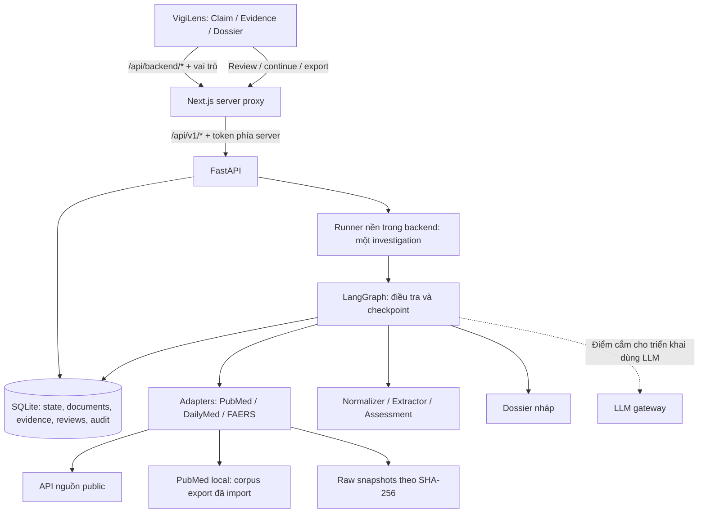

# Kiến trúc MVP — Agent điều tra bằng chứng an toàn thuốc (P-066)

Tài liệu mô tả MVP theo [kế hoạch M01–M10](docs/planMVPfinal.md) và [contract](docs/mvp-contracts.md). Cấu hình `MVP_EVIDENCE_MODE=person3` cùng `MVP_SOURCE_MODE=live` ghép bộ phân tích/hồ sơ Người 3 với connectors Người 1 và graph/gateway Người 2. Có chế độ synthetic và corpus snapshot riêng; kết quả tích hợp kỹ thuật chưa xác nhận nghiệm thu chuyên môn/live hoàn chỉnh.

MVP dùng VigiLens (Next.js/TypeScript), FastAPI, runner trong tiến trình backend, LangGraph và SQLite. Mỗi thời điểm chỉ xử lý một cuộc điều tra; backend chạy **một worker Uvicorn**. Nguồn gồm PubMed, DailyMed và openFDA FAERS. Kết quả là hồ sơ Markdown có bằng chứng, gaps, limitations và quyết định reviewer; không tự kết luận nhân quả hoặc đề xuất thay đổi điều trị.

## 1. Thành phần và đường đi dữ liệu

Sơ đồ thể hiện các đường tích hợp. Nguồn fixture chạy offline, còn PubMed local đọc corpus thay vì gọi PubMed API; xem chế độ ở mục 3.

| Thành phần | Code local | Trách nhiệm |
|---|---|---|
| Giao diện | `frontend/` | Form claim, polling tiến trình, evidence, review và dossier |
| Proxy | `frontend/app/api/backend/[...path]/route.ts` | Chuyển tiếp `/api/v1/*`, gắn token từ môi trường server |
| API và xác thực | `src/api/investigations.py`, `reviews.py`, `auth.py`, `mvp_runtime.py` | Tạo/đọc/tiếp tục điều tra, kiểm tra role, version và quyền export |
| Runner | `src/services/runner.py` | Khóa một run, chạy thread nền, cấp `RunContext`, xử lý restart |
| Điều phối | `src/agents/graph.py`, `src/services/planner.py`, `stopping.py`, `budget.py` | Chọn query/source theo gaps, dừng, reserve và ghi counters |
| Lưu trữ | `src/services/store.py` | SQLite, state/version, tài liệu, evidence, decisions, dossiers và audit |
| Nguồn | `src/services/sources/` | HTTP, parser, cache, snapshots và `SourceSearchResult` |
| Gateway và hồ sơ | `src/services/llm.py`, `dossier.py`, `review.py` | Structured output, usage, kiểm tra hồ sơ và phê duyệt |

## 2. Luồng điều tra và reviewer

1. API kiểm tra claim, nguồn và ngân sách; tạo investigation với idempotency key và trả ID để UI polling.
2. Runner chạy graph: normalize → checklist → plan → retrieve → extract/assess → update gaps → stop/continue. Planner có thể đổi query hoặc nguồn, lưu lý do và fingerprint để tránh lặp vô ích.
3. Claim mơ hồ dừng ở checkpoint `normalization`. Kết quả đánh giá chuyển tới checkpoint `assessment`; reviewer có thể sửa, từ chối hoặc yêu cầu tìm thêm.
4. Sau quyết định hợp lệ, `/continue` chạy từ `next_stage` đã lưu và giữ counters. Dossier được tạo rồi chờ review riêng ở checkpoint `dossier`.
5. Export Markdown chỉ lấy phiên bản hồ sơ hiện hành đã duyệt và vượt qua validator. Duyệt assessment không tự duyệt dossier.

`run_status`, `assessment_status` và `review_status` là ba trạng thái riêng. Sửa claim/evidence tạo version mới và vô hiệu phê duyệt liên quan; request dùng `expected_version` cũ bị từ chối. Refresh đọc lại state, không tạo run mới. Khi backend khởi động lại, run `queued/running` chuyển `interrupted`; checkpoint đang chờ review được giữ. MVP chưa tự replay external call bị gián đoạn.

## 3. Chế độ nguồn và điểm tích hợp

| Cấu hình local | Hành vi | Giới hạn |
|---|---|---|
| `MVP_SOURCE_MODE=fixture` (mặc định) | Adapters và normalizer/extractor fixture | Dữ liệu synthetic phục vụ kiểm thử/demo |
| `MVP_SOURCE_MODE=live`, `MVP_PUBMED_MODE=api` (mặc định) | Runner tạo adapters thật từ normalized claim qua `source_factory` | Retrieval thật; normalizer/extractor mặc định vẫn là fixture |
| `MVP_SOURCE_MODE=live`, `MVP_PUBMED_MODE=local` | PubMed tìm lexical trên export đã import; DailyMed/FAERS vẫn gọi API | Không chứng minh PubMed API live hoạt động; không tự fallback khi API lỗi |
| `MVP_SOURCE_MODE=live`, `MVP_EVIDENCE_MODE=person3` | Connectors Người 1, normalizer/extractor/analyzer/dossier Người 3, gateway/budget Người 2 | Cần model và dictionary verified; vẫn cần review scope/citation và nhãn chuyên môn |

`RunContext` có các điểm cắm `adapters`, `source_factory`, `normalizer`, `extractor`, `evidence_analyzer` và `dossier_builder`. `MVP_EVIDENCE_MODE=person3` gắn bộ phân tích/hồ sơ thật mỗi run/resume và yêu cầu source mode live/dictionary verified. `person3_demo` chạy synthetic; launcher corpus chạy snapshot. Chỉ bật source live giữ normalizer/extractor fixture; xem [hướng dẫn cấu hình](docs/person3/merged_runtime.md).

PubMed giữ PMID, metadata và abstract lấy được, không giả định đã đọc full text. DailyMed giữ SETID/version/section và thông tin nhãn. FAERS giữ report ID/version cùng dữ liệu ở cấp báo cáo; nhiều drugs/reactions không tự trở thành cặp nhân quả hoặc incidence. Nguồn lỗi trả trạng thái có kiểu và tạo gap, khác với kết quả rỗng.

## 4. Lưu trữ, provenance và ngân sách

- SQLite mặc định ở `data/mvp.sqlite3`; store lưu investigations, events, documents, liên kết investigation–document, evidence versions, review decisions, dossier versions và audit events. JSON dùng schema Pydantic; thao tác lưu kiểm tra version và dùng transaction.
- `SourceDocument` giữ source/ID/version/URL, thời điểm truy xuất, parsed text và SHA-256 của text. Quote/locator phải đối chiếu với đúng text/version đã lưu. Raw response được lưu ở `data/snapshots/<source>/<raw_hash>.raw`.
- Cache adapters nằm trong bộ nhớ, không phải persistent cache. Cache hit không phát sinh HTTP request mới; lỗi nguồn không bị cache thành empty. PubMed local dùng manifest/raw export trong `MVP_PUBMED_CORPUS_ROOT` (mặc định `data/pubmed-local`).
- Ngân sách mặc định 8 bước/50 tài liệu, trần 20 bước/100 tài liệu; trần kỹ thuật 80 source requests, 80 LLM calls, 150.000 input tokens và 25.000 output tokens. Một quyết định truy xuất vẫn tính bước khi cache hit; tài liệu trùng không tính lại.
- Graph reserve trước retrieval. Adapters thật gọi callback để lưu từng HTTP request trước khi gửi, gồm retry; không tính một search nhiều HTTP thành một request. Transport chỉ cho HTTPS tới host nguồn trong allowlist, chặn redirect, giới hạn timeout/kích thước và tối đa một retry khi lỗi tạm thời.
- Gateway có structured output, usage và provider transport. Cấu hình fixture dùng mô phỏng; cấu hình person3 gọi model qua gateway cho extraction và tạo dossier từ typed quotes. Tiếp tục sau review không reset ngân sách.

## 5. Quyền và ranh giới tin cậy

FastAPI xác thực bằng `INVESTIGATOR_TOKEN`/`REVIEWER_TOKEN`, qua `X-API-Token` hoặc Bearer token. Chỉ reviewer được gửi quyết định review; danh tính audit do server ánh xạ từ token, không lấy từ body. Cả hai vai trò có thể đọc/export hồ sơ nếu các điều kiện phê duyệt hợp lệ.

Proxy VigiLens giữ token trong biến môi trường server `VIGILENS_INVESTIGATOR_TOKEN`/`VIGILENS_REVIEWER_TOKEN` và chọn token theo header `X-Vigilens-Role` từ trình duyệt. Hiện chưa có session server xác minh người chọn vai trò: giữ token ngoài bundle **chưa tạo thành hệ thống đăng nhập/phân quyền người dùng**. Bản này dành cho demo local trên loopback.

Tài liệu nguồn là dữ liệu không tin cậy. URL truy xuất do adapters tạo; nguồn không được thay chính sách hoặc điều khiển tool. Scope unknown không được coi là match; FAERS-only không đủ để tự đề xuất supported/contradicted. Validator và review/export guard kiểm tra citation, version, evidence đã loại và các diễn giải bị cấm trước hồ sơ chính thức.

## 6. Đóng gói và phục hồi

Chạy local bằng Python 3.11+, Node.js 24 và một Uvicorn worker; hướng dẫn tại [README](README.md) và [runbook](docs/runbook.md). `docker-compose.mvp.yml` dựng backend bằng `Dockerfile.mvp` và frontend bằng `frontend/Dockerfile`, công bố cổng `127.0.0.1:8000`/`127.0.0.1:3100`. Volume `mvp_data` gắn vào `/app/data` giữ SQLite, snapshots và corpus local trong container.

`scripts/mvp_backup.py` backup SQLite cùng snapshots sau khi dừng ghi, tạo manifest SHA-256 và kiểm tra integrity/hash trước restore. Corpus PubMed local chưa truy xuất không tự được đưa vào bản backup này; cần giữ thêm manifest/raw corpus theo runbook. Nghiệm thu restore phải mở lại được một hồ sơ đã duyệt và chuỗi citation tương ứng.

Tests mặc định chặn mạng ngoài loopback; `scripts.smoke_sources` là live smoke chủ động riêng. Kết quả kiểm tra và phần chưa nghiệm thu nằm ở [bàn giao Người 1](docs/mvp-person1-status.md): PubMed API live còn bị chặn trên mạng đã thử; clone sạch, thao tác trình duyệt, bốn demo và evaluation cần kiểm chứng trên bản tích hợp.

## 7. Thành phần VMEC cũ còn trong repository

`archive/legacy-frontends/frontend-vite/` (React/Vite), `src/vmec.py`, `src/api/vmec_routes.py`, `src/db.py`, `src/worker.py`, `migrations/` và `docker-compose.yml` thuộc luồng VMEC dùng PostgreSQL/worker riêng. `archive/legacy-frontends/frontend-next/` là giao diện khác được lưu trữ trong archive; frontend MVP chính thức hiện tại dùng `frontend/`.

`research/` và `eval/results/` chứa benchmark VMEC trên dữ liệu tổng hợp. Các kết quả đó không xác nhận chất lượng của MVP điều tra an toàn thuốc. Kế hoạch MVP hiện tại dùng SQLite/runner trong backend; PostgreSQL, worker riêng, nhiều replica và vector database là phần mở rộng sau MVP.
