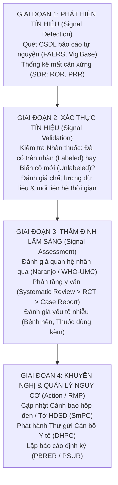

# Đánh Giá Chuyên Môn Cảnh Giác Dược & Lộ Trình Tính Năng Thực Tiễn Cho Hệ Thống P-066 (VigiLens)

> **Tác giả:** Chuyên viên Kiểm soát Dược / Dược sĩ Cảnh giác Dược (Senior Pharmacovigilance Specialist & Clinical Pharmacist)  
> **Dự án:** P-066 — Hệ thống AI Agent hỗ trợ điều tra và kiểm chứng nhận định an toàn thuốc  
> **Cơ sở tham chiếu chuyên môn:** Hướng dẫn Thực hành Cảnh giác Dược tốt của Châu Âu (EMA GVP Module IX — Signal Management), Tiêu chuẩn của Hội đồng Quốc tế về Hài hòa các Thủ tục Kỹ thuật (ICH E2A/E2B/E2C), Quy chuẩn Tổ chức Y tế Thế giới (WHO-UMC), và Hướng dẫn Đánh giá Biến cố Bất lợi của US FDA.  
> **Thời điểm thẩm định:** Tháng 10/2026  
> **Trạng thái:** Báo cáo tham vấn chuyên môn chính thức  

---

## 1. Bản Chất Nghiệp Vụ Cảnh Giác Dược (Day in the Life of a PV Specialist)

Để đánh giá một hệ thống công nghệ có thực sự hữu ích cho chuyên viên kiểm soát dược hay không, trước hết cần hiểu rõ **bản chất công việc và những áp lực hằng ngày của một Dược sĩ Cảnh giác Dược (Pharmacovigilance - PV)**.

### 1.1. Chu trình Quản lý Tín hiệu An toàn Thuốc Chuẩn Quốc tế (EMA GVP Module IX)
Cảnh giác dược không phải là việc đọc lướt vài bài báo rồi đưa ra kết luận cảm tính xem thuốc "an toàn" hay "nguy hiểm". Đó là một chuỗi quy trình dịch tễ dược học và lâm sàng có tính pháp lý cao, gồm 4 giai đoạn bắt buộc:



### 1.2. Hai Câu Hỏi Cốt Tử Của Dược Sĩ Khi Tiếp Nhận Một Ca ADR
Khi một bác sĩ hoặc bệnh nhân báo cáo: *"Bệnh nhân dùng thuốc A bị biến cố B"*, phản xạ chuyên môn đầu tiên của Dược sĩ luôn là:
1. **Câu hỏi 1 (Tình trạng nhãn - Listedness):** *"Biến cố này đã có trong Tờ thông tin sản phẩm (SmPC/USPI nhãn FDA) chưa?"*
   - Nếu **Đã có trên nhãn (Labeled / Listed)**: Tần suất ghi nhận là bao nhiêu? Biến cố có tăng đột biến về số lượng hoặc mức độ trầm trọng không?
   - Nếu **Chưa có trên nhãn (Unlabeled / Unlisted)**: Đây là **Tín hiệu an toàn thuốc mới (New Signal)** $\rightarrow$ Phải kích hoạt quy trình thẩm định ưu tiên cao nhất!
2. **Câu hỏi 2 (Mối quan hệ nhân quả - Causality):** *"Liệu chính thuốc A gây ra biến cố B, hay do bệnh nền của bệnh nhân, hay do tương tác với thuốc khác mà bệnh nhân đang uống kèm?"*
   - Để trả lời câu hỏi này, Dược sĩ bắt buộc phải xem xét: **Thời gian xuất hiện (Latency)**, **Ngừng thuốc có đỡ không (Dechallenge)**, và **Dùng lại có bị lại không (Rechallenge)**.

---

## 2. Thẩm Định Chi Tiết Hệ Thống P-066 Hiện Tại (As-Is Evaluation)

Dưới lăng kính của một Dược sĩ Cảnh giác Dược, tôi đã rà soát toàn bộ cấu trúc mã nguồn backend (`src/`), dữ liệu (`data/`), tài liệu đặc tả (`docs/`) và giao diện (`frontend/`).

### 2.1. Những Điểm Sáng Hệ Thống Đã Làm Rất Đúng Chuẩn Y Khoa (Strengths)

1. **Tuyệt đối tuân thủ chính sách ngôn ngữ phi nhân quả ([`src/services/policy.py`](file:///d:/create/vin/P-066/src/services/policy.py)):**
   - Hệ thống cài đặt bộ lọc Regex chặn đứng các từ ngữ mang tính khẳng định nguyên nhân trực tiếp (*"gây ra"*, *"caused by"*, *"leads to"*).
   - Cấm triệt để việc suy diễn tỷ lệ mắc (incidence) từ dữ liệu báo cáo tự nguyện (FAERS).
   - *Nhận xét chuyên môn:* **Xuất sắc**. Rất nhiều phần mềm AI hiện nay phạm sai lầm nghiêm trọng là để mô hình LLM phát ngôn khẳng định nhân quả thay cho Hội đồng Y khoa. Việc P-066 nhận thức rõ giới hạn này hoàn toàn phù hợp với nguyên tắc đạo đức và pháp lý của WHO và FDA.
2. **Cơ chế từ chối kết luận có trách nhiệm (Abstention với Evidence Gaps):**
   - Khi dữ liệu không đủ hoặc bằng chứng không có sự thống nhất, hệ thống trả về kết luận `insufficient_evidence` kèm theo danh sách các khoảng trống thông tin cụ thể (Gaps).
   - *Nhận xét chuyên môn:* Trong thực tế lâm sàng, biết rõ **"hồ sơ còn thiếu bằng chứng gì"** có giá trị cảnh báo an toàn cao gấp nhiều lần một bản tóm tắt kết luận liều lĩnh.
3. **Tính có thể kiểm toán & Trích dẫn nguyên văn 100% ([`src/services/evidence/extract.py`](file:///d:/create/vin/P-066/src/services/evidence/extract.py)):**
   - Mọi `EvidenceUnit` bắt buộc phải có `quote` khớp từng ký tự với tài liệu nguồn kèm toạ độ span. Hệ thống có cơ chế kiểm tra hash tài liệu để đảm bảo không bị chỉnh sửa.
   - *Nhận xét chuyên môn:* Đây là tính năng sống còn giúp Dược sĩ thẩm định nguồn gốc, chống ảo giác (hallucination) của AI và phục vụ thanh tra/kiểm toán y khoa.
4. **Cơ chế giữ người trong vòng lặp (Human-in-the-Loop Review Checkpoints):**
   - Agent không tự ý chạy hết chu trình rồi xuất file, mà dừng lại ở các điểm kiểm soát (`claim_normalization`, `assessment`, `dossier`) để Dược sĩ đóng vai trò Reviewer phê duyệt hoặc yêu cầu tìm kiếm thêm.
5. **Tiếp cận đa nguồn (Multi-source Triangulation):**
   - Tích hợp cả 3 nguồn thiết yếu: Y văn nghiên cứu (PubMed), Nhãn thuốc chính thức (DailyMed), và Báo cáo an toàn tự nguyện (openFDA FAERS).

---

### 2.2. Những Khoảng Trống Lâm Sàng & Điểm Chưa Sát Thực Tế (Clinical Gaps & Limitations)

> [!WARNING]
> Mặc dù khung kỹ thuật (framework) được xây dựng rất bài bản, nhưng nếu đưa cho một Dược sĩ lâm sàng sử dụng hôm nay, họ sẽ thấy hệ thống còn mang tính "nguyên mẫu học thuật" (academic prototype) và thiếu các công cụ thực chiến cốt tử:

1. **Thiếu hoàn toàn Khung Đánh Giá Mối Quan Hệ Nhân Quả (Causality Framework):**
   - Hiện tại hệ thống chỉ phân loại bằng chứng thành `supporting`, `contradicting`, `uncertain` và kiểm tra độ bao phủ của 6 trường text phẳng (`drug`, `adverseEvent`, `population`, `dose`, `route`, `timeWindow`).
   - *Hạn chế:* Dược sĩ không thể kết luận một ca ADR chỉ bằng 6 trường này. Chúng tôi bắt buộc phải dựa vào **Thang thuật toán Naranjo (10 câu hỏi)** hoặc **Thang phân loại WHO-UMC**. Hệ thống chưa có tính năng trích xuất thông tin **Dechallenge** (ngừng thuốc) hay **Rechallenge** (tái sử dụng thuốc).
2. **Khai thác dữ liệu FAERS chưa đúng thực tiễn dịch tễ học:**
   - Trong [`src/services/sources/faers.py`](file:///d:/create/vin/P-066/src/services/sources/faers.py), hệ thống chỉ tải về text JSON của một số case report lẻ rồi lưu lại.
   - *Hạn chế:* Dược sĩ không đọc FAERS theo kiểu đọc từng case lẻ! FAERS là kho dữ liệu khổng lồ với hàng triệu ca. Giá trị thực sự của FAERS nằm ở **Phân tích mất cân xứng thống kê (Disproportionality Analysis: ROR, PRR)** để xem tần suất báo cáo cặp thuốc - biến cố này có cao bất thường so với nền chung của toàn bộ cơ sở dữ liệu hay không.
3. **Chưa có tính năng Phân loại Tình trạng Nhãn Thuốc (Labeled vs. Unlabeled):**
   - Dù hệ thống có kéo dữ liệu DailyMed về, nhưng kết quả không trả lời dứt khoát cho Dược sĩ: *"Biến cố này đã có trên nhãn chưa? Nằm ở mục Cảnh báo hộp đen (Boxed Warning), Cảnh báo thận trọng (Warnings), hay Tác dụng không mong muốn (Adverse Reactions)?"*.
4. **Đánh đồng mức độ tin cậy của bằng chứng (Lack of Evidence Hierarchy):**
   - Trong y học thực chứng (Evidence-Based Medicine), bằng chứng được xếp theo kim tự tháp: **Systematic Review / Meta-analysis > RCT > Cohort Study > Case-Control > Case Report**.
   - Hiện tại P-066 coi 1 bài báo cáo ca đơn lẻ (Case report) có lập trường `contradicts` ngang hàng với một nghiên cứu thử nghiệm lâm sàng ngẫu nhiên có đối chứng (RCT) quy mô 5.000 bệnh nhân. Điều này dễ dẫn đến cảnh báo mâu thuẫn giả tạo (pseudo-contradiction).
5. **Chuẩn hóa danh pháp y khoa còn thô sơ:**
   - Dùng một từ điển JSON tĩnh gồm 5 cặp thuốc (`mvp_candidates_2026_10_02.json`). Dược sĩ thực tế cần hệ thống tự động ánh xạ sang **MedDRA** (System Organ Class - SOC, Preferred Term - PT) và mã **ATC** của WHO.
6. **Các thành phần còn Mock hoặc giả lập (Tạm bỏ qua theo yêu cầu):**
   - Khung chat Trợ lý VigiLens (`/app/assistant`) hoàn toàn dùng `setTimeout 500ms` trả về câu cố định.
   - Cài đặt (`/app/app/settings`) lưu local storage.
   - Database SQLite ban đầu chưa được nạp sẵn dữ liệu mẫu.

---

## 3. Đề Xuất Lộ Trình Tính Năng Thực Tiễn Cho Dược Sĩ Kiểm Soát Dược (To-Be Feature Roadmap)

Để biến VigiLens từ một đồ án công nghệ thành **trợ thủ đắc lực không thể thiếu của các Chuyên viên Cảnh giác Dược**, đề xuất 8 tính năng thực chiến được chia thành 3 giai đoạn:

```
┌────────────────────────────────────────────────────────────────────────┐
│ GIAI ĐOẠN 1: TÍNH NĂNG THẨM ĐỊNH LÂM SÀNG CỐT LÕI (Core Clinical MVP)  │
│  ├─ Feature 1: Trợ lý Đánh giá Nhân quả Naranjo / WHO-UMC Bán Tự Động  │
│  ├─ Feature 2: Bảng Phân tích Mất cân xứng FAERS (ROR & PRR)           │
│  └─ Feature 3: Bộ Đối chiếu Tình trạng Nhãn Thuốc (Listedness Checker) │
├────────────────────────────────────────────────────────────────────────┤
│ GIAI ĐOẠN 2: CHUẨN HÓA Y KHOA & PHÂN TẦNG BẰNG CHỨNG (Intelligence)   │
│  ├─ Feature 4: Bộ Ánh xạ Thuật ngữ MedDRA & Mã ATC Tự Động             │
│  ├─ Feature 5: Phân tầng Kim tự tháp Bằng chứng Y học Thực chứng       │
│  └─ Feature 6: Nhận diện Yếu tố Nhiễu & Tương tác Thuốc Dùng Kèm       │
├────────────────────────────────────────────────────────────────────────┤
│ GIAI ĐOẠN 3: BÁO CÁO PHÁP LÝ & COPILOT HỘI THOẠI (Regulatory Ready)    │
│  ├─ Feature 7: Mẫu Báo cáo Đánh giá Tín hiệu Chuẩn CIOMS / EMA GVP     │
│  └─ Feature 8: Trợ lý Dược học Lâm sàng Trực tuyến (Gemini Copilot)    │
└────────────────────────────────────────────────────────────────────────┘
```

---

### 3.1. Chi Tiết Các Tính Năng Giai Đoạn 1 (Khuyến Nghị Triển Khai Ngay)

#### 🎯 Feature 1: Trợ Lý Đánh Giá Quan Hệ Nhân Quả Naranjo / WHO-UMC Bán Tự Động
* **Nghiệp vụ thực tế:** Khi thẩm định báo cáo ADR, Dược sĩ bắt buộc phải hoàn thành phiếu đánh giá nhân quả theo thang Naranjo (10 câu hỏi) hoặc WHO-UMC. Việc tự đọc tài liệu rồi chấm điểm thủ công rất tốn thời gian.
* **Giải pháp công nghệ:**
  - AI Agent khi duyệt qua các tài liệu PubMed và DailyMed sẽ tự động trích xuất các bằng chứng tương ứng với 10 câu hỏi của thang Naranjo:
    1. *Có báo cáo xác nhận trước đây về phản ứng này chưa?* (Quét nhãn DailyMed và y văn)
    2. *Biến cố xuất hiện sau khi dùng thuốc nghi ngờ?* (Đánh giá trình tự thời gian)
    3. *Biến cố có thuyên giảm khi ngừng thuốc (Dechallenge)?* (Tìm từ khóa: resolved, improved upon discontinuation, drug stopped)
    4. *Biến cố có tái xuất hiện khi dùng lại thuốc (Rechallenge)?* (Tìm từ khóa: recurred upon re-exposure, rechallenge positive)
    5. *Có nguyên nhân thay thế có thể tự gây ra biến cố không?* (Bệnh nền tiến triển)
    6. *Có phản ứng tương tự khi dùng giả dược không?* (Trong các thử nghiệm lâm sàng)
    7. *Có phát hiện nồng độ thuốc trong máu ở mức độc tính không?*
    8. *Mức độ nghiêm trọng có tăng khi tăng liều (hoặc giảm khi giảm liều)?*
    9. *Bệnh nhân từng có phản ứng tương tự với thuốc cùng nhóm chưa?*
    10. *Biến cố có được khẳng định bằng xét nghiệm khách quan không?*
  - **Giao diện tương tác:** Tại tab Thẩm định (`/review`), hiển thị một bảng tương tác **"Thang Điểm Naranjo"** với điểm số sơ bộ do AI đề xuất (+1, 0, -1) kèm trích dẫn văn bản chứng minh. Dược sĩ chỉ cần kiểm tra, click xác nhận hoặc sửa lại $\rightarrow$ Hệ thống tự động tính tổng điểm và phân hạng:
    - $\ge 9$ điểm: **Chắc chắn (Definite)**
    - $5 - 8$ điểm: **Có khả năng (Probable)**
    - $1 - 4$ điểm: **Có thể (Possible)**
    - $\le 0$ điểm: **Nghi ngờ / Không chắc chắn (Doubtful)**

---

#### 🎯 Feature 2: Bảng Phân Tích Mất Cân Xứng Thống Kê FAERS (Disproportionality Analyzer - ROR & PRR)
* **Nghiệp vụ thực tế:** Theo hướng dẫn của EMA (GVP Module IX) và FDA, để xác định một tín hiệu an toàn thuốc từ cơ sở dữ liệu báo cáo tự nguyện, chuyên viên phải tính toán các chỉ số thống kê mất cân xứng.
* **Giải pháp công nghệ:**
  - Tận dụng openFDA API để tự động truy vấn tổng số lượng báo cáo và xây dựng bảng tiếp liên $2 \times 2$ (Contingency Table):
    $$\begin{array}{|c|c|c|}
    \hline
    \textbf{Phân loại} & \textbf{Biến cố đích (E)} & \textbf{Các biến cố khác } (\neg E) \\
    \hline
    \textbf{Thuốc đích (D)} & A & B \\
    \hline
    \textbf{Các thuốc khác } (\neg D) & C & D \\
    \hline
    \end{array}$$
  - Tính toán tự động các chỉ số:
    1. **Tỷ số chênh báo cáo (Reporting Odds Ratio - ROR):**
       $$\text{ROR} = \frac{A \times D}{B \times C}$$
       Kèm khoảng tin cậy 95%: $\text{CI}_{95\%} = \exp\left(\ln(\text{ROR}) \pm 1.96 \sqrt{\frac{1}{A} + \frac{1}{B} + \frac{1}{C} + \frac{1}{D}}\right)$
    2. **Tỷ số tỷ lệ báo cáo (Proportional Reporting Ratio - PRR):**
       $$\text{PRR} = \frac{A / (A + B)}{C / (C + D)}$$
    3. **Tiêu chuẩn xác định tín hiệu (SDR - Signal of Disproportionate Reporting):** Bật đèn cảnh báo vàng nếu:
       $$A \ge 3 \quad \text{và} \quad \text{PRR} \ge 2 \quad \text{và} \quad \chi^2 \ge 4$$
  - **Giao diện hiển thị:** Một thẻ trực quan (Card) trên trang chi tiết điều tra thể hiện: Số lượng ca trong FAERS, Giá trị ROR/PRR, Biểu đồ cơ cấu giới tính (Nam/Nữ) và nhóm tuổi (Trẻ em, Người trưởng thành, Người cao tuổi).

---

#### 🎯 Feature 3: Bộ Đối Chiếu Tình Trạng Nhãn Thuốc Tức Thì (DailyMed Listedness Checker)
* **Nghiệp vụ thực tế:** Dược sĩ cần biết ngay lập tức biến cố này là biến cố đã biết (Labeled) hay biến cố mới (Unlabeled) để quyết định mức độ khẩn cấp của hồ sơ.
* **Giải pháp công nghệ:**
  - Agent quét tự động qua cấu trúc nhãn thuốc SPL (Structured Product Labeling) của DailyMed, tìm kiếm biến cố tại các mục trọng yếu:
    - *BOXED WARNING* (Cảnh báo hộp đen)
    - *CONTRAINDICATIONS* (Chống chỉ định)
    - *WARNINGS AND PRECAUTIONS* (Cảnh báo và thận trọng)
    - *ADVERSE REACTIONS* (Tác dụng không mong muốn)
  - **Kết quả hiển thị trực quan trên giao diện:**
    - 🔴 **Tín hiệu mới (Unlabeled / Unlisted):** Biến cố hoàn toàn không xuất hiện trên nhãn FDA hiện hành $\rightarrow$ Đóng khung đỏ cảnh báo ưu tiên cao.
    - 🟡 **Đã có trên nhãn kèm Cảnh báo nghiêm trọng (Boxed Warning / Contraindicated):** Nêu rõ vị trí và nội dung khuyến cáo.
    - 🟢 **Tác dụng phụ thường quy (Labeled):** Ghi rõ mục xuất hiện và tần suất nếu có (ví dụ: *"Ho khan được ghi nhận trong mục ADVERSE REACTIONS với tần suất 3.7% ở các thử nghiệm lâm sàng"*).

---

### 3.2. Chi Tiết Các Tính Năng Giai Đoạn 2 (Chuẩn Hóa & Nâng Cao Chất Lượng)

#### 🔹 Feature 4: Bộ Ánh Xạ Danh Pháp Chuẩn MedDRA & ATC
* Khi người dùng nhập câu nhận định tự do (kể cả tiếng Việt hoặc tiếng Anh không chính xác):
  - Hệ thống tự động gợi ý và chuẩn hóa tên thuốc sang **Mã ATC** (Anatomical Therapeutic Chemical) của WHO (ví dụ: *Lisinopril $\rightarrow$ C09AA03 - Thuốc ức chế men chuyển*).
  - Chuẩn hóa triệu chứng sang **MedDRA Preferred Term (PT)** và **System Organ Class (SOC)** (ví dụ: *"ho khan"* $\rightarrow$ PT: *Cough*, SOC: *Respiratory, thoracic and mediastinal disorders*).
* **Lợi ích:** Tăng độ bao phủ tìm kiếm (Recall) trên PubMed và FAERS lên mức tối đa, tránh bỏ sót y văn do dùng từ đồng nghĩa.

#### 🔹 Feature 5: Phân Tầng Kim Tự Tháp Bằng Chứng Y Học Thực Chứng (Level of Evidence)
* Tự động nhận diện loại hình nghiên cứu của từng bài báo PubMed:
  - **Level 1:** Phân tích gộp / Tổng quan hệ thống (Meta-analysis / Systematic Review)
  - **Level 2:** Thử nghiệm lâm sàng ngẫu nhiên có đối chứng (RCT)
  - **Level 3:** Nghiên cứu đoàn hệ (Cohort Study)
  - **Level 4:** Nghiên cứu bệnh - chứng (Case-Control Study)
  - **Level 5:** Báo cáo ca bệnh / Loạt ca bệnh (Case Report / Case Series)
* **Xử lý mâu thuẫn thông minh:** Khi phát hiện 1 Case Report nói "có liên quan" nhưng 1 bài Meta-analysis kết luận "không có sự khác biệt có ý nghĩa thống kê", hệ thống sẽ thông báo: *"Mâu thuẫn phân tầng bằng chứng: Báo cáo ca đơn lẻ (Level 5) đối lập với Phân tích gộp quy mô lớn (Level 1)"*, giúp Dược sĩ thẩm định ngay lập tức mà không bị bối rối.

#### 🔹 Feature 6: Nhận Diện Thuốc Dùng Kèm & Yếu Tố Nhiễu (Confounders & Drug Interactions)
* Bệnh nhân báo cáo ADR hiếm khi chỉ uống 1 loại thuốc duy nhất.
* Khi phân tích các ca bệnh, Agent chủ động tìm kiếm danh sách **thuốc dùng kèm (Concomitant Medications)** và cảnh báo: *"Biến cố xuất huyết tiêu hóa có thể bị tăng nặng do bệnh nhân đang dùng đồng thời Aspirin và Ibuprofen (Tương tác dược lực học)"*.

---

### 3.3. Chi Tiết Các Tính Năng Giai Đoạn 3 (Báo Cáo Pháp Lý & Hỗ Trợ Chuyên Sâu)

#### 🔹 Feature 7: Mẫu Báo Cáo Thẩm Định Tín Hiệu Chuẩn Hóa CIOMS / EMA GVP Module IX
* Xuất hồ sơ Dossier không chỉ là file Markdown chung chung, mà định dạng theo đúng cấu trúc của một bản **Signal Assessment Report** chính thức nộp cho Hội đồng Thuốc và Điều trị hoặc Cơ quan Quản lý Dược:
  1. *Tóm tắt thông tin tín hiệu (Signal Overview)*
  2. *Tình trạng pháp lý & Thông tin trên nhãn hiện hành (SmPC/USPI Listedness)*
  3. *Phân tích định lượng báo cáo tự nguyện (FAERS Disproportionality: ROR, PRR)*
  4. *Tổng hợp y văn y học thực chứng theo cấp độ bằng chứng (Literature Synthesis)*
  5. *Đánh giá mối quan hệ nhân quả (Naranjo Algorithm Score)*
  6. *Đánh giá tác động Lợi ích / Nguy cơ (Benefit-Risk Impact)*
  7. *Đề xuất biện pháp giảm thiểu nguy cơ (Risk Minimization Measures: Sửa nhãn, ban hành DHPC, giám sát định kỳ)*
  8. *Chữ ký thẩm định và nhật ký kiểm toán (Audited Sign-off)*

#### 🔹 Feature 8: Trợ Lý Đối Thoại Dược Học Lâm Sàng (Gemini 3.5 Flash Lite Clinical Copilot)
* Đấu nối API Google Gemini 3.5 Flash Lite thật vào trang `/app/assistant` với System Prompt được thiết kế riêng cho Dược sĩ lâm sàng:
  - Hỗ trợ giải thích cơ chế dược lý ở mức độ phân tử (ví dụ: *Giải thích cơ chế tích tụ Bradykinin và Substance P ở phế quản do ức chế men chuyển gây ho khan*).
  - Đóng vai trò phản biện lâm sàng (Clinical Peer Reviewer): Giúp Dược sĩ rà soát lại các điểm yếu trong lập luận trước khi chốt duyệt hồ sơ.

---

## 4. Kịch Bản Kiểm Thử Thẩm Định Trên 5 Ca Lâm Sàng Điển Hình (Clinical Benchmark)

Để chứng minh tính thực tế và hiệu quả của các tính năng mới, hệ thống cần được đánh giá trên 5 ca lâm sàng kinh điển có đầy đủ tài liệu trong gói `data/mvp-candidates-50-2026-10-02/`:

| Ca lâm sàng | Tình trạng nhãn (DailyMed) | Thống kê FAERS (Kỳ vọng) | Điểm Naranjo (Kỳ vọng) | Điểm cần lưu ý của Dược sĩ |
|---|:---:|:---:|:---:|---|
| **1. Lisinopril $\rightarrow$ Cough** | **Labeled** (Adverse Reactions: 3.7%) | ROR > 3.0 (Tín hiệu rất mạnh) | $\ge 6$ (Probable) | Ho khan dai dẳng, không phụ thuộc liều, hết sau khi ngừng thuốc (Dechallenge dương tính). |
| **2. Metformin $\rightarrow$ Lactic Acidosis** | **Boxed Warning** (Cảnh báo hộp đen) | Số ca báo cáo cao ở bệnh nhân suy thận | $4 - 6$ (Possible/Probable) | Yếu tố nguy cơ then chốt là suy giảm chức năng thận (eGFR < 30 mL/min). |
| **3. Ibuprofen $\rightarrow$ GI Haemorrhage** | **Boxed Warning** (Nguy cơ loét/chảy máu) | Tín hiệu mất cân xứng cao | $\ge 6$ (Probable) | Cần kiểm tra tương tác khi dùng kèm thuốc chống đông hoặc Corticoid. |
| **4. Atorvastatin $\rightarrow$ Myalgia** | **Labeled** (Warnings: Cơ vân) | Phổ biến (PRR > 2.0) | $5 - 7$ (Probable) | Phân biệt rõ giữa Đau cơ thông thường (Myalgia) và Tiêu cơ vân nguy kịch (Rhabdomyolysis). |
| **5. Amoxicillin $\rightarrow$ Rash** | **Labeled** (Dị ứng penicillin) | Tín hiệu phổ biến | $3 - 5$ (Possible) | Cần phân biệt giữa phát ban dị ứng thật sự và phát ban lành tính do virus (Epstein-Barr virus). |

---

## 5. Kết Luận & Lời Khuyên Dành Cho Nhóm Kỹ Thuật

Là một Dược sĩ Cảnh giác Dược, tôi đánh giá **dự án P-066 đang đi trên một nền tảng kiến trúc kỹ thuật rất vững chắc**:
* Các bạn đã giải quyết xuất sắc bài toán cốt lõi của khoa học máy tính: điều phối agent LangGraph, trích xuất văn bản có tọa độ kiểm toán, và kiểm soát đạo đức AI không kết luận nhân quả bừa bãi.
* Bước đi tiếp theo để đưa sản phẩm từ **"Đồ án tốt"** thành **"Công cụ hữu ích thực sự cho ngành Dược"** là: **Hãy bổ sung các công cụ nghiệp vụ thực chiến (Thang Naranjo, Thống kê ROR/PRR, Đối chiếu nhãn Labeled/Unlabeled)**.

Khi Dược sĩ mở VigiLens lên và thấy ngay điểm số Naranjo kèm bảng tính ROR của FAERS được tính toán tự động trong 30 giây thay vì phải làm tay mất 2 tiếng, đó chính là khoảnh khắc sản phẩm khẳng định giá trị vô giá của mình đối với ngành Y tế!
