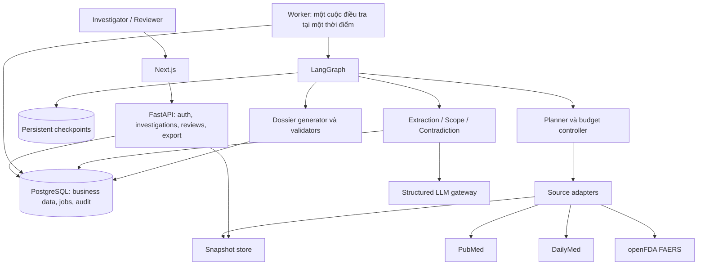

# Kế hoạch triển khai chi tiết toàn bộ dự án

**Đề tài:** AI Agent chủ động điều tra và kiểm chứng nhận định an toàn thuốc bằng chiến lược truy xuất bằng chứng thích ứng.

**Mục tiêu:** Xây dựng một ứng dụng nghiên cứu chạy được từ đầu đến cuối: tiếp nhận nhận định, điều tra bằng chứng, kiểm tra phạm vi và mâu thuẫn, giải thích khi chưa thể kết luận, cho chuyên viên duyệt và xuất hồ sơ có nguồn gốc kiểm tra được.

**Nhóm thực hiện:** 4 người, giữ phân công đã thống nhất. Kế hoạch sắp theo phụ thuộc và đầu ra, không có lịch, thời lượng công việc hoặc hạn hoàn thành.

**Kiến trúc:** Next.js → FastAPI → LangGraph và các dịch vụ nghiệp vụ → PubMed, DailyMed, openFDA FAERS. PostgreSQL giữ dữ liệu, phiên bản, hàng công việc và checkpoint. Một worker riêng thực hiện điều tra; API tiếp nhận yêu cầu và trả tiến trình.

**Công nghệ:** Tận dụng Python 3.11, FastAPI, Pydantic, LangGraph, HTTPX, pytest, Ruff và Docker của repository; bổ sung PostgreSQL, SQLAlchemy/Alembic, driver PostgreSQL, checkpointer bền vững, Next.js/TypeScript và kiểm thử giao diện.

**Nguồn yêu cầu:** [Đặc tả đề tài](spec/SPEC_AI_AGENT_DIEU_TRA_AN_TOAN_THUOC.md) · [Kế hoạch triển khai MVP](superpowers/plans/2026-09-30-ke-hoach-trien-khai-mvp-an-toan-thuoc.md).

Tài liệu này chi tiết hóa kế hoạch tổng quan thành các hạng mục **P01–P29**. Những đường dẫn, model, hàm, script và lệnh kiểm tra được đề xuất dưới đây là đầu ra cần triển khai; không có nghĩa chúng đã tồn tại hoặc đã chạy đạt. Khi dùng trợ lý lập trình thực hiện kế hoạch, áp dụng quy trình `superpowers:executing-plans` theo từng hạng mục và kiểm tra đầu ra trước khi chuyển tiếp.

## Mục lục

1. Kết quả cần đạt và phạm vi.
2. Hiện trạng và các quyết định kỹ thuật.
3. Chuẩn bị tài nguyên, môi trường và cấu hình.
4. Phân công bốn người và quyền sở hữu mã nguồn.
5. Kiến trúc, cấu trúc thư mục và luồng dữ liệu.
6. Mô hình dữ liệu và database.
7. Hợp đồng giữa các mô-đun.
8. Đặc tả truy xuất ba nguồn dữ liệu.
9. Phân tích bằng chứng và chính sách kết luận.
10. Workflow, ngân sách, checkpoint và phê duyệt.
11. API, phân quyền và xử lý lỗi.
12. Giao diện và nội dung hồ sơ.
13. Chi tiết công việc P01–P29.
14. Thứ tự ghép và công việc song song.
15. Kiểm thử, benchmark và cách đo.
16. Triển khai, quan sát, phục hồi và chi phí.
17. Nghiệm thu, bàn giao và xử lý giới hạn.
18. Đối chiếu yêu cầu và tài liệu kỹ thuật.

## 1. Kết quả cần đạt và phạm vi

### 1.1. Luồng sử dụng hoàn chỉnh

1. Investigator đăng nhập và nhập một claim về một cặp thuốc–biến cố.
2. Hệ thống kiểm tra thông tin bắt buộc, chuẩn hóa hoạt chất/biến cố, ghi các trường chưa rõ.
3. Nếu claim mơ hồ, chuyên viên xác nhận cách hiểu trước khi tiếp tục.
4. Agent tạo evidence checklist, chọn nguồn, tìm kiếm và lưu tài liệu có phiên bản.
5. Agent trích evidence, kiểm tra khả năng áp dụng, nhận diện mâu thuẫn và xác định gaps.
6. Agent thay đổi truy vấn hoặc nguồn khi kết quả mới yêu cầu điều đó.
7. Agent dừng theo điều kiện rõ ràng, tạo đề xuất đánh giá hoặc trả lý do chưa thể kết luận.
8. Reviewer xem nguồn, sửa hoặc loại evidence, yêu cầu tìm thêm, xác nhận đánh giá và duyệt hồ sơ.
9. Người có quyền tải hồ sơ Markdown đúng phiên bản đã duyệt và mở lại nhật ký điều tra.

### 1.2. Phạm vi bắt buộc của MVP

| Nhóm | Yêu cầu |
|---|---|
| Claim | Một thuốc/hoạt chất và một adverse event; thêm quần thể, chỉ định, liều, đường dùng, thời gian tiếp xúc khi có |
| Nguồn | PubMed, DailyMed, openFDA FAERS; tiếng Anh |
| Điều tra | Nhiều truy vấn, chọn nguồn theo gaps, tìm bằng chứng phản bác, replanning có lý do |
| Phân tích | Normalization, extraction, scope, contradiction, chất lượng evidence và nghi trùng FAERS cơ bản |
| Điều khiển | Tối đa 20 bước truy xuất và 100 tài liệu duy nhất; giới hạn request và LLM riêng |
| Reviewer | Xem/sửa evidence, xác nhận claim, duyệt đánh giá, yêu cầu tìm thêm, duyệt hồ sơ |
| Kết quả | Hồ sơ có citation, gaps, limitations, abstention reason, reviewer decision và audit trail |
| Đánh giá | 20–30 claim, keyword baseline, single-shot RAG, bộ đo và phân tích lỗi |
| Bàn giao | Web app, mã nguồn, môi trường chạy tái lập, tài liệu, demo, báo cáo đánh giá |

### 1.3. Giới hạn và quy tắc xuyên suốt

- Không tự kết luận `causal` hoặc `not_causal`; không suy ra incidence từ FAERS.
- Không xem số báo cáo cao, không tìm thấy tài liệu, hoặc kết quả không có ý nghĩa thống kê là bằng chứng nhân quả/phản bác trực tiếp.
- Không nhập dữ liệu bệnh nhân bí mật; chỉ dùng tài liệu công khai phù hợp quyền sử dụng hoặc dữ liệu tổng hợp có nhãn.
- Mọi phát biểu thực tế trong hồ sơ liên kết tới evidence đã truy xuất; giữ riêng sự kiện, suy luận và giả thuyết.
- Mọi cuộc điều tra có audit log; mọi hồ sơ chính thức có người duyệt và phiên bản đã duyệt.
- Nguồn lỗi khác với kết quả rỗng; phạm vi chưa rõ khác với phạm vi phù hợp.
- Tài liệu nguồn không được điều khiển agent, chọn URL tùy ý, thay đổi quyền hoặc sửa policy.
- ClinicalTrials.gov, kết nối EMA/FDA regulatory trực tiếp, PDF export, MedDRA đầy đủ, SSO, vector database và hệ thống doanh nghiệp là phần mở rộng, không phải điều kiện hoàn thành MVP.
- Bộ từ điển nhỏ phải ghi nguồn; không đưa dữ liệu có giấy phép hạn chế vào repository khi chưa có quyền.

## 2. Hiện trạng và các quyết định kỹ thuật

### 2.1. Những gì đang có

| Thành phần | Hiện trạng quan sát được | Công việc tiếp theo |
|---|---|---|
| Backend | FastAPI, `/api/v1/chat`, `/api/v1/status`, `/health` | Thêm API nghiệp vụ và auth; thay luồng chat mẫu khỏi luồng sản phẩm |
| Agent | Graph hai node mẫu; state cho query/context/response | Thiết kế state điều tra, graph nhiều bước, checkpoint và ngân sách |
| LLM | Factory tạo client; model và temperature lấy từ settings | Tách giao tiếp có kiểu, mock, giới hạn gọi và version prompt/model |
| Database | Settings mặc định SQLite; chưa có schema nghiệp vụ | Chuyển cấu hình mục tiêu sang PostgreSQL, thêm migration và repository |
| Test | Test mẫu; có mock LLM nhưng chưa được nối vào mọi luồng gọi | Inject dependencies và bảo đảm test mặc định không gọi mạng |
| Frontend | Chưa có ứng dụng nghiệp vụ | Tạo Next.js và các màn hình investigator/reviewer |
| CI/Docker | Lint, pytest, container backend | Thêm database, worker, frontend, migration, build và kiểm tra tích hợp |
| Tài liệu | Đề tài, kế hoạch tổng quan, quy tắc phối hợp | Hoàn thiện hợp đồng API, policy, runbook, annotation guide và báo cáo |

Không đánh giá khung mẫu là đã đáp ứng chức năng chỉ vì có thư mục tương ứng. Không thay đổi cơ chế AI usage logging hoặc tài liệu `docs/guide/` khi triển khai nghiệp vụ.

### 2.2. Các quyết định dùng để triển khai

| Quyết định | Lựa chọn mặc định | Lý do và điều kiện thay đổi |
|---|---|---|
| Đơn vị sản phẩm | Ứng dụng một tổ chức, tài khoản được cấp sẵn | Đủ cho nhóm nghiên cứu; chưa làm đăng ký tự do hoặc đa tenant |
| Agent | LangGraph với node có trách nhiệm rõ | Tận dụng template, hỗ trợ dừng/tiếp tục và kiểm thử state |
| Chạy nền | Một worker, hàng công việc bền vững trong PostgreSQL | API không bị giữ bởi cuộc điều tra; chưa cần Redis/Celery |
| Lưu trữ | PostgreSQL và volume lưu snapshot | Truy vấn, version, audit và phục hồi; object storage là bước mở rộng |
| Truy xuất baseline | Corpus đóng băng, BM25, top-k evidence | Tách được chất lượng retrieval khỏi synthesis; chưa cần embedding/vector store |
| Giao diện | Next.js/TypeScript, polling tiến trình | Phù hợp bảng evidence, màn hình review; SSE có thể bổ sung sau |
| Xác thực | Tài khoản seed, mật khẩu băm, session cookie phía server | Có định danh reviewer; không có mật khẩu/khóa cố định trong mã nguồn |
| Phê duyệt | Tách approval claim, assessment và dossier | Duyệt một điểm kiểm tra không tự duyệt các đầu ra phát sinh sau đó |
| Dependency | Khóa phiên bản sau kiểm tra tương thích | Không suy rằng các ràng buộc `>=` hiện tại đã bảo đảm mọi API cần dùng |
| Chế độ dữ liệu | `fixture`, `live`, `replay` tách rõ | Demo/test không phụ thuộc mạng; replay không lẫn dữ liệu mới vào benchmark |

Cách chạy worker là phần cụ thể hóa runner trong bản tổng quan: bổ sung tiến trình thực thi riêng nhưng vẫn dùng chung PostgreSQL, không bổ sung dịch vụ hàng đợi bên ngoài.

## 3. Chuẩn bị tài nguyên, môi trường và cấu hình

### 3.1. Tài nguyên cần có trước khi chạy thật

- [ ] Repository chung và quyền tạo nhánh/pull request cho bốn người.
- [ ] Python 3.11, môi trường ảo, Git; Node.js bản tương thích với Next.js được chọn; Docker Compose cho luồng chạy chuẩn.
- [ ] Khóa LLM và model có hỗ trợ đầu ra có cấu trúc; Người 2 kiểm tra bằng một request tối thiểu trước khi khóa cấu hình.
- [ ] Thông tin liên hệ của ứng dụng khi gọi NCBI; khóa NCBI/openFDA nếu nhóm sử dụng, lưu ngoài repository.
- [ ] PostgreSQL cho phát triển, kiểm thử tích hợp và môi trường demo; không dùng chung database giữa test và demo.
- [ ] Tài khoản investigator, reviewer và admin của nhóm; cấp thông tin đăng nhập qua kênh riêng.
- [ ] Hai người có chuyên môn để gán nhãn độc lập và một người phân xử khi bất đồng; đây là vai trò kiểm chứng, không thay đổi số thành viên phát triển.
- [ ] Danh mục tài liệu được phép lưu, bộ claim ban đầu và các nguồn gold evidence.
- [ ] Môi trường demo có volume bền vững, HTTPS nếu truy cập từ bên ngoài và nơi lưu backup.

Nếu chưa có khóa hoặc reviewer, có thể làm các phần độc lập bằng fixture; chỉ nghiệm thu live hoặc đánh giá chuyên môn khi điều kiện tương ứng đã được đáp ứng.

### 3.2. Cấu hình phải được quản lý

| Biến cấu hình | Mục đích | Yêu cầu |
|---|---|---|
| `APP_ENV`, `LOG_LEVEL` | Môi trường và log | Phân biệt development/test/production |
| `DATABASE_URL` | Database nghiệp vụ | Secret; database test riêng |
| `CHECKPOINT_DATABASE_URL` | Checkpointer LangGraph | Có thể cùng máy DB nhưng schema/tables riêng |
| `OPENAI_API_KEY`, `MODEL_NAME` | Provider hiện có và model | Chỉ backend/worker đọc; ghi model thực dùng vào run metadata |
| `LLM_TEMPERATURE` | Độ ngẫu nhiên | Đề xuất 0 nếu model hỗ trợ; ghi rõ nếu tham số bị provider bỏ qua |
| `NCBI_API_KEY`, `NCBI_EMAIL`, `NCBI_TOOL` | Nhận diện và quota NCBI | Key tùy chọn; không log URL chứa key |
| `OPENFDA_API_KEY` | Quota openFDA | Key tùy chọn; không gửi ra frontend |
| `SOURCE_MODE`, `SNAPSHOT_ROOT` | Live/fixture/replay và kho snapshot | Replay đọc manifest đã đóng băng |
| `MAX_AGENT_STEPS`, `MAX_DOCUMENTS` | Trần nghiệp vụ | Lần lượt 20 và 100; request chỉ được giảm |
| `MAX_SOURCE_REQUESTS`, `MAX_LLM_CALLS` | Trần chi phí thực | Đề xuất 200 request nguồn và 120 lần LLM/run; mọi retry đều tính |
| `MAX_LLM_INPUT_TOKENS`, `MAX_LLM_OUTPUT_TOKENS` | Trần tổng token/run | Đề xuất 300.000 và 40.000; dành phần dự phòng tổng hợp theo mục 10 |
| `CORS_ORIGINS`, `SESSION_COOKIE_SECURE` | Frontend và cookie | Origin cụ thể; Secure bật khi HTTPS |
| `SNAPSHOT_MAX_BYTES`, `MAX_CHUNKS_PER_DOCUMENT` | Giới hạn nội dung | Đề xuất 10 MiB/tài liệu và 12 chunk; phần chưa đọc phải có cảnh báo |

Các mức request/token/bytes là quyết định kỹ thuật đề xuất để kiểm thử, không phải quota của nhà cung cấp. Quota nguồn thấp hơn luôn được ưu tiên. Timeout, TTL và thời gian đo trải nghiệm là tham số kỹ thuật, không phải lịch triển khai dự án.

## 4. Phân công bốn người và quyền sở hữu mã nguồn

| Người | Trách nhiệm chính | Chủ trì hạng mục | Phần phối hợp |
|---|---|---|---|
| Người 1 | Nguồn, database, provenance, môi trường và vận hành | P02, P03, P05–P09, P28 | Worker với Người 2; dữ liệu benchmark với Người 3/4 |
| Người 2 | Hợp đồng, worker, LLM gateway, agent, auth, API và tích hợp | P01, P04, P11, P16–P20, P27 | Các node phân tích với Người 3; API với Người 4 |
| Người 3 | Normalization, evidence, scope, contradiction, dossier và gold dataset | P10, P12–P15, P21, P25 | Annotation và metric với Người 4; policy với Người 2 |
| Người 4 | Frontend, baseline, evaluation, tài liệu và demo | P22–P24, P26, P29 | Tài liệu vận hành với Người 1; integration với Người 2 |

Số hạng mục không đại diện cho khối lượng bằng nhau: frontend và evaluation gồm nhiều đầu ra. Người 4 bắt đầu UI bằng fixture; Người 3 chuẩn bị annotation sớm; Người 1 hỗ trợ tạo corpus, Người 2 hỗ trợ bộ chạy đánh giá.

Quyền sở hữu tệp chung:

- Người 2: `src/models/schemas.py`, public schema, `docs/contracts.md`, graph/state, API routing.
- Người 1: cấu hình môi trường, manifest/lock backend, database migration, Docker và CI.
- Người 3: evidence rubric, policy nội dung, từ điển, prompt phân tích và template dossier.
- Người 4: frontend manifest/lock, client types được sinh, báo cáo tổng hợp và tài liệu demo.
- Mọi thay đổi giao tiếp phải có PR nhỏ, ghi người tiêu thụ bị ảnh hưởng và kiểm thử hợp đồng; áp dụng quy tắc phối hợp và quy trình Git ở mục 14.

## 5. Kiến trúc, cấu trúc thư mục và luồng dữ liệu

### 5.1. Kiến trúc mục tiêu



API không chạy một job chỉ trong bộ nhớ rồi trả thành công. Tạo investigation và job trong cùng transaction; worker nhận job từ database. UI đọc tiến trình đã lưu nên refresh trang không làm mất cuộc điều tra.

### 5.2. Bản đồ tệp dự kiến

```text
src/
  config.py, main.py, worker.py
  api/
    routes.py, auth.py, investigations.py, evidence.py, reviews.py, exports.py
  models/
    schemas.py              # public re-exports, không gom mọi model vào một tệp lớn
    claims.py, sources.py, evidence.py, investigations.py, reviews.py, dossiers.py
    database.py             # ORM models hoặc re-exports nếu cần tách tiếp
  agents/
    graph.py, state.py
    nodes/
      normalize.py, plan.py, retrieve.py, extract.py, assess.py
      stop_or_continue.py, human_review.py, dossier.py
    tools/source_tools.py
  services/
    llm.py, auth.py
    storage/database.py, repositories.py, snapshots.py
    sources/base.py, transport.py, cache.py, pubmed.py, dailymed.py, faers.py
    evidence/normalizer.py, parser.py, extractor.py, grading.py
    evidence/scope.py, contradictions.py, duplicates.py, citations.py
    investigation/jobs.py, runner.py, planner.py, budget.py, stopping.py, review.py
    dossier/generator.py, validator.py, markdown_export.py
  prompts/
    normalize.md, extract.md, plan.md, contradiction.md, dossier.md, manifest.json
frontend/
  app/login/page.tsx
  app/investigations/page.tsx
  app/investigations/new/page.tsx
  app/investigations/[id]/page.tsx
  components/claims/, timeline/, evidence/, reviews/, dossier/
  lib/api.ts, generated/api-types.ts
  tests/, e2e/
migrations/
data/
  dictionaries/, templates/, demo/
  benchmark/claims.jsonl, annotations.jsonl, splits.json, corpus_manifest.json
  snapshots/                # nội dung chạy thật, bỏ qua bởi Git
tests/
  fixtures/, test_models/, test_storage/, test_sources/, test_evidence/
  test_agents/, test_api/, test_dossier/, test_security/, test_integration/, test_eval/
eval/
  baselines/keyword.py, single_shot_rag.py
  run_evaluation.py, metrics.py, results/, report.md
scripts/
  seed_users.py, seed_demo.py, export_openapi.py, smoke_sources.py
docs/
  contracts.md, safety_policy.md, annotation_guidelines.md
  runbook.md, demo_scenarios.md, decisions/
```

`src/services/storage/` thay cho một `storage.py` lớn trong bản tổng quan. `citations.py` là tên thống nhất cho bộ kiểm tra citation. Dùng các đường dẫn của tài liệu chi tiết này khi bắt đầu triển khai; không tạo đồng thời hai bản mô-đun cùng trách nhiệm.

### 5.3. Chuỗi nguồn gốc phải giữ được

`Dossier statement → EvidenceUnit version → quoted span → parsed document hash → raw snapshot hash/source version → SearchAction → Investigation/claim version`.

Một tài liệu được tìm thấy nhiều lần chỉ có một bản tương ứng cùng nội dung/phiên bản; vẫn giữ tất cả liên kết tới các truy vấn đã tìm ra nó. Bản nguồn thay đổi tạo version mới, không ghi đè version đã dùng cho hồ sơ.

## 6. Mô hình dữ liệu và database

### 6.1. Quy ước chung

- ID nghiệp vụ dùng UUID; ngày nguồn có thể thiếu hoặc chỉ chính xác tới tháng/năm, phải lưu `date_precision`.
- Timestamp hệ thống lưu UTC có timezone; UI hiển thị theo người dùng. `investigation_cutoff_date` là giới hạn dữ liệu, không phải ngày kết thúc dự án.
- Public schema dùng Pydantic, cấm field thừa ở request và validate enum/giới hạn.
- Văn bản người dùng được giữ nguyên trong bản gốc; bản chuẩn hóa có version và nguồn ánh xạ.
- Mọi thao tác sửa dùng `expected_version`; cập nhật sai version trả conflict, không ghi đè âm thầm.
- `null` nghĩa là chưa biết; không dùng chuỗi rỗng/0 để giả lập thông tin không có.

### 6.2. Đối tượng và trường bắt buộc

| Model | Trường và quy tắc |
|---|---|
| `ClaimInput` | `claim_text: str` 1–5.000 ký tự; `drug: str`, `event: str` 1–200; `population`, `dose`, `route`, `indication`, `time_window` tùy chọn; `investigation_cutoff_date: date | null` |
| `NormalizedClaim` | `claim_id`, `version`, original input, active ingredient candidates, event terms, scope fields, `unknown_fields`, `ambiguities`, dictionary version, `requires_review` |
| `InvestigationConfig` | `allowed_sources` không rỗng thuộc `pubmed/dailymed/faers`; `max_steps` 1–20; `max_documents` 1–100; mode; required checks; budgets lấy từ server |
| `SearchAction` | `action_id`, `gap_id`, source, query/filters, rationale ngắn, `query_fingerprint`, `limit`, claim version; URL do adapter tạo |
| `SourceDocument` | `document_id`, source, source ID, source version, URL, title, published/available/retrieved dates, date precision, content hash, raw reference, parsed text, content level, parser version, access/license status |
| `SourceSearchResult` | action ID, `status: success/empty/partial/error`, documents, request count, warnings, typed errors, source snapshot metadata, next cursor nếu còn |
| `EvidenceUnit` | evidence ID/version, claim version, document ID/version, `stance: support/contradict/uncertain/background`, population/exposure/comparator/event/time/outcome, result, limitations, quote, locator, content hash, scope, quality, exclusion state |
| `ScopeAssessment` | từng field có `matched/mismatched/unknown`, lý do và mức ảnh hưởng; `eligible_as_direct_evidence: bool` |
| `ContradictionPair` | evidence IDs/versions, `direct/apparent/methodological`, khác biệt theo field, lời giải thích, review required/resolution |
| `DuplicateCandidate` | report IDs, matching fields, conflicting fields, method version, reviewer decision; không xóa report |
| `EvidenceGap` | gap ID, evidence type/scope field, severity, status, attempted actions, reason; checked-empty khác covered |
| `BudgetState` | counters used/reserved/limits cho steps, documents, source requests, LLM calls, input/output tokens; reason khi từ chối reserve |
| `ReviewDecision` | checkpoint ID, review kind, action, expected content version, changes, reason, reviewer ID lấy từ session, created timestamp |
| `Dossier` | ID/version, claim/evidence/policy versions, assessment, typed statements với evidence refs, search strategy, gaps, limitations, duplicate candidates, citations, reviewer decision, audit ref, content hash |

`ReviewDecision.reviewer_id` do server xác định, không tin giá trị client gửi. Quality dùng rubric giải thích được; không hiển thị xác suất tin cậy nếu chưa có dữ liệu hiệu chỉnh.

### 6.3. Trạng thái

| Trường | Giá trị |
|---|---|
| `run_status` | `queued`, `running`, `waiting_for_review`, `completed`, `failed`, `cancelled` |
| `assessment_status` | `supported_for_scope`, `contradicted_for_scope`, `insufficient_evidence`, `scope_mismatch`, `out_of_scope`, `requires_human_review`, hoặc `null` |
| `proposed_assessment_status` | Đề xuất nội bộ chờ reviewer; không trình bày như đánh giá đã duyệt |
| `review_status` | `pending`, `approved`, `rejected`, `changes_requested` |
| `review_kind` | `normalization`, `assessment`, `dossier` |

`completed` không đồng nghĩa `approved`. `cancelled` là người dùng dừng chạy, không phải kết luận về bằng chứng. `failed` dành cho lỗi hệ thống ngăn tạo kết quả hợp lệ; thiếu evidence là kết quả nghiệp vụ, không phải lỗi 500.

### 6.4. Các bảng và ràng buộc

| Bảng | Nội dung | Ràng buộc quan trọng |
|---|---|---|
| `users`, `sessions` | Identity, role, password hash, session token hash | Username duy nhất; session thu hồi được; không lưu token thô |
| `investigations` | Chủ sở hữu, config, trạng thái, version hiện hành | Khóa ngoại user; optimistic version |
| `investigation_members` | Người được chia sẻ và quyền trên investigation | Unique investigation/user; quyền không vượt role được cấp |
| `claim_versions` | Input và normalized claim theo phiên bản | Unique investigation/version; bản cũ bất biến |
| `jobs` | Tạo/resume/recover, trạng thái, khóa xử lý, payload | Tối đa một job active/investigation; request idempotency |
| `search_actions`, `tool_calls` | Query, kết quả, retries, ngân sách | Action ID ổn định; request ID riêng; không chứa secret |
| `documents`, `document_versions` | Định danh nguồn và nội dung | Unique source/source ID; version theo hash và source version |
| `investigation_documents` | Tài liệu nào thuộc cuộc điều tra và query nào | Không lặp cùng version; lưu provenance nhiều query |
| `evidence_versions` | Evidence có cấu trúc và span | Trỏ đúng document version và claim version |
| `contradictions`, `duplicate_candidates`, `evidence_gaps` | Quan hệ và thiếu sót | Hai evidence cùng investigation; không tự tham chiếu |
| `review_checkpoints`, `review_decisions` | Điểm chờ và hành động reviewer | Decision gắn đúng checkpoint/content version; không sửa lịch sử |
| `dossier_versions`, `exports` | Nội dung, hash, approval, file xuất | Export trỏ đúng version đã duyệt |
| `audit_events`, `budget_reservations` | Nhật ký và bộ đếm bền vững | Append-only qua quyền ứng dụng; operation key duy nhất |
| Tables checkpointer | State LangGraph | Do package checkpointer quản lý, tách khỏi schema nghiệp vụ |

Index theo investigation ID, status, source ID và thứ tự audit event. Truy vấn danh sách dùng pagination; không tải toàn bộ evidence/snapshot vào mọi response. Thử migration từ DB rỗng và từ phiên bản trước; backup trước thay đổi schema không tương thích.

## 7. Hợp đồng giữa các mô-đun

Các kiểu dưới đây được định nghĩa trong các model ở mục 6; kết quả phụ nằm cùng mô-đun chủ sở hữu, có field cụ thể như mô tả.

| Chủ sở hữu | Giao tiếp dự kiến | Hành vi |
|---|---|---|
| Người 1 | `SourceAdapter.search(action: SearchAction, budget: BudgetHandle) -> SourceSearchResult` bất đồng bộ | Adapter chỉ lấy dữ liệu; không quyết định stance/kết luận |
| Người 1 | `SnapshotStore.save(document: SourceDocument, raw: bytes) -> SourceDocument` | Trả document có raw ref/hash, kiểm tra quyền lưu và kích thước |
| Người 1 | `parse_document(document: SourceDocument) -> ParsedDocument` | Text/sections/locators/parser version/warnings; không tự sinh nội dung |
| Người 3 | `normalize_claim(claim: ClaimInput) -> NormalizedClaim` bất đồng bộ | Giữ ambiguities và unknowns |
| Người 3 | `extract_evidence(doc: ParsedDocument, claim: NormalizedClaim) -> list[EvidenceUnit]` bất đồng bộ | Span và scope phải có nguồn |
| Người 3 | `match_scope(evidence: EvidenceUnit, claim: NormalizedClaim) -> ScopeAssessment` | Quy tắc theo field, output giải thích được |
| Người 3 | `analyze_contradictions(evidence: list[EvidenceUnit]) -> list[ContradictionPair]` bất đồng bộ | Lọc cặp tương đương trước khi phân tích |
| Người 3 | `find_duplicate_candidates(documents: list[SourceDocument]) -> list[DuplicateCandidate]` | Đề xuất nghi trùng, giữ tất cả bản gốc |
| Người 2 | `choose_next_action(state: InvestigationState) -> PlannerDecision` | `action`, `stop` hoặc `review`, kèm reason/gap ID |
| Người 2 | `reserve_budget(inv_id, operation_key, requested: BudgetDelta) -> BudgetReservation` | Reserve atomically; operation key lặp không tăng bộ đếm lần nữa |
| Người 2 | `evaluate_stop(state: InvestigationState) -> StopDecision` | Continue/abstain/review/dossier, reason và missing requirements |
| Người 2 | `apply_review(inv_id, actor: User, decision: ReviewDecision) -> ReviewResult` | Validate quyền/version/checkpoint, ghi event, tạo job nếu cần |
| Người 3 | `build_dossier(state: InvestigationState) -> Dossier` bất đồng bộ | Chỉ dùng evidence refs có trong investigation |
| Người 3 | `validate_dossier(dossier: Dossier) -> ValidationReport` | Errors/warnings/statement IDs; errors chặn phê duyệt và export |
| Người 4 | `run_evaluation(config: EvaluationConfig) -> EvaluationReport` | Manifest, metric từng claim, tổng hợp, lỗi và chi phí |

`BudgetHandle` chỉ cho adapter/gateway reserve và ghi tiêu thụ; không cho tự sửa limits. `BudgetDelta` chứa các bộ đếm số nguyên không âm. `PlannerDecision`, `StopDecision`, `ReviewResult`, `ValidationReport` phải là Pydantic model, không dùng text tự do để điều hướng workflow.

## 8. Đặc tả truy xuất ba nguồn dữ liệu

### 8.1. Hành vi chung

- Adapter nhận trường có kiểu; tự escape/query encode. Domain và endpoint nằm trong allowlist, không nhận URL do LLM hoặc tài liệu nguồn tự chọn.
- Một lượt truy xuất có giới hạn số documents; dừng phân trang khi đủ kết quả/ngân sách.
- Retry timeout/429/5xx tối đa hai lần sau lần đầu, có backoff và tôn trọng `Retry-After`; không retry lỗi request không hợp lệ.
- Mỗi request thật, kể cả retry, reserve ngân sách trước khi gửi. Cache hit ghi provenance và không tính là request mạng mới.
- Cache key gồm nguồn, query/filters, giới hạn, cutoff và phiên bản adapter; snapshot dùng cho một run không bị thay khi cache live cập nhật.
- `empty` chỉ khi request thành công và nguồn xác nhận không có kết quả; lỗi một phần trả `partial` cùng lý do.
- Parser giới hạn dung lượng/nesting; XML tắt external entities; ZIP kiểm tra đường dẫn, số file và kích thước giải nén.

### 8.2. PubMed

Luồng dự kiến: `esearch.fcgi` với `db=pubmed` để lấy PMID, sau đó `efetch.fcgi` lấy record XML theo lô. Lưu query translation, PMID, title, abstract, publication type, DOI nếu có, ngày và khả năng truy cập. PubMed record không đồng nghĩa đã đọc full text. [Tài liệu NLM](https://www.nlm.nih.gov/dataguide/eutilities/utilities.html).

Giới hạn request phải tính chung theo IP/key: mặc định không vượt 3 request/giây khi không có API key, 10 khi có key thông thường; cấu hình bảo thủ hơn nếu nhiều người chung kết nối. [Hướng dẫn NCBI](https://support.nlm.nih.gov/kbArticle/?pn=KA-05510).

Kiểm tra: abstract thiếu; structured abstract nhiều phần; nhiều PMID trùng; DOI không có; query ký tự đặc biệt; publication date thiếu chính xác; tài liệu nằm ngoài cutoff. Chỉ lưu nội dung được phép; full text ngoài PubMed không tự động được tải trong MVP.

### 8.3. DailyMed

Tìm SPL bằng `/spls`, đọc nội dung theo SETID và giữ phiên bản. Khi dùng cutoff, tra `/spls/{SETID}/history` rồi lấy đúng bản nhãn qua cơ chế tải phiên bản lịch sử. DailyMed cung cấp API lịch sử và URL tải ZIP theo SETID/version. [DailyMed Web Services](https://dailymed.nlm.nih.gov/dailymed/app-support-web-services.cfm).

Parser giữ section code/title và đoạn cảnh báo, adverse reactions, contraindications phù hợp. Nhiều sản phẩm/đường dùng cùng hoạt chất phải giữ riêng scope. Nếu không xác minh được bản nhãn tồn tại trước cutoff, đánh dấu `historical_version_unavailable`, không thay bằng nhãn hiện tại.

Kiểm tra: nhiều nhãn cho cùng tên, nhãn archived, thiếu section, XML lỗi, file quá lớn và version lịch sử không lấy được.

### 8.4. openFDA FAERS

Endpoint adapter dùng `https://api.fda.gov/drug/event.json`; query theo trường thuốc và `patient.reaction.reactionmeddrapt`, giới hạn kết quả theo ngân sách ứng dụng. [Hướng dẫn endpoint](https://open.fda.gov/apis/drug/event/how-to-use-the-endpoint/), [cú pháp query](https://open.fda.gov/apis/query-syntax/).

Lưu `safetyreportid`, `safetyreportversion`, ngày nguồn, thuốc, reactions và các trường scope có thật. Có fallback tìm tên gốc khi thiếu harmonized fields. Kiểm tra từng phần tử drug trong record để tránh ghép tên thuốc của phần tử này với liều/route của phần tử khác.

Một report có thể chứa nhiều thuốc và nhiều reactions, không thể mặc định nối mỗi thuốc với mỗi reaction thành quan hệ xác định. Không dùng số báo cáo làm incidence hoặc kết luận nhân quả. [Giới hạn FAERS](https://open.fda.gov/apis/drug/event/).

Tài liệu trường cho biết openFDA chỉ hiển thị phiên bản report mới nhất; lưu version và snapshot quan sát được, không hứa tái dựng đủ chuỗi follow-up lịch sử từ API hiện tại. Bộ retrospective chỉ dùng snapshot có provenance phù hợp. [Tham chiếu trường FAERS](https://open.fda.gov/fields/drugevent_reference.pdf).

Kiểm tra: thiếu `openfda`, multi-drug/multi-reaction, dữ liệu tuổi/giới/route thiếu, phiên bản trùng, ghi chú follow-up và không có kết quả.

### 8.5. Quy tắc cutoff và độ bao phủ

`published_at`, `available_at`, `retrieved_at` có ý nghĩa khác nhau. Chỉ lọc publication date chưa chứng minh hệ thống có thể truy cập đúng nội dung vào thời điểm lịch sử. Khi không xác minh được availability/version, ghi hạn chế hoặc loại khỏi phép đo retrospective. LLM vẫn có thể có tri thức sau cutoff trong dữ liệu huấn luyện; đánh giá lịch sử chỉ kiểm soát evidence cung cấp, không tuyên bố loại bỏ hoàn toàn rò rỉ tri thức mô hình.

Không mở được full text, section bị cắt vì giới hạn, hoặc nguồn bị lỗi đều tạo gap/limitation. Không ghi “đã kiểm tra đầy đủ” khi chỉ đọc abstract hoặc một phần nhãn.

## 9. Phân tích bằng chứng và chính sách kết luận

### 9.1. Chuẩn hóa và extraction

- Giữ brand và active ingredient riêng; nhiều ứng viên hợp lý tạo checkpoint, không chọn tùy ý.
- Synonym có provenance; không tự nhận đã thực hiện MedDRA coding chuẩn từ dictionary nhỏ.
- Tách record thành section/chunk có offset ổn định; mặc định chunk khoảng 1.500 token, overlap 150, tối đa 12 chunk/tài liệu. Ghi rõ phần chưa xử lý khi bị giới hạn.
- Extract output theo schema: exposure, population, event, comparator, result, limitations và quote. Numeric effect phải giữ loại thước đo, giá trị và khoảng tin cậy nếu nguồn có.
- Kiểm tra quote/locator trên parsed text có hash cố định; không xác nhận citation chỉ vì URL tồn tại.
- LLM output sai schema được sửa tối đa một lần; tiếp tục sai thì gắn extraction failure và evidence gap.

### 9.2. Scope và contradiction

- So khớp từng trường: ingredient, formulation, dose, route, population, indication, concomitant medication, event definition, severity, time window, outcome.
- Mismatch về thuốc/event/route rõ ràng loại khỏi bằng chứng trực tiếp; evidence vẫn được lưu để reviewer biết vì sao không dùng.
- Trường quan trọng chưa rõ giữ `unknown`, không cộng điểm như matched.
- Chỉ tạo candidate contradiction khi cùng mục tiêu so sánh và scope đủ tương đương. Phân biệt khác population, comparator, độ chính xác ước lượng và study design.
- Kết quả không có ý nghĩa thống kê với khoảng tin cậy rộng là `uncertain`; không tự xem là bằng chứng “không có nguy cơ”.
- Reviewer có thể override classification, nhưng phải ghi lý do và tạo version mới.

### 9.3. Chất lượng và nghi trùng

Rubric gồm thiết kế nghiên cứu, liên quan trực tiếp, đầy đủ nội dung, độ chính xác kết quả và hạn chế. Hiển thị lý do thay vì một điểm số gây cảm giác chính xác giả. FAERS chỉ là loại bằng chứng báo cáo tự phát, không đủ một mình để kết luận supported/contradicted.

Phân biệt trùng kỹ thuật cùng source/version/hash với hai report nghi cùng một case. Trùng kỹ thuật không tính lại document budget; nghi trùng case vẫn lưu nguyên bản, gắn candidate và chỉ thay cách trình bày đếm theo quy tắc đã công bố.

### 9.4. Bảng quyết định assessment

| Điều kiện | Kết quả hoặc điểm chờ |
|---|---|
| Input thiếu drug/event tối thiểu | API báo validation; UI yêu cầu bổ sung |
| Nhận định ngoài phạm vi sau normalization | `out_of_scope` và lý do |
| Nhiều cách hiểu ảnh hưởng search | `requires_human_review`, checkpoint normalization |
| Evidence trực tiếp chỉ khác scope nghiêm trọng | `scope_mismatch`, nêu phạm vi thực sự có evidence |
| Ít evidence, nguồn thiết yếu lỗi, ngân sách hết trước đủ điều kiện | `insufficient_evidence`, gaps và next actions |
| Mâu thuẫn quan trọng chưa giải quyết | `requires_human_review`, không ép majority vote |
| Có evidence phù hợp ủng hộ và các kiểm tra bắt buộc đủ | Đề xuất `supported_for_scope`, chờ assessment review trước khi công bố |
| Có evidence phù hợp phản bác claim cụ thể | Đề xuất `contradicted_for_scope`, chờ assessment review; không biến thành “thuốc an toàn” |

Chặn unsupported statements cả ở generator và export. Việc dẫn lại một câu trong tài liệu nói về causality phải được phân biệt với kết luận tự động của hệ thống; không dùng một bộ lọc từ khóa đơn lẻ làm toàn bộ guardrail.

## 10. Workflow, ngân sách, checkpoint và phê duyệt

### 10.1. Các node và nhánh

`validate → normalize → normalization_review nếu cần → checklist → plan → retrieve → parse/extract → scope → contradiction/duplicates → update_gaps → stop_or_continue`.

- Continue: quay về plan với evidence mới và ngân sách còn lại.
- Review: lưu checkpoint cụ thể và chuyển `waiting_for_review`.
- Stop: tạo đề xuất đánh giá, xử lý assessment review nếu cần, tạo dossier nháp rồi checkpoint dossier.
- Cancel: dừng trước external call tiếp theo, lưu state/counters; giữ được hồ sơ tiến trình, không gọi nó là dossier hoàn tất.

Planner phải thử evidence phản bác có chủ đích. Query lặp cùng fingerprint và không có thay đổi scope không được gọi lại chỉ để tăng số bước.

### 10.2. Ngân sách và chống vòng lặp

- Một step nghiệp vụ là một quyết định chọn/gọi công cụ truy xuất; cache hit vẫn là step vì agent đã dùng một lượt quyết định.
- Một tool action có thể cần nhiều HTTP request. Request nguồn, LLM calls và tokens có counters riêng.
- Một document tính theo source ID + version/hash duy nhất trong run; mỗi FAERS report được lấy là một document. Raw hit count chỉ là số thống kê tìm kiếm.
- Reserve atomic trước tác vụ; nếu không đủ, không gửi request. Input token kiểm tra trước bằng tokenizer/bộ ước lượng bảo thủ; output cap truyền xuống provider.
- Mọi call thực sự lặp lại sau crash/retry phải nhận attempt ID và tính ngân sách; cùng operation đã có kết quả bền vững thì dùng lại kết quả đó.
- Dành 2 LLM calls cuối cùng cho tạo/kiểm tra dossier; extraction/planner dừng ở 118 calls. Nếu phần dự phòng không đủ token, tạo dossier cấu trúc theo template và abstain, không vượt trần.
- Hai bước liên tiếp không thu được evidence mới hoặc thu hẹp gap kích hoạt đánh giá bão hòa; chỉ dừng thành công nếu điều kiện đủ đã đạt, còn lại phải ghi thiếu sót.
- Yêu cầu reviewer tìm thêm vẫn dùng tổng ngân sách cũ. Nếu cần vượt trần, tạo cuộc điều tra mới có liên kết với bản cũ; không tự reset counters.

### 10.3. Lưu, dừng và tiếp tục an toàn

LangGraph interrupt/resume cần persistent checkpointer và cùng `thread_id`. Node chứa interrupt có thể được chạy lại từ đầu khi resume, vì vậy ghi dữ liệu hoặc gọi công cụ trước điểm interrupt phải idempotent hoặc được tách thành node khác. [LangGraph interrupts](https://docs.langchain.com/oss/python/langgraph/interrupts).

Quy ước `thread_id = investigation_id`; payload checkpoint gồm kind, expected version, evidence IDs và câu hỏi cần reviewer xử lý. Server validate quyết định trước khi truyền `Command(resume=...)`; không phụ thuộc vào tính năng validate mới nhất của thư viện khi chưa kiểm tra phiên bản cài.

Job chỉ chuyển completed sau khi output, counters và audit đã bền vững. Worker dùng khóa cho một investigation; job bị gián đoạn được nhận diện từ khóa/heartbeat và cho phép recovery. Checkpoint và database nghiệp vụ có thể ghi ở hai transaction khác nhau: dùng operation ledger, ID cố định và reconciliation để replay không nhân đôi evidence, approval hoặc ngân sách.

### 10.4. Điều kiện duyệt và invalidation

| Thay đổi | Phần cần tính lại | Phê duyệt bị mất hiệu lực |
|---|---|---|
| Sửa drug/event/scope | Normalization, scope, kế hoạch và dossier; giữ nguồn cũ để audit | Normalization, assessment, dossier |
| Thêm/loại/sửa stance evidence | Gaps, contradiction, assessment, dossier | Assessment và dossier |
| Yêu cầu tìm thêm | Tạo job continue, dùng ngân sách còn lại | Assessment/dossier của nội dung mới |
| Sửa nội dung hồ sơ | Validator và dossier version | Dossier |
| Đổi policy/model cho lần điều tra khác | Run mới và manifest riêng | Không sửa hồi tố bản hồ sơ đã xuất |

Approved export cũ vẫn giữ bản bất biến và dấu đã bị thay thế nếu có. Endpoint xuất mặc định chỉ cho bản hiện hành đã duyệt; lịch sử cũ có nhãn rõ, không giả làm kết quả mới nhất.

## 11. API, phân quyền và xử lý lỗi

### 11.1. Vai trò

| Hành động | Investigator | Reviewer | Admin |
|---|---|---|---|
| Tạo/xem cuộc điều tra được cấp quyền | Có | Có | Có |
| Sửa claim nháp, hủy run của mình | Có | Có khi được cấp quyền | Có |
| Xem nguồn và hồ sơ nháp | Theo quyền investigation | Theo quyền investigation | Có |
| Duyệt normalization/assessment/dossier | Không | Có | Chỉ khi đồng thời có role reviewer |
| Tải bản chính thức đã duyệt | Theo quyền investigation | Theo quyền investigation | Có |
| Cấp tài khoản/quyền | Không | Không | Có qua CLI quản trị MVP |

Role không đủ để truy cập mọi ID: mỗi endpoint kiểm tra ownership hoặc danh sách người được chia sẻ. Nhóm có thể cấp cả investigator và reviewer cho một tài khoản demo, nhưng audit vẫn ghi vai trò và hành động cụ thể; thí nghiệm reviewer dùng tài khoản độc lập.

### 11.2. Danh sách endpoint

Mọi endpoint nghiệp vụ có tiền tố `/api/v1`; ID dưới đây dùng UUID. Tạo hoặc tiếp tục run trả `202 Accepted`, không chờ agent chạy xong.

| Method/path | Request chính | Response và ràng buộc |
|---|---|---|
| `POST /auth/login` | username, password | Session cookie HttpOnly; lỗi không tiết lộ username tồn tại |
| `GET /auth/me` | Session | User roles và CSRF token dùng cho các thao tác ghi |
| `POST /auth/logout` | Session + CSRF | Thu hồi session |
| `POST /investigations` | `{claim, config}` + `Idempotency-Key` | `{id, run_status, version}`; cùng key/body trả cùng ID |
| `GET /investigations` | cursor, limit, status | Danh sách được cấp quyền; limit 1–100 |
| `GET /investigations/{id}` | — | State summary, counters, gaps, pending checkpoint và các version |
| `GET /investigations/{id}/events` | `after_id`, limit | Event có thứ tự tăng, next cursor; không trả hidden reasoning |
| `GET /investigations/{id}/evidence` | stance, scope, source, cursor | Evidence và citation metadata có phân trang |
| `GET /investigations/{id}/documents/{doc_id}` | — | Nội dung được phép hiển thị, quote locators và nguồn; kiểm tra membership |
| `GET /investigations/{id}/contradictions` | — | Cặp evidence, lý do, review resolution |
| `GET /investigations/{id}/dossier` | version tùy chọn | Nội dung nháp/approved và hash/approval rõ ràng |
| `POST /investigations/{id}/reviews` | checkpoint/kind/action/changes/reason/expected version | ReviewResult, new version; reviewer ID từ session |
| `POST /investigations/{id}/resume` | decision ID hoặc recovery reason; expected version; idempotency key | 202; chỉ decision hợp lệ, không áp dụng lại thay đổi đã áp dụng |
| `POST /investigations/{id}/cancel` | expected version | Yêu cầu dừng; lặp lại an toàn |
| `GET /investigations/{id}/export` | `format=markdown`, version tùy chọn | Attachment đúng version được phép, tên file an toàn |
| `GET /health` | — | Liveness, không phụ thuộc nguồn bên ngoài |
| `GET /ready` | — | Kết nối DB/migration, cấu hình thiết yếu và worker heartbeat |

Review `request_more` được lưu quyết định trước; UI sau đó gọi resume với decision ID. Transaction và idempotency bảo đảm double click không tạo hai job. Sửa claim/evidence trong MVP đi qua review action có kiểu, không cung cấp generic JSON patch tùy ý.

### 11.3. Lỗi và bảo vệ request

Response lỗi thống nhất: `error.code`, `error.message`, `error.details`, `request_id`. Dùng 401 chưa đăng nhập, 403 không có quyền, 404 ID không được phép tiết lộ/không tồn tại, 409 version/checkpoint/job conflict, 422 validation, 429 rate limit, 503 phụ thuộc nội bộ chưa sẵn sàng.

Session dùng token ngẫu nhiên đủ mạnh, chỉ lưu hash trong DB; mật khẩu băm Argon2id qua thư viện được duy trì. Cookie HttpOnly, SameSite, Secure ở HTTPS; request ghi cần CSRF token gắn session và kiểm tra Origin. Mô hình triển khai cùng origin cho frontend/API giảm cấu hình CORS phức tạp. Không để khóa API hoặc mật khẩu seed trong frontend bundle.

Thêm giới hạn kích thước body, login attempts, số job đang chờ theo user và khả năng tạo investigation. Những giới hạn vận hành này cấu hình riêng, không thay đổi trần evidence của một run.

## 12. Giao diện và nội dung hồ sơ

### 12.1. Các màn hình cần có

| Màn hình | Thành phần | Trạng thái cần kiểm tra |
|---|---|---|
| Đăng nhập | Form, lỗi, trạng thái gửi | Sai mật khẩu, hết session, không lộ secret |
| Danh sách điều tra | Tạo mới, bộ lọc, status, owner, mở lại | Rỗng, loading, lỗi, pagination |
| Nhập claim | Drug/event/text, scope mở rộng, cutoff, nguồn, budget | Field bắt buộc, giới hạn, synonym mơ hồ |
| Chi tiết điều tra | Summary, timeline, counters, gaps, cancel | Queued/running/waiting/completed/failed/cancelled |
| Evidence matrix | Nguồn, type, scope, stance, quality, citation | Lọc, evidence bị loại, trùng, chỉ abstract, thiếu dữ liệu |
| Document viewer | Đoạn trích nổi bật, nguồn, version, phạm vi đã đọc | Locator không còn khớp, nội dung link-only |
| Contradiction view | Hai evidence cạnh nhau và khác biệt scope | Direct/apparent/methodological, resolution |
| Reviewer panel | Checkpoint, sửa có lý do, approve/reject/request more | Không có quyền, stale version, ngân sách hết |
| Dossier | Summary, evidence/gaps/limitations, approval, export | Nháp, bị từ chối, mất hiệu lực duyệt, đã được thay thế |

Cho phép dùng bàn phím, label rõ cho form, không chỉ dùng màu để biểu thị stance/status. Cảnh báo khi rời form chưa lưu. Polling hủy khi chuyển trang, dùng event cursor và cập nhật lại khi tab được mở lại; lỗi kết nối không reset UI thành cuộc điều tra mới.

### 12.2. Cấu trúc hồ sơ Markdown

1. Claim ban đầu, bản chuẩn hóa và phạm vi thực sự đánh giá.
2. Trạng thái đánh giá, đề xuất nếu còn chờ duyệt và tình trạng phê duyệt.
3. Chiến lược tìm kiếm, nguồn đã thử, truy vấn và phạm vi nội dung đã đọc.
4. Evidence ủng hộ, phản bác, chưa rõ và background, mỗi mục có refs/quote.
5. Scope mismatch, contradiction và cách reviewer giải quyết.
6. Evidence gaps, nguồn lỗi, phần dữ liệu không có và duplicate candidates.
7. Lý do dừng/abstain, giới hạn và bước tiếp theo cho chuyên viên.
8. Quyết định reviewer, phiên bản, source cutoff và audit log reference.
9. Tuyên bố giới hạn đúng theo đặc tả: prototype hỗ trợ nghiên cứu, không tự đánh giá nhân quả hoặc quyết định điều trị.

Markdown renderer vô hiệu HTML/script nguy hiểm; URL chỉ dùng giao thức cho phép. Trước khi xuất, chạy lại kiểm tra quyền, version, approval, statement citations và content hash; không chỉ tin trạng thái nút ở frontend.

## 13. Chi tiết công việc P01–P29

Mỗi hạng mục thực hiện theo chu trình: tạo kiểm thử cho hành vi yêu cầu → xác nhận lỗi/chưa có chức năng → triển khai tối thiểu → chạy kiểm tra → cập nhật hợp đồng/tài liệu liên quan → tạo commit và PR để người khác review. Không cần viết test giả cho thay đổi văn bản thuần túy.

Các lệnh dưới đây là **lệnh nghiệm thu sau khi triển khai hạng mục**, không phải báo cáo kết quả hiện tại. Test mặc định dùng fixture/mock; test database thật dùng database test riêng, test nguồn thật đánh dấu `live` và chạy chủ động.

### P01. Chốt yêu cầu, public schema và hợp đồng

**Chủ trì:** Người 2. **Review:** Người 1, Người 3. **Phụ thuộc:** Không.

**Tệp:** Tạo `src/models/claims.py`, `sources.py`, `evidence.py`, `investigations.py`, `reviews.py`, `dossiers.py` trong cùng thư mục; cập nhật `src/models/schemas.py`, `src/agents/state.py`; tạo `docs/contracts.md`, `docs/safety_policy.md`, `tests/test_models/test_contracts.py`.

**Giao tiếp:** Đầu vào là đặc tả; đầu ra là các model ở mục 6–7 và JSON fixture cho cả bốn người.

- [x] Gán mã yêu cầu theo mục 18 và thống nhất MVP/mở rộng.
- [x] Định nghĩa enum, giới hạn, unknown/null, version và error payload.
- [x] Tạo schema cho budget, planner/stop/review result; không để `dict` không kiểm soát ở các quyết định điều khiển.
- [x] Tạo fixture hợp lệ và sai cho claim, document, evidence, review, dossier.
- [x] Kiểm thử `test_rejects_budget_above_cap`: 21 steps hoặc 101 docs phải lỗi; `test_rejects_unknown_assessment`: `causal` không hợp lệ; `test_unknown_scope_is_not_match` giữ unknown.

**Kiểm tra:** `python -m pytest tests/test_models/test_contracts.py -q`.

**Bàn giao:** Model và fixture được review; tên field ổn định; đây là điều kiện mở các nhánh phát triển độc lập.

### P02. Môi trường tái lập và bộ kiểm thử không gọi mạng

**Chủ trì:** Người 1. **Review:** Người 2. **Phụ thuộc:** P01 cho schema mẫu.

**Tệp:** Cập nhật `requirements.txt`, `src/config.py`, `.env.example`, `tests/conftest.py`, các test mẫu; tạo `requirements.lock.txt`, `pytest.ini`, `tests/test_config.py`, `tests/test_offline.py`, `docs/development.md`.

**Giao tiếp:** Cung cấp dependency injection cho LLM/source/storage và settings test; test mặc định không cần khóa thật.

- [ ] Kiểm tra bộ phiên bản tương thích Python/LangGraph/checkpointer; khóa dependencies của môi trường triển khai.
- [ ] Chuyển khởi tạo client có side effect khỏi lúc import; fixture thực sự được inject vào graph/API.
- [ ] Tạo settings theo environment; production thiếu secret/DB hợp lệ phải báo cấu hình lỗi, không khởi động giả thành công.
- [ ] Đánh dấu `live` và `integration`; chặn request ngoài localhost trong test offline.
- [ ] Kiểm thử `test_offline_run_needs_no_provider_key` và `test_network_access_is_blocked_in_unit_suite`; không coi mock object chưa được sử dụng là test offline.

**Kiểm tra:** `python -m pytest tests/test_config.py tests/test_offline.py -q`; `python -m ruff check src tests`.

**Bàn giao:** Hướng dẫn chạy trên Windows và Docker; manifest khóa được cài lại; CI có thể chạy mà không cần khóa provider.

### P03. Database, migration, repository và snapshot store

**Chủ trì:** Người 1. **Review:** Người 2. **Phụ thuộc:** P01, P02.

**Tệp:** `src/models/database.py`, `src/services/storage/database.py`, `repositories.py`, `snapshots.py`; `migrations/`, `alembic.ini`; `tests/test_storage/test_repositories.py`, `test_snapshots.py`, `test_migrations.py`.

**Giao tiếp:** Repository tạo/read/version investigation, documents, evidence, reviews, dossier và audit; `SnapshotStore.save` theo mục 7.

- [ ] Tạo bảng, khóa ngoại, unique constraints và index ở mục 6.4.
- [ ] Ghi source version/hash bất biến; raw snapshot đường dẫn sinh từ ID/hash, không từ tên file người dùng gửi.
- [ ] Tạo transaction cập nhật version, audit và kết quả nghiệp vụ cùng nhau.
- [ ] Bảo vệ append-only audit ở quyền ứng dụng; migrations chạy bằng tài khoản riêng có quyền cao hơn.
- [ ] Kiểm thử `test_stale_version_cannot_overwrite`, `test_document_versions_are_immutable`, `test_snapshot_hash_round_trip`, `test_migrate_empty_and_previous_database`.

**Kiểm tra:** `python -m pytest tests/test_storage -m integration -q` trên PostgreSQL test.

**Bàn giao:** Migration dựng được DB rỗng; truy ngược được evidence tới snapshot; sửa mới không làm mất bản cũ.

### P04. Hàng công việc và worker bền vững

**Chủ trì:** Người 2. **Review:** Người 1. **Phụ thuộc:** P03.

**Tệp:** `src/worker.py`, `src/services/investigation/jobs.py`, `runner.py`; `tests/test_integration/test_jobs.py`, `test_worker_recovery.py`.

**Giao tiếp:** `enqueue_run(inv_id, intent, idempotency_key) -> Job`; `claim_next_job(worker_id) -> Job | None`; worker gọi runner theo ID bền vững.

- [ ] Tạo investigation và job atomically; duplicate idempotency key cùng payload trả kết quả cũ, khác payload trả 409.
- [ ] Worker lấy job bằng khóa DB, thực thi một investigation; unique active job ngăn hai job cùng run.
- [ ] Lưu heartbeat/attempt/status; lúc dừng tiến trình chỉ đánh dấu hoàn tất khi kết quả đã commit.
- [ ] Tạo recovery từ checkpoint; job timeout không làm reset state hoặc tạo approval mới.
- [ ] Kiểm thử `test_two_workers_do_not_claim_same_run`, `test_duplicate_create_enqueues_once`, `test_crash_recovers_last_persisted_state`.

**Kiểm tra:** `python -m pytest tests/test_integration/test_jobs.py tests/test_integration/test_worker_recovery.py -m integration -q`.

**Bàn giao:** API có thể enqueue và đọc tiến trình; crash/restart được mô phỏng thành công bằng runner giả, trước khi ghép agent thật.


> **Ghi chú triển khai MVP (Người 2):** MVP dùng **runner trong tiến trình** (`src/services/runner.py`, planMVPfinal M02) thay cho hàng đợi job bền vững: khoá một-lượt-chạy trả `runner_busy`, idempotency theo `Idempotency-Key`, recovery `interrupted` giữ nguyên counters/checkpoint — đã có test tại `tests/test_services/test_mvp_runtime.py`. Hàng đợi bền vững nhiều worker (heartbeat/attempt/claim theo DB) thuộc phạm vi mở rộng, chưa triển khai.
### P05. Hạ tầng gọi nguồn: transport, quota và cache

**Chủ trì:** Người 1. **Review:** Người 2. **Phụ thuộc:** P01–P03.

**Tệp:** `src/services/sources/base.py`, `transport.py`, `cache.py`; `tests/test_sources/test_transport.py`, `test_cache.py`.

**Giao tiếp:** `SourceAdapter`, `SourceSearchResult`, `BudgetHandle`; mock HTTP transport dùng cho P06–P08.

- [ ] Chặn host/redirect ngoài allowlist; không đưa query params có secret vào log.
- [ ] Implement timeout, retry có trần, rate limit theo nguồn và kiểm tra response content type/size.
- [ ] Cache kết quả thành công có provenance; không cache lỗi tạm thời như kết quả không có bằng chứng.
- [ ] Lưu lỗi typed: `timeout`, `rate_limited`, `invalid_query`, `unavailable`, `parse_error`, `budget_exhausted`.
- [ ] Kiểm thử `test_429_retries_consume_request_budget`, `test_foreign_redirect_is_rejected`, `test_cache_key_includes_cutoff`, `test_error_is_not_empty_result`.

**Kiểm tra:** `python -m pytest tests/test_sources/test_transport.py tests/test_sources/test_cache.py -q`.

**Bàn giao:** Ba nguồn dùng chung cơ chế request/counters; không tự viết retry khác nhau ở từng adapter.

### P06. PubMed connector

**Chủ trì:** Người 1. **Review:** Người 3. **Phụ thuộc:** P05.

**Tệp:** `src/services/sources/pubmed.py`, `tests/test_sources/test_pubmed.py`, `tests/fixtures/sources/pubmed/`.

**Giao tiếp:** `PubMedAdapter.search` nhận SearchAction, trả SourceSearchResult với PMID và metadata/abstract có nguồn.

- [ ] Tạo query theo hoạt chất/event/synonym và filters được cho phép.
- [ ] Lấy PMID, batch fetch, parse publication types/dates/abstract sections và giữ query translation.
- [ ] Phân biệt abstract-only với full text, missing abstract với empty search.
- [ ] Fixture có bài đa đoạn, thiếu DOI, ngày không đầy đủ, PMID trùng và phản hồi lỗi.
- [ ] Kiểm thử `test_structured_abstract_preserves_sections`, `test_missing_abstract_remains_metadata_only`, `test_cutoff_does_not_silently_use_future_record`.

**Kiểm tra:** `python -m pytest tests/test_sources/test_pubmed.py -q`.

**Bàn giao:** Kết quả chuẩn hóa, định danh và thông tin nội dung đã đọc có thể sử dụng ngay trong extraction.

### P07. DailyMed connector và phiên bản nhãn

**Chủ trì:** Người 1. **Review:** Người 3. **Phụ thuộc:** P05.

**Tệp:** `src/services/sources/dailymed.py`, `tests/test_sources/test_dailymed.py`, `tests/fixtures/sources/dailymed/`.

**Giao tiếp:** `DailyMedAdapter.search` giữ SETID, version, product/formulation/route và lịch sử nguồn.

- [ ] Tìm ứng viên nhãn; giữ nhiều ứng viên khi tên thuốc chưa đủ xác định sản phẩm.
- [ ] Đọc SPL và các section, bản lịch sử tương ứng cutoff khi có thể xác minh.
- [ ] Parser ZIP/XML có giới hạn và chặn path traversal/external entities.
- [ ] Ghi nhãn archived, version không tải được và section không tồn tại.
- [ ] Kiểm thử `test_selects_verified_historical_version`, `test_current_label_does_not_replace_missing_history`, `test_same_ingredient_different_route_stays_separate`, `test_zip_path_escape_is_rejected`.

**Kiểm tra:** `python -m pytest tests/test_sources/test_dailymed.py -q`.

**Bàn giao:** Không mất version/scope của nhãn; thiếu lịch sử được biểu diễn như hạn chế cụ thể.

### P08. FAERS connector và dữ liệu nhiều thuốc

**Chủ trì:** Người 1. **Review:** Người 3. **Phụ thuộc:** P05.

**Tệp:** `src/services/sources/faers.py`, `tests/test_sources/test_faers.py`, `tests/fixtures/sources/faers/`.

**Giao tiếp:** `FAERSAdapter.search` trả report-level documents, giữ report ID/version và provenance trường dữ liệu.

- [ ] Tìm trên harmonized fields khi có và dùng tên gốc làm fallback có ghi chú.
- [ ] Map các trường của đúng phần tử drug; giữ reactions ở report level và mô tả giới hạn liên kết.
- [ ] Lưu version/snapshot quan sát được; missing fields giữ null, không tự suy liều/tuổi.
- [ ] Tách report count trong mẫu, tổng hits và thống kê nghi trùng; không gọi các giá trị này là incidence.
- [ ] Kiểm thử `test_missing_openfda_uses_raw_name`, `test_route_is_not_taken_from_other_drug`, `test_multidrug_report_does_not_assert_causal_pair`, `test_repeated_version_is_not_new_document`.

**Kiểm tra:** `python -m pytest tests/test_sources/test_faers.py -q`.

**Bàn giao:** Dữ liệu dùng được cho quan sát báo cáo tự phát và nghi trùng; không chứa suy luận nhân quả do adapter tự tạo.

### P09. Parser, chunk, locator và provenance xuyên suốt

**Chủ trì:** Người 1. **Review:** Người 3. **Phụ thuộc:** P03, P06–P08 để tích hợp; có thể khởi tạo bằng fixture.

**Tệp:** `src/services/evidence/parser.py`, `tests/test_evidence/test_parser.py`, `test_provenance.py`; cập nhật snapshot/document repository.

**Giao tiếp:** `parse_document -> ParsedDocument` với sections, chunks, offset map, content hash và warnings.

- [ ] Quy định chuẩn hóa Unicode/newline để quote được định vị ổn định trên parsed text.
- [ ] Map section/chunk về nguồn gốc; ghi raw hash, parsed hash, parser version riêng.
- [ ] Lọc script/markup không dùng nhưng giữ text làm bằng chứng; không coi việc lọc markup là đủ chống prompt injection.
- [ ] Khi cắt nội dung vì giới hạn, liệt kê phần bị bỏ và không báo full coverage.
- [ ] Kiểm thử `test_unicode_quote_locator_round_trip`, `test_parser_change_creates_new_version`, `test_truncated_document_has_coverage_warning`.

**Kiểm tra:** `python -m pytest tests/test_evidence/test_parser.py tests/test_evidence/test_provenance.py -q`.

**Bàn giao:** Mở citation luôn về đúng đoạn của đúng phiên bản, kể cả sau khi parser được nâng cấp.

### P10. Chuẩn hóa claim và dictionary có nguồn

**Chủ trì:** Người 3. **Review:** Người 2. **Phụ thuộc:** P01; P11 cho nhánh có LLM.

**Tệp:** `src/services/evidence/normalizer.py`, `src/agents/nodes/normalize.py`, `data/dictionaries/drugs.json`, `events.json`; `tests/test_evidence/test_normalizer.py`.

**Giao tiếp:** `normalize_claim(ClaimInput) -> NormalizedClaim`; nội dung bản gốc luôn còn nguyên.

- [ ] Tạo dictionary nhỏ phục vụ benchmark, ghi synonym/source/license/version.
- [ ] Ưu tiên ánh xạ đã xác minh; LLM chỉ đề xuất ứng viên, không tự coi đó là mã thuật ngữ chính thức.
- [ ] Phát hiện brand nhiều hoạt chất, tên viết tắt mơ hồ và claim thiếu scope ảnh hưởng điều tra.
- [ ] Xuất ambiguities cần reviewer xác nhận, giữ unknowns và alternative interpretations.
- [ ] Kiểm thử `test_ambiguous_brand_requires_review`, `test_missing_population_is_unknown`, `test_unresolved_drug_never_becomes_invented_ingredient`.

**Kiểm tra:** `python -m pytest tests/test_evidence/test_normalizer.py -q`.

**Bàn giao:** Claim chuẩn hóa có thể giải thích nguồn của từng ánh xạ; không có scope tự bịa.

### P11. Structured LLM gateway, prompt version và chi phí

**Chủ trì:** Người 2. **Review:** Người 3. **Phụ thuộc:** P01–P03.

**Tệp:** Cập nhật `src/services/llm.py`; tạo `src/prompts/manifest.json` và prompt files; `tests/test_services/test_llm_gateway.py`, `test_prompt_contracts.py`.

**Giao tiếp:** `LLMGateway.invoke(task_name, payload, output_schema, budget) -> validated output`; trả usage, model ID, prompt hash trong metadata nội bộ.

- [x] Phân tách system policy, user claim và untrusted document content; nguồn không thể sửa task/policy/tools.
  → `src/services/prompts.py` dựng 3 kênh tách biệt; nội dung nguồn chỉ nằm trong khối
  `<<<DỮ LIỆU KHÔNG TIN CẬY…>>>` sau khi vô hiệu hoá `<<<`/`>>>`, token `<|…|>` và dòng giả `SYSTEM:`.
- [x] Validate schema và evidence refs; chỉ sửa output lỗi một lần; malformed output không điều hướng graph.
  → `LLMGateway.invoke` kiểm schema + `allowed_values` (manifest) + `evidence_refs` (hỗ trợ đường dẫn
  qua danh sách, ví dụ `sections.evidence_ids`); sửa đúng 1 lần rồi `llm_format_error` (502).
- [x] Reserve calls/tokens trước request, ghi actual usage sau; lỗi không biết token thực dùng giữ reservation bảo thủ đến khi đối chiếu.
  → `_reserve` chặn trước khi gọi provider, `_settle_actual` ghi số thật và luôn giữ bộ đếm trong trần;
  lỗi provider hoặc provider không trả usage ⇒ giữ reservation (`ledger.unknown_usage_calls`), đối chiếu
  bằng `LLMGateway.reconcile`.
- [x] Giới hạn output, payload/chunk và retry; dùng model qua config, không hard-code ở từng node.
  → `max_output_chars` theo tác vụ, trần prompt 40 000 ký tự, `untrusted_char_limit` mỗi khối + tối đa 50
  khối, provider thật 3 lần thử có backoff; model/provider lấy từ `get_settings()`.
- [x] Mock gateway để test deterministically; test không phụ thuộc văn phong LLM.
  → `MockProvider` + 26 test offline, không test nào phụ thuộc câu chữ của mô hình.
- [x] Kiểm thử `test_invalid_json_gets_one_repair`, `test_exhausted_budget_never_calls_provider`, `test_source_instruction_cannot_change_action_schema`, `test_unknown_usage_does_not_refund_budget_blindly`.
  → cả 4 test có trong `tests/test_services/test_llm_gateway.py`; thêm `test_prompt_contracts.py` kiểm
  manifest ↔ tệp prompt ↔ schema ↔ enum hành động.

**Kiểm tra:** `python -m pytest tests/test_services/test_llm_gateway.py tests/test_services/test_prompt_contracts.py -q` — **26 passed** (commit `9df476f`).

**Bàn giao:** Mọi node dùng chung gateway; usage và phiên bản truy vết được; thiếu khóa có lỗi cấu hình rõ.

### P12. Evidence extraction, chất lượng và citation validation

**Chủ trì:** Người 3. **Review:** Người 1. **Phụ thuộc:** P09–P11.

**Tệp:** `src/services/evidence/extractor.py`, `grading.py`, `citations.py`; `src/agents/nodes/extract.py`; `tests/test_evidence/test_extractor.py`, `test_grading.py`, `test_citations.py`.

**Giao tiếp:** ParsedDocument + NormalizedClaim → EvidenceUnit list, citation errors và extraction gaps.

- [ ] Extract các field trong mục 9; nội dung không có trong source phải để unknown.
- [ ] Giữ nguyên effect measure/value/CI và loại tài liệu; không suy luận sự vắng mặt evidence từ một abstract ngắn.
- [ ] Kiểm tra quote tồn tại, locator/hash đúng và statement được span hỗ trợ; lỗi khiến evidence không đủ điều kiện tổng hợp trực tiếp.
- [ ] Chấm rubric theo khía cạnh, không chỉ theo tên study design.
- [ ] Kiểm thử `test_hallucinated_quote_rejected`, `test_valid_url_with_unrelated_quote_rejected`, `test_effect_measure_is_not_relabelled`, `test_abstract_only_is_recorded`.

**Kiểm tra:** `python -m pytest tests/test_evidence/test_extractor.py tests/test_evidence/test_grading.py tests/test_evidence/test_citations.py -q`.

**Bàn giao:** Evidence dùng được cho scope, contradiction và dossier; mọi evidence có locator và limitations.

### P13. Scope matcher theo từng trường

**Chủ trì:** Người 3. **Review:** Người 2. **Phụ thuộc:** P10, P12.

**Tệp:** `src/services/evidence/scope.py`, `tests/test_evidence/test_scope.py`.

**Giao tiếp:** `match_scope` theo mục 7; phân biệt direct evidence eligibility với điểm liên quan để giữ evidence nền.

- [ ] Viết bảng rule cho drug, formulation, route, dose, population, indication, comparator, event/time/outcome.
- [ ] Xác định mismatch quan trọng, unknown quan trọng và lý do field-level.
- [ ] Cho reviewer override bằng version mới có reason; không sửa âm thầm assessment cũ.
- [ ] Kiểm thử `test_oral_vs_injection_is_mismatch`, `test_unknown_dose_is_not_match`, `test_population_subset_limits_applicability`, `test_override_retains_prior_assessment`.

**Kiểm tra:** `python -m pytest tests/test_evidence/test_scope.py -q`.

**Bàn giao:** UI có thể chỉ rõ khác ở đâu; evidence ngoài scope không trở thành evidence trực tiếp do một điểm similarity cao.

### P14. Contradiction analyzer

**Chủ trì:** Người 3. **Review:** Người 2. **Phụ thuộc:** P13, P11.

**Tệp:** `src/services/evidence/contradictions.py`, `src/agents/nodes/assess.py`, `tests/test_evidence/test_contradictions.py`.

**Giao tiếp:** Evidence hợp lệ → candidate pairs → ContradictionPair list có explanation ngắn và review flag.

- [ ] Lọc cặp theo scope trước khi gọi LLM; tránh so sánh toàn bộ mọi cặp không liên quan.
- [ ] So sánh comparator, outcome definition, effect direction, uncertainty và study method.
- [ ] Đánh dấu direct/apparent/methodological; không bỏ evidence thiểu số khi nhiều tài liệu ủng hộ hơn.
- [ ] Kiểm thử `test_different_population_is_apparent`, `test_wide_ci_null_result_is_uncertain`, `test_comparable_opposite_findings_trigger_review`.

**Kiểm tra:** `python -m pytest tests/test_evidence/test_contradictions.py -q`.

**Bàn giao:** Cặp evidence hiển thị được cạnh nhau và giải thích được vì sao cần reviewer.

### P15. Duplicate candidates cho FAERS

**Chủ trì:** Người 3. **Review:** Người 1. **Phụ thuộc:** P08, P12.

**Tệp:** `src/services/evidence/duplicates.py`, `tests/test_evidence/test_duplicates.py`.

**Giao tiếp:** SourceDocument FAERS → DuplicateCandidate; không trả danh sách case đã tự động xóa.

- [ ] Tách trùng kỹ thuật/version khỏi nghi trùng case giữa report IDs khác nhau.
- [ ] So khớp các trường có thật: thuốc, event, tuổi/giới, quốc gia, ngày, liều/outcome khi có.
- [ ] Thiếu field làm giảm khả năng xác minh; ghi trường khớp và xung đột.
- [ ] Kiểm thử `test_same_source_version_is_technical_duplicate`, `test_similar_cases_are_flagged_not_deleted`, `test_missing_fields_do_not_confirm_identity`.

**Kiểm tra:** `python -m pytest tests/test_evidence/test_duplicates.py -q`.

**Bàn giao:** Reviewer xem được lý do nghi trùng; các số báo cáo luôn chỉ rõ quy tắc đếm.

### P16. Evidence checklist, planner và budget controller

**Chủ trì:** Người 2. **Review:** Người 3. **Phụ thuộc:** P01, P03, P11; dùng result fixture khi adapter chưa xong.

**Tệp:** `src/services/investigation/planner.py`, `budget.py`; `src/agents/nodes/plan.py`, `retrieve.py`, `update_state.py`; `tests/test_agents/test_planner.py`, `test_budget.py`.

**Giao tiếp:** InvestigationState → PlannerDecision; reserve/consume budget cho nguồn và LLM.

- [x] Checklist mặc định gồm label check, literature phù hợp, spontaneous pattern, contrary evidence và scope gaps; trường hợp người dùng tắt nguồn phải hiện phần không kiểm tra được.
  → `CHECKLIST_LABELS` trong `src/agents/graph.py` sinh 5 nhóm gap: nhãn thuốc (DailyMed), y văn (PubMed),
  mẫu báo cáo tự nguyện (FAERS), `GAP-CONTRARY` (bằng chứng phản bác) và gap scope (`GAP-UNKNOWN-*`).
  Nguồn chưa chạy được ghi rõ "chưa kiểm tra được (nguồn chưa chạy)"; `GAP-CONTRARY` chỉ được đóng sau khi
  bước phản bác thực sự chạy (đối chiếu vân tay truy vấn phản bác).
- [x] Xếp action bằng importance/information gain/reliability/cost có rubric; LLM đề xuất trong tập action hợp lệ, code enforce giới hạn.
  → `src/services/planner.py::_candidates` xếp thứ tự tất định: (1) tìm bằng chứng phản bác khi đã có bằng chứng
  ủng hộ, (2) gap theo `priority` giảm dần, (3) nguồn chưa gọi theo `SOURCE_PRIORITY` (độ tin cậy), và loại
  truy vấn theo chi phí bằng vân tay đã chạy. Nhánh LLM (P11) chỉ được chọn trong `allowed_values` của
  manifest và bị `LLMGateway` chặn nếu trả giá trị ngoài danh sách.
- [x] Bổ sung brand→ingredient, mở rộng synonym, thu hẹp false positives, đổi nguồn và tìm lời giải thích mâu thuẫn.
- [x] Lưu fingerprint và tập truy vấn đã chạy, số evidence mới và gap đã thu hẹp.
- [x] Kiểm thử `test_empty_search_changes_strategy`, `test_contradiction_adds_followup_gap`, `test_repeated_query_is_not_reissued`, `test_budget_boundary_20_steps_100_documents`, `test_concurrent_reservation_cannot_overspend`.
  → cả 5 test có trong `tests/test_agents/test_mvp_graph.py` và `tests/test_services/test_mvp_runtime.py`
  (đặt trước đồng thời trên cùng một version ⇒ `version_conflict`, không thể vượt trần).

> **Trạng thái MVP (Người 2, mốc M05):** checklist hiện là 3 nguồn bắt buộc (pubmed/dailymed/faers) + các trường claim còn `unknown`, chưa có nhánh "người dùng tắt nguồn".
> Planner là luật tất định (`src/services/planner.py`) chứ chưa để LLM đề xuất action theo rubric importance/information-gain/reliability/cost.
> Fingerprint truy vấn, tập `queries`, `searched_sources`, gap thu hẹp và số evidence mới đã lưu trong `InvestigationState` và có kiểm thử.
> Hai ô đã tick ở trên đã có bằng chứng trong `tests/test_agents/test_mvp_graph.py` (`test_d4_replanning_changes_query_then_source`, `test_planner_never_repeats_same_query_on_same_source`).

**Kiểm tra:** `python -m pytest tests/test_agents/test_planner.py tests/test_agents/test_budget.py -q`; test atomic reservation chạy thêm với PostgreSQL.

**Bàn giao:** Có trace chứng minh next action phụ thuộc kết quả trước; các adapter/gateway đều dùng bộ budget chung.

### P17. Ghép LangGraph, stopping và abstention

**Chủ trì:** Người 2. **Review:** Người 3. **Phụ thuộc:** P04, P06–P16.

**Tệp:** `src/agents/graph.py`, `state.py`, `nodes/stop_or_continue.py`; `src/services/investigation/stopping.py`; `tests/test_agents/test_investigation_graph.py`, `test_stopping.py`.

**Giao tiếp:** Initial request/continuation intent → state bền vững; các node giữ hợp đồng mục 7.

- [x] Entry dispatcher phân biệt run mới, tiếp tục điều tra và recovery; không reset state khi tiếp tục.
- [x] Ghép normalize→plan→retrieve→parse/extract→scope/contradiction→gaps→stop.
- [x] Dừng thành công chỉ khi có evidence đủ phù hợp và checks bắt buộc đủ; attempted search không tự chuyển gap thành covered.
- [x] Hết ngân sách, nguồn chính lỗi, ít evidence hoặc scope không phù hợp trả assessment/gaps theo bảng quyết định.
- [x] Đặt giới hạn recursion kỹ thuật đủ chứa các node của 20 search steps; đó không phải bộ đếm ngân sách nghiệp vụ.
- [x] Kiểm thử `test_faers_only_never_auto_supports`, `test_exhaustion_yields_dossier_gaps`, `test_unresolved_contradiction_waits_for_review`, `test_cancel_stops_before_next_external_call`.
  → 3/4 test có trong `tests/test_agents/test_mvp_graph.py` (kèm `test_checklist_covers_five_required_categories`,
  `test_contrary_gap_is_closed_after_the_contrary_search`). Riêng `test_cancel_stops_before_next_external_call`
  **chưa làm**: MVP chưa có endpoint `cancel` (planMVPfinal không yêu cầu) — khi thêm cancel thì test này là
  điều kiện bắt buộc trước khi gọi nguồn kế tiếp.

> **Trạng thái MVP (Người 2, mốc M05):** dispatcher ở `src/agents/graph.py::entry_router` phân biệt run mới / tiếp tục từ checkpoint review (giữ nguyên counters); nhánh `recovery` dùng `InProcessRunner.recover_interrupted` (M02).
> Ngân sách và bảng quyết định dừng nằm ở `src/services/stopping.py` + `src/services/budget.py`; giới hạn recursion kỹ thuật là `RECURSION_LIMIT = 160` (≈5 node/bước × trần cứng 20 bước).
> Bốn test tương ứng đã có với tên MVP: `test_faers_only_never_auto_supported`, `test_budget_exhaustion_stops_and_dossier_lists_gaps`, `test_contradiction_requires_human_review` trong `tests/test_agents/test_mvp_graph.py`; **`test_cancel_stops_before_next_external_call` chưa có** vì MVP chưa có endpoint cancel (dự kiến ở P20/M07).

**Kiểm tra:** `python -m pytest tests/test_agents/test_investigation_graph.py tests/test_agents/test_stopping.py -q`.

**Bàn giao:** Chạy được một claim end-to-end bằng fixture với state và audit, chưa cần UI.

### P18. Identity, session và phân quyền

**Chủ trì:** Người 2. **Review:** Người 1. **Phụ thuộc:** P03.

**Tệp:** `src/services/auth.py`, `src/api/auth.py`, `scripts/seed_users.py`; `tests/test_security/test_auth.py`, `test_permissions.py`, `test_csrf.py`.

**Giao tiếp:** `get_current_user`/permission dependency; actor identity dùng cho mọi thao tác ghi.

- [ ] Seed tài khoản từ input/secret quản trị, password hash, session token hash và logout/revoke.
- [x] Enforce role và quyền investigation ở server; browser chỉ dùng session cookie.
- [ ] CSRF/Origin cho request ghi, login rate limit, session hết hạn và cookie production đúng cấu hình.
- [ ] Không cho admin tự đóng vai reviewer nếu chưa có role đó; không có default password trong image.
- [x] Kiểm thử `test_investigator_cannot_approve`, `test_user_cannot_read_other_investigation`, `test_request_cannot_spoof_reviewer_id`, `test_write_without_csrf_is_rejected`.

> **Trạng thái MVP (Người 2, mốc M07):** MVP demo cục bộ dùng **hai token vai trò** cấu hình ở server
> (`INVESTIGATOR_TOKEN`, `REVIEWER_TOKEN` — xem `src/api/auth.py`), đúng như mục 6 của `docs/planMVPfinal.md`;
> chưa có bảng người dùng/session/cookie nên các ô về seed tài khoản, CSRF và cookie production để lại cho kế hoạch đầy đủ.
> Đã có ở server: role lấy từ token (không tin body), chặn 401/403, và `reviewer_id` luôn do server gán
> (`src/api/reviews.py` + `ReviewRequest` với `extra="forbid"`).
> Test MVP tương ứng: `test_investigator_cannot_submit_review`, `test_reviewer_identity_comes_from_token`,
> `test_document_of_other_investigation_is_404`, `test_missing_token_is_401` (trong `tests/test_api/test_mvp_api.py`).

**Kiểm tra:** `python -m pytest tests/test_security/test_auth.py tests/test_security/test_permissions.py tests/test_security/test_csrf.py -q`.

**Kiểm tra (MVP hiện có):** `python -m pytest tests/test_api/test_mvp_api.py -q`.

**Bàn giao:** Auth thực sự bảo vệ API; thành viên khác dùng dependency chung, không viết kiểm tra quyền rời rạc.

### P19. Human review, version và resume

**Chủ trì:** Người 2. **Review:** Người 3. **Phụ thuộc:** P04, P17, P18.

**Tệp:** `src/services/investigation/review.py`, `src/agents/nodes/human_review.py`; `tests/test_agents/test_review_checkpoint.py`, `tests/test_integration/test_resume.py`.

**Giao tiếp:** `apply_review -> ReviewResult`; quyết định lưu trước, resume tham chiếu decision ID.

- [x] Checkpoint normalization, assessment và dossier có payload và version riêng.
- [x] Cho approve/reject/edit_claim/edit_evidence/exclude_evidence/request_more qua action schema rõ; edit lưu reason.
- [x] Áp dụng bảng invalidation; hai reviewer cùng expected version thì chỉ một update thành công.
- [ ] Run đang interrupt dùng cùng thread ID và `Command(resume=...)`; run completed muốn tìm thêm dùng continuation input qua dispatcher cùng state, không giả resume một interrupt không tồn tại.
- [ ] Recovery lỗi kỹ thuật dùng checkpoint hợp lệ; run cancelled chỉ tiếp tục khi actor chủ động yêu cầu; run rejected không tự chạy lại.
- [x] Kiểm thử `test_edit_invalidates_current_dossier_approval`, `test_resume_preserves_all_counters`, `test_replayed_decision_is_not_applied_twice`, `test_stale_review_returns_conflict`.

> **Trạng thái MVP (Người 2, mốc M06):** `src/services/review.py::apply_review` hiện thực đủ 6 hành động với checkpoint + `expected_version`
> (khóa lạc quan của `MvpStore.save_state`), quyết định được lưu trước khi áp dụng và chặn replay theo `decision_id`.
> Bảng invalidation nằm trong `docs/mvp-contracts.md` và được kiểm thử bởi `tests/test_services/test_mvp_review.py`.
> Hai ô chưa tick thuộc cơ chế interrupt/`Command(resume=...)` của LangGraph checkpoint saver bền vững và endpoint cancel —
> MVP dùng runner trong tiến trình (`src/services/runner.py`) nên chỉ có `recover_interrupted` (M02) thay cho thread ID;
> `test_cancel_stops_before_next_external_call` chưa có vì chưa có endpoint cancel (dự kiến ở M07/P20).
> Bốn test P19 đã có với tên MVP: `test_edit_evidence_blocks_export_until_reapproved`, `test_request_more_keeps_budget_counters`,
> `test_replayed_decision_is_not_applied_twice`, `test_stale_review_returns_conflict`.

**Kiểm tra:** `python -m pytest tests/test_agents/test_review_checkpoint.py tests/test_integration/test_resume.py -q` với cấu hình DB phù hợp.

**Bàn giao:** Không có đường vượt checkpoint, sử dụng approval cũ cho nội dung mới hoặc reset ngân sách.

### P20. API nghiệp vụ và OpenAPI dùng chung

**Chủ trì:** Người 2. **Review:** Người 4. **Phụ thuộc:** P18, P19; P21 cung cấp dossier/export service.

**Tệp:** `src/api/investigations.py`, `evidence.py`, `reviews.py`, `exports.py`; cập nhật `routes.py`, `main.py`; `scripts/export_openapi.py`; `tests/test_api/test_investigations.py`, `test_reviews.py`, `test_exports.py`.

**Giao tiếp:** Endpoint mục 11; schema OpenAPI để Người 4 sinh client types.

- [x] Implement create/list/read/events/evidence/documents/contradictions/reviews/resume/cancel/export.
- [x] Chuẩn hóa lỗi, cursor, version, idempotency và request ID.
- [x] Giữ `/health` tương thích; thêm readiness; bỏ `/chat` mẫu khỏi luồng UI và không trả trường `analysis` nội bộ như giải thích cho người dùng.
- [x] Cập nhật OpenAPI trong PR thay đổi hợp đồng; kiểm thử quyền và membership cho mọi endpoint ID.
- [x] Kiểm thử `test_create_returns_202_and_persisted_job`, `test_events_cursor_has_no_duplicates`, `test_unapproved_export_is_blocked`, `test_wrong_investigation_document_is_hidden`.

> **Trạng thái MVP (Người 2, mốc M07):** mười endpoint ở mục 6 của `docs/planMVPfinal.md` đã có trong
> `src/api/investigations.py`, `src/api/reviews.py`, `src/api/auth.py`; lỗi có cấu trúc `{code, message, details, request_id, retryable}`
> qua `MvpError` + handler ở `src/main.py`. `/health` giữ nguyên, thêm `/ready` (store + runner), `/chat` mẫu đã gỡ khỏi app
> (gọi vào trả 404) và không endpoint nào trả trường `analysis` nội bộ.
> Khác biệt so với checklist đầy đủ: **contradiction refs** nằm trong `GET /evidence` (chưa tách endpoint riêng);
> **cancel** chưa có vì MVP dừng theo budget/checkpoint và chưa có yêu cầu huỷ từ UI; **resume** là `POST /{id}/continue`.
> Membership: MVP chưa có tài khoản người dùng nên mọi token hợp lệ đọc được mọi cuộc điều tra; phần chặn theo chủ sở hữu
> để lại cho P18 (kế hoạch đầy đủ). Tài liệu OpenAPI sinh bằng `python scripts/export_openapi.py` → `docs/openapi.json`.
> Test MVP tương ứng: `test_create_returns_202_and_idempotency_key_creates_one_job`, `test_events_cursor_returns_only_new_items`,
> `test_full_flow_from_claim_to_approved_export` (export bị chặn 409 trước khi duyệt), `test_document_of_other_investigation_is_404`.

**Kiểm tra:** `python -m pytest tests/test_api -q`; `python scripts/export_openapi.py` tạo schema ổn định.

**Bàn giao:** Người 4 có thể tích hợp bằng API thật; body lỗi và kiểu response khớp fixture đã thống nhất.

### P21. Dossier generator, validator và Markdown export

**Chủ trì:** Người 3. **Review:** Người 2, Người 4. **Phụ thuộc:** P12–P17, P19.

**Tệp:** `src/services/dossier/generator.py`, `validator.py`, `markdown_export.py`; `src/agents/nodes/dossier.py`, `data/templates/dossier.md`; `tests/test_dossier/test_generator.py`, `test_validator.py`, `test_export.py`.

**Giao tiếp:** `build_dossier`, `validate_dossier`; export nhận approved dossier version thay vì text tùy ý.

- [ ] Tạo typed statements với evidence IDs, rationale và classification fact/inference/hypothesis.
- [ ] Điền đủ nội dung mục 12.2 và các hạn chế đọc abstract/cutoff/source errors.
- [ ] Kiểm tra quote/ref/hash/scope và overclaim theo chính sách; missing refs chặn hoàn tất hồ sơ chính thức.
- [ ] Dossier có thể sinh từ template khi hết LLM budget, giữ evidence/gaps và trạng thái insufficient.
- [ ] Kiểm thử `test_export_requires_current_approval`, `test_foreign_evidence_reference_is_rejected`, `test_missing_citation_blocks_statement`, `test_budget_fallback_keeps_gaps_and_audit`.

**Kiểm tra:** `python -m pytest tests/test_dossier -q`.

**Bàn giao:** Hồ sơ mẫu đầy đủ, bản nháp rõ ràng, export ổn định và mở được nguồn tương ứng.

### P22. Khung frontend, client types và auth

**Chủ trì:** Người 4. **Review:** Người 2. **Phụ thuộc:** P01; P18/P20 cho tích hợp auth thật.

**Tệp:** `frontend/package.json`, lockfile, app layout/login, `lib/api.ts`, `generated/api-types.ts`, test configuration và `frontend/tests/auth.test.tsx`.

**Giao tiếp:** API base cùng origin; types sinh từ OpenAPI, không sửa tay file generated.

- [ ] Chốt phiên bản Next.js/Node tương thích, lock dependencies, script lint/typecheck/test/build/e2e.
- [ ] Tạo layout, navigation, loading/error state, session expiry và CSRF handling.
- [ ] API client thống nhất xử lý 401/403/409/422/429/503; không log secret hoặc payload nhạy cảm.
- [ ] Mock API theo fixture chung; không hard-code kết quả demo trong component thật.
- [ ] Kiểm thử `login_requires_valid_session`, `expired_session_preserves_return_path`, `stale_version_error_is_visible`.

**Kiểm tra trong `frontend/`:** `npm run lint`, `npm run typecheck`, `npm run test -- --run`, `npm run build`.

**Bàn giao:** Các màn hình tiếp theo có client và trạng thái lỗi dùng chung; bundle không có server secret.

### P23. Form claim, danh sách và timeline điều tra

**Chủ trì:** Người 4. **Review:** Người 2. **Phụ thuộc:** P22; P20 để chạy thật.

**Tệp:** Pages investigations/list/new/detail; `components/claims/`, `timeline/`; `frontend/tests/claim-form.test.tsx`, `timeline.test.tsx`, `frontend/e2e/investigation.spec.ts`.

**Giao tiếp:** POST create, GET state/events/list, POST cancel; schema và event cursor từ P20.

- [ ] Form phản ánh validation backend; field scope tùy chọn có mô tả dễ hiểu.
- [ ] Tránh double-submit bằng idempotency key giữ ổn định cho cùng lần gửi.
- [ ] Poll theo cursor, giữ progress khi reload và dừng polling hợp lý theo status.
- [ ] Hiển thị gaps, ngân sách, source warnings và bước cần reviewer; queued không hiển thị như failed.
- [ ] Kiểm thử `double_click_creates_one_investigation`, `reload_restores_timeline`, `budget_limits_match_server`, `network_error_does_not_clear_results`.

**Kiểm tra:** Unit tests liên quan và `npm run test:e2e -- investigation.spec.ts` trong `frontend/`.

**Bàn giao:** Người dùng tạo, theo dõi, hủy và mở lại cuộc điều tra qua UI.

### P24. Evidence, contradiction, review và export trên UI

**Chủ trì:** Người 4. **Review:** Người 3, Người 2. **Phụ thuộc:** P22–P23, P19–P21.

**Tệp:** `frontend/components/evidence/`, `reviews/`, `dossier/`; `frontend/tests/evidence.test.tsx`, `review.test.tsx`; `frontend/e2e/reviewer.spec.ts`.

**Giao tiếp:** Evidence/documents/contradictions/dossier/reviews/resume/export API.

- [ ] Bảng lọc stance/scope/source; mở quote đúng version và gắn nhãn abstract-only/partial coverage.
- [ ] So sánh evidence hai cột, hiện scope khác nhau và duplicate candidates.
- [ ] Form review có reason, expected version, loại checkpoint; stale review hướng dẫn tải nội dung mới.
- [ ] Sau edit hoặc request_more, cập nhật approval state; disable export chỉ là UX, server vẫn kiểm tra.
- [ ] Kiểm thử `reviewer_sees_scope_difference`, `edit_removes_approved_badge`, `viewer_cannot_submit_review`, `markdown_html_is_not_executed`, `approved_version_downloads`.

**Kiểm tra:** Unit tests liên quan và `npm run test:e2e -- reviewer.spec.ts`.

**Bàn giao:** Reviewer hoàn thành công việc mà không gọi API thủ công; trạng thái phê duyệt khớp backend.

### P25. Gold dataset, annotation và cutoff manifest

**Chủ trì:** Người 3. **Review:** Người 4 về phương pháp; chuyên viên về nhãn. **Phụ thuộc:** P01, P06–P09.

**Tệp:** `data/benchmark/claims.jsonl`, `annotations.jsonl`, `splits.json`, `corpus_manifest.json`; `docs/annotation_guidelines.md`; `tests/test_eval/test_dataset_integrity.py`.

**Giao tiếp:** Claim IDs, gold evidence IDs/versions, expected scopes/contradictions/assessment/abstain reason; manifest nguồn và quyền lưu.

- [ ] Đề xuất 30 claim, 10 development và 20 held-out; nếu chỉ thu được 20 thì 5 development và 15 held-out, ghi rõ cỡ mẫu thực.
- [ ] Chia nhóm theo drug–event và tài liệu liên quan để các biến thể cùng claim không rơi sang hai tập.
- [ ] Hai reviewer gán nhãn độc lập; lưu bất đồng, phân xử và mức đồng thuận.
- [ ] Tách gold bắt buộc/optional; unknown/không đủ bằng chứng là nhãn hợp lệ.
- [ ] Tài liệu kết luận sau cutoff chỉ ở khu vực gold tham chiếu, không đưa vào corpus mà agent đọc.
- [ ] Kiểm thử `test_splits_have_no_claim_family_overlap`, `test_gold_refs_resolve_to_source_versions`, `test_future_gold_is_not_in_retrieval_corpus`.

**Kiểm tra:** `python -m pytest tests/test_eval/test_dataset_integrity.py -q`.

**Bàn giao:** Dataset có nguồn và người gán nhãn; phần synthetic tách riêng; người chạy eval không điều chỉnh prompt theo held-out labels.

### P26. Hai baseline, metric và bộ chạy đánh giá

**Chủ trì:** Người 4. **Review:** Người 3, Người 2. **Phụ thuộc:** P12, P17, P21, P25.

**Tệp:** `eval/baselines/keyword.py`, `eval/baselines/single_shot_rag.py`, `eval/corpus.py`, `eval/run_evaluation.py`, `eval/metrics.py`; `tests/test_eval/test_metrics.py`, `test_baselines.py`, `test_replay.py`; `eval/results/`, `eval/report.md`.

**Giao tiếp:** EvaluationConfig chọn system/split/manifest/model/prompt/budgets; report có metric từng claim, aggregate và raw predictions.

- [ ] Keyword dùng BM25, cấu hình tokenization/index được lưu trong manifest; RAG lấy top-k một lượt rồi tổng hợp cùng output contract; agent có adaptive loop.
- [ ] Tạo replay adapter dùng cùng corpus/index cho từng nguồn; không trả trực tiếp gold documents theo claim ID. CLI hỗ trợ `--system all|keyword|single_shot_rag|agent`, `--split development|heldout` và `--mode replay`.
- [ ] Cùng corpus/cutoff và ngân sách tổng; ghi khác biệt số query/calls như một phần kết quả.
- [ ] Replay từ snapshot manifest; ngắt mạng trong benchmark để không vô tình thêm tài liệu live.
- [ ] Tính metric theo định nghĩa mục 15; keyword chỉ có metric retrieval, không gán giả citation/abstention.
- [ ] Lưu run manifest, model/prompt/code/source versions, usage, errors và thời gian reviewer nếu có thử nghiệm.
- [ ] Kiểm thử metric với bộ nhỏ biết đáp án: gold 4, retrieved relevant 3 thì recall=0,75; 9/10 citation đúng thì precision=0,9; mẫu không có denominator trả N/A.

**Kiểm tra:** `python -m pytest tests/test_eval -q`; sau đó `python -m eval.run_evaluation --system all --split heldout --mode replay` khi corpus/labels đã sẵn sàng.

**Bàn giao:** Báo cáo có kết quả thật, raw evidence và phân tích lỗi; không thay số đo bằng mục tiêu đề tài.

### P27. Kiểm thử tích hợp, an toàn và phục hồi

**Chủ trì:** Người 2 điều phối; mỗi người sửa mô-đun của mình. **Review:** Người 1, Người 3, Người 4. **Phụ thuộc:** P17–P24, P26.

**Tệp:** `tests/test_integration/test_end_to_end.py`, `test_failure_recovery.py`; `tests/test_security/test_prompt_injection.py`, `test_source_access.py`; `frontend/e2e/failure-paths.spec.ts`.

**Giao tiếp:** Chạy toàn bộ stack bằng fixture server, DB test và mock LLM có kịch bản.

- [ ] Chạy đủ happy path, thiếu evidence, mismatch, contradiction, source unavailable, budget exhausted và cancelled.
- [ ] Chèn lỗi giữa external call/DB commit/checkpoint; kiểm tra replay không nhân đôi side effects hoặc tự hoàn lại ngân sách không rõ.
- [ ] Thử direct API để bỏ qua nút UI: export chưa duyệt, reviewer giả, doc ID của run khác và double resume.
- [ ] Chèn prompt injection/XSS/URL ngoài allowlist vào tài liệu và claim; xác minh policy, quyền và endpoint không đổi.
- [ ] Kiểm tra restart giữ dossier, audit, snapshot refs và trạng thái chờ reviewer.

**Kiểm tra:** `python -m pytest tests/test_integration tests/test_security -q`; `npm run test:e2e` trong frontend; kiểm thử mặc định phải độc lập nguồn thật.

**Bàn giao:** Ma trận mục 15.2 đạt; lỗi blocking đã sửa hoặc chặn tính năng tương ứng có lý do rõ.

### P28. Đóng gói, CI, vận hành và backup/restore

**Chủ trì:** Người 1. **Review:** Người 2, Người 4. **Phụ thuộc:** P03–P04, P18–P24, P27 cho nghiệm thu cuối.

**Tệp:** `Dockerfile`, `docker-compose.yml`, `frontend/Dockerfile`, `.dockerignore`, `.github/workflows/ci.yml`; `scripts/smoke_sources.py`; `docs/runbook.md`.

**Giao tiếp:** Backend, worker, frontend, DB dùng cấu hình ở mục 3; readiness/health và logs dùng request/investigation/job IDs.

- [ ] Image backend/worker dùng cùng build, command khác nhau; frontend build riêng; DB/snapshots có volume bền vững.
- [ ] Chạy migration trước API/worker; một lần migration có khóa để hai tiến trình không cùng nâng schema.
- [ ] CI lint/test backend, DB integration, frontend lint/typecheck/unit/build; E2E fixture là gate ghép.
- [ ] Live smoke là workflow chủ động có secret riêng, không chạy trên PR từ nguồn không tin cậy.
- [ ] Log/metric counters, job errors, source failures, token usage, pending review; log đã che secret.
- [ ] Backup database và snapshot manifest đồng bộ; restore vào môi trường riêng rồi xác minh hash/citation.
- [ ] Ghi quy trình deploy, health check, rollback image/config, migration tương thích và khôi phục dữ liệu.

**Kiểm tra:** `docker compose config`; sau khi build, chạy stack từ DB trống theo runbook, một luồng fixture, restart và một bài restore độc lập.

**Bàn giao:** Môi trường tái lập được, nguồn secret rõ, không phụ thuộc dữ liệu chỉ có trên máy một thành viên.

### P29. Tài liệu, demo và nghiệm thu sản phẩm

**Chủ trì:** Người 4. **Review:** Cả nhóm. **Phụ thuộc:** P25–P28.

**Tệp:** `README.md`, `ARCHITECTURE.md`, `docs/architecture_diagram.md`, `docs/demo_scenarios.md`, `JOURNAL.md`, `WORKLOG.md`, `eval/report.md`, `presentation/`; `scripts/seed_demo.py`.

**Giao tiếp:** Tài liệu trỏ đến lệnh/script đã tồn tại; demo có input, state transition và output kỳ vọng.

- [ ] README chứa mục đích, phạm vi, yêu cầu môi trường, cấu hình, chạy, test, demo, troubleshooting và giới hạn.
- [ ] Chuẩn bị bốn scenario gốc: claim quá rộng, mâu thuẫn biểu kiến, FAERS bị diễn giải quá mức và replanning.
- [ ] Mỗi scenario có dữ liệu fixture, manifest và hồ sơ mẫu; phiên demo live được gắn nhãn riêng.
- [ ] Hoàn thiện video, pitch deck, live URL khi đã triển khai, evaluation evidence, journal/worklog và AI logs theo yêu cầu khóa học.
- [ ] Một người không viết phần cài đặt làm thử quy trình từ bản clone sạch; ghi và sửa những bước thiếu.
- [ ] Đối chiếu checklist mục 17–18, ghi đạt/chưa đạt kèm bằng chứng; không đánh dấu chức năng chỉ dựa vào ảnh UI.

**Kiểm tra:** Người review chạy theo README, mở bốn dossier demo, kiểm tra nguồn và đối chiếu evaluation report với raw results.

**Bàn giao:** Bộ sản phẩm đầy đủ, dùng được cho thuyết trình và cho người khác tiếp tục phát triển.

## 14. Thứ tự ghép và công việc song song

### 14.1. Các điểm tích hợp

| Điểm tích hợp | Phần cần ghép | Điều kiện qua điểm |
|---|---|---|
| G0 — Giao tiếp chung | P01, P02 | Schema/fixtures/policy ổn định, test offline chạy được |
| G1 — Dữ liệu và công việc nền | P03–P09; phần auth P18 có thể song song | Lưu/search/parse được, worker không mất job, provenance đủ |
| G2 — Phân tích bằng chứng | P10–P15 | Evidence/quote/scope/contradiction đúng trên bộ fixture |
| G3 — Agent chạy xuyên suốt | P16–P19, dossier P21 | Có replanning, stopping, review và recovery được kiểm tra |
| G4 — Sản phẩm dùng qua UI | P20, P22–P24 | Từ form đến hồ sơ được duyệt và export qua giao diện |
| G5 — Đo và hoàn thiện | P25–P27 | Dataset kiểm tra được, metrics tái lập, failure paths đạt |
| G6 — Đóng gói và bàn giao | P28, P29 | Dựng mới, restart, restore, demo và tài liệu khớp nhau |

Tên G0–G6 biểu diễn thứ tự phụ thuộc, không phải lịch triển khai. P25 cần bắt đầu chuẩn bị claim/rubric từ G0; chỉ đợi connectors để hoàn thiện corpus. P28 bắt đầu khung Docker/CI từ G0, nghiệm thu hoàn chỉnh tại G6.

### 14.2. Luồng công việc theo người

- **Người 1:** Môi trường/test → DB → transport → ba connectors → parser/provenance → deploy/restore. Có thể dựng fixture/source schema trước khi DB hoàn chỉnh.
- **Người 2:** Contracts → worker và LLM gateway → planner/budget → graph → review/auth/API → integration. Auth triển khai song song theo nhánh riêng khi DB đã có.
- **Người 3:** Rubric/dictionary → normalization → extraction → scope/contradiction/duplicates → dossier; đồng thời chuẩn bị và kiểm chứng gold dataset.
- **Người 4:** UI với mock contract → form/timeline → evidence/review/export → baseline/eval → demo/tài liệu. Tạo khung metric và report bằng dataset giả trước khi gold được duyệt.

### 14.3. Điều kiện sẵn sàng của một hạng mục

- Giao tiếp đầu vào đã có schema và fixture.
- Người chủ trì biết tệp nào mình sở hữu và tệp chung cần phối hợp.
- Các test hành vi và tiêu chí bàn giao đã rõ.
- Phụ thuộc chưa xong được thay bằng mock cùng hợp đồng; đánh dấu phần tích hợp thật còn chờ.
- PR bàn giao mô-đun không được gắn nhãn end-to-end complete khi mới chạy với mock.

### 14.4. Tránh conflict khi triển khai kế hoạch

Mỗi hạng mục dùng một nhánh `codex/<nhom>-<hang-muc>`, ví dụ `codex/data-p06-pubmed`. Ghép PR schema trước PR dùng schema; Người 2 ghép graph/state/API, Người 1 ghép config/database/dependencies, Người 3 ghép policy/prompt, Người 4 ghép frontend lock và generated types.

Khi có thay đổi phá vỡ giao tiếp, chọn một trong hai cách rõ ràng: giữ tương thích tạm thời có test trong một PR, hoặc ghép toàn bộ provider/consumer trong một PR tích hợp. Không đưa provider mới lên `main` rồi để consumer hỏng chờ người khác sửa.

### 14.5. Quy trình làm việc với Git

#### Bắt đầu một hạng mục:
1. Tạo hoặc nhận issue có người chủ trì, phạm vi, đầu ra, phụ thuộc và tiêu chí nghiệm thu (theo mã P01–P29).
2. Mỗi người dùng bản clone riêng trên máy của mình.
3. Kiểm tra và lưu các thay đổi đang có trước khi chuyển nhánh.
4. Cập nhật `main`, rồi tạo nhánh mới cho hạng mục đó:
```powershell
git status
git switch main
git pull --ff-only
git switch -c codex/<nhom>-<hang-muc>
```
Mỗi hạng mục dùng một nhánh riêng. Sau khi nhánh đã được ghép, hạng mục tiếp theo bắt đầu từ `main` mới nhất để tránh kéo theo thay đổi cũ.

#### Trong khi phát triển:
- Tập trung vào phần việc đã nhận; tách các chỉnh sửa ngoài phạm vi thành hạng mục riêng.
- Commit các thay đổi có ý nghĩa và dễ review.
- Dùng fixture hoặc bộ giả lập theo schema chung để phát triển khi phần phụ thuộc chưa hoàn chỉnh.
- Hạn chế đổi tên, di chuyển hoặc định dạng hàng loạt tệp đang có người khác sửa; nếu cần, thực hiện trong pull request riêng và phối hợp trước.
- Giữ bí mật và dữ liệu cục bộ trong các vị trí được bỏ qua bởi Git; `.env.example` chỉ chứa giá trị mẫu.

#### Trước khi mở hoặc ghép pull request:
Sau khi đã commit thay đổi trên nhánh cá nhân:
```powershell
git fetch origin
git merge origin/main
```
1. Xử lý conflict nếu có và kiểm tra nội dung sau khi ghép.
2. Chạy kiểm thử liên quan, kiểm tra định dạng và kiểm tra tích hợp bị ảnh hưởng.
3. Đẩy nhánh lên repository và mở pull request vào `main`.
4. Ghi vấn đề đã giải quyết, phần thay đổi, cách kiểm tra và thay đổi giao tiếp nếu có.
5. Nhờ ít nhất một thành viên khác review; tệp chung cần người chủ trì tham gia.
6. Ghép khi kiểm tra đạt, phản hồi review đã được xử lý và các phụ thuộc đã có trong `main`.

### 14.6. Xử lý khi conflict mã nguồn đã xảy ra

1. Đọc cả phiên bản trên nhánh cá nhân và trên `main` để hiểu mục đích của từng thay đổi.
2. Trao đổi với tác giả thay đổi hoặc người chủ trì tệp để thống nhất kết quả cần giữ.
3. Chỉnh sửa thành phiên bản đáp ứng cả hai yêu cầu khi chúng tương thích; nếu chúng mâu thuẫn về thiết kế, thống nhất giao tiếp trước.
4. Xóa các dấu conflict và kiểm tra toàn bộ hàm hoặc cấu trúc bị ảnh hưởng.
5. Chạy lại kiểm thử, đặc biệt với schema, graph, database và cấu hình chung.
6. Đánh dấu tệp đã xử lý và hoàn tất merge:
```powershell
git status
git add duong-dan-tep-da-xu-ly
git merge --continue
```
*Lưu ý:* Nếu chưa xác định được cách xử lý, có thể hủy lần merge hiện tại bằng `git merge --abort`, rồi phối hợp và thử lại. Tuyệt đối không dùng lựa chọn giữ toàn bộ một phía (`ours`/`theirs`) để giải quyết conflict chưa hiểu rõ.  
Với lockfile, thống nhất thay đổi thư viện trong manifest rồi dùng công cụ quản lý gói của dự án để tạo lại lockfile. Với migration, kiểm tra chuỗi migration và khả năng nâng cấp database.

### 14.7. Checklist trước khi ghép code vào main

- [ ] Nhánh đã cập nhật từ `main` mới nhất.
- [ ] Không còn dấu conflict hoặc thay đổi chưa giải quyết.
- [ ] Pull request đúng phạm vi hạng mục (P01–P29).
- [ ] Schema, API, fixture và tài liệu giao tiếp được cập nhật nếu có thay đổi.
- [ ] Kiểm thử liên quan và kiểm tra CI đạt.
- [ ] Luồng tích hợp bị ảnh hưởng đã được kiểm tra.
- [ ] Không có API key, credential hoặc dữ liệu bí mật trong code/commit.
- [ ] Có ít nhất một người khác review; người chủ trì tệp chung đã kiểm tra thay đổi liên quan.
- [ ] Đầu ra và tiêu chí nghiệm thu của hạng mục được đáp ứng đầy đủ.

## 15. Kiểm thử, benchmark và cách đo


### 15.1. Các lớp kiểm tra

| Lớp | Công cụ/đầu vào | Điều phải chứng minh |
|---|---|---|
| Static | Ruff, frontend lint/typecheck | Import/type/format và hợp đồng phía giao diện |
| Unit | pytest, fixture, mock gateway/HTTP | Schema, parser, scope, budget, stop và validators |
| Contract | Pydantic/OpenAPI/JSON fixture | Backend và frontend dùng cùng tên trường/enum/error |
| Integration | PostgreSQL test, worker, persistent checkpoint | Transaction, job locking, version, replay, review/export |
| UI component | Frontend test runner và mock API | Form, loading/error, quyền hiển thị và stale review |
| E2E | Trình duyệt + full stack fixture | Luồng investigator/reviewer thực sự chạy |
| Live smoke | Ba nguồn thật, dữ liệu công khai giới hạn nhỏ | Xác thực endpoint/response hiện hành; không thay cho unit test |
| Research evaluation | Frozen corpus và gold labels | Chất lượng retrieval/evidence/decision và lợi ích cho reviewer |

Tất cả lỗi test trước hết phải được phân loại: lỗi sản phẩm, lỗi fixture, thay đổi API hay cấu hình môi trường. Không sửa assertion để bỏ qua một yêu cầu an toàn chỉ vì test đang đỏ.

### 15.2. Ma trận tình huống nghiệm thu bắt buộc

| ID | Tình huống | Kết quả mong đợi | Hạng mục |
|---|---|---|---|
| F01 | Claim thiếu thuốc/event | Validation rõ, không tạo job chạy nguồn | P01, P20, P23 |
| F02 | Brand nhiều hoạt chất | Checkpoint normalization, chưa tự chốt ingredient | P10, P19 |
| F03 | Evidence khác route/dose/population | Mismatch có lý do, chặn direct evidence không phù hợp | P13 |
| F04 | Study không có ý nghĩa thống kê, CI rộng | Uncertain, không tự gọi contradiction | P14 |
| F05 | Evidence tương đương nhưng kết quả đối lập | Hiển thị cặp và chờ reviewer | P14, P17, P24 |
| F06 | FAERS report nhiều drugs/reactions | Không tự gán causal pair hoặc lấy route sai drug | P08, P12 |
| F07 | Report nghi trùng | Candidate có lý do, không xóa case | P15 |
| F08 | Không có abstract/full text | Metadata-only/abstract-only và gap tương ứng | P06, P12 |
| F09 | Citation URL thật nhưng quote không hỗ trợ | Statement bị chặn/loại, không được xuất như fact | P12, P21 |
| F10 | Label lịch sử không truy cập được | Không thay bằng nhãn mới sau cutoff | P07, P25 |
| F11 | Source timeout/429/error | Retry có giới hạn, phân biệt lỗi với empty | P05, P17 |
| F12 | 20 steps/100 docs hoặc token budget đã hết | Không gọi thêm vượt trần, giữ gaps và lý do dừng | P11, P16, P17 |
| F13 | Prompt injection, link lạ hoặc XSS trong tài liệu | Policy/permissions không đổi; nội dung nguy hiểm không thực thi | P05, P11, P24, P27 |
| F14 | Double create/resume hoặc hai worker | Một job hữu hiệu, không nhân đôi kết quả | P04, P19 |
| F15 | Crash giữa tool/DB/checkpoint | Recovery giữ state/budget, reconcile side effects | P04, P17, P19, P27 |
| F16 | User đọc ID investigation/document người khác | Bị từ chối ở server | P18, P20 |
| F17 | Hai reviewer duyệt cùng version | Một quyết định áp dụng, bên còn lại nhận 409 | P19, P24 |
| F18 | Sửa evidence sau approval | Dossier hiện hành mất hiệu lực duyệt, export bị chặn | P19–P21, P24 |
| F19 | Cancel rồi refresh/restart | Trạng thái giữ nguyên, không tự gọi nguồn tiếp | P17, P23, P27 |
| F20 | DB restore và snapshot missing/hash sai | Phát hiện thiếu nguồn, không báo phục hồi hoàn chỉnh | P03, P28 |
| F21 | Fixture/demo bị đưa vào live evaluation | Manifest/mode check chặn hoặc đánh dấu rõ để loại khỏi metric live | P25–P26 |
| F22 | RAG/agent đọc gold sau cutoff | Corpus integrity check thất bại | P25–P26 |

### 15.3. Định nghĩa metric

| Metric | Cách tính và lưu ý |
|---|---|
| Evidence Recall@20 | Số evidence bắt buộc trong gold được top 20 kết quả bao phủ / tổng evidence bắt buộc; map tài liệu về evidence unit để không đếm trùng |
| Precision@K | Kết quả liên quan trong top K / số kết quả thực trả, tối đa K; ghi rõ cách tính khi ít hơn K |
| Citation precision | Số liên kết statement–citation hợp lệ và hỗ trợ statement / tổng liên kết đã kiểm tra |
| Citation completeness | Số factual statements có ít nhất một citation hỗ trợ / tổng factual statements cần citation |
| Scope-mismatch recall | Mismatch gold phát hiện đúng / tổng mismatch gold; báo cáo theo field và toàn claim |
| Contradiction precision/recall | Tính trên cặp evidence có nhãn, tách direct và apparent để tránh gộp sai |
| Abstention | Confusion matrix cho đủ/thiếu evidence và quyết định abstain; thêm tỷ lệ trả lời và lỗi trên phần trả lời |
| Unsupported-claim rate | Factual statements không được evidence hỗ trợ / tổng factual statements của dossier |
| Safety violations | Số vi phạm causality/incidence/approval/cutoff; báo cả số tuyệt đối và mẫu số |
| Agent behavior | Steps, HTTP requests, LLM calls/tokens, replanning hợp lệ, query lặp, stop reason |
| Reviewer effort | Thời gian hoàn thành cùng nhiệm vụ, số lần mở tài liệu, số chỉnh sửa lớn và workload tự đánh giá |

Trường hợp không có mẫu số trả `N/A` và báo số mẫu, không quy ước thành 100%. Báo macro-average theo claim và tổng số quan sát; dataset nhỏ phải kèm kết quả từng claim để tránh trung bình che lỗi quan trọng.

Nếu sau này thêm confidence xác suất, mới đánh giá Brier score/ECE và đường coverage-risk tương ứng. Rubric chất lượng hiện tại không được diễn giải như xác suất calibrated.

### 15.4. Thí nghiệm công bằng và tái lập

1. Chốt corpus, split, gold và cấu hình trước khi chạy held-out.
2. Dùng cùng nguồn/corpus/cutoff và trần tổng tài liệu cho ba hệ thống; agent được nhiều lượt tìm vì đó là khả năng đang đánh giá.
3. Keyword chỉ xếp hạng; single-shot RAG tổng hợp một lượt từ top-k; agent dùng cùng gateway/model cấu hình khi phù hợp.
4. Xác định Recall@20 từ thứ tự kết quả được hệ thống trình bày cho reviewer; lưu thứ tự truy xuất ban đầu riêng để phân tích.
5. Ghi model ID thực tế, prompt hash, dictionary/parser/policy/code versions, source manifest và ngân sách vào mỗi run.
6. Khi chạy nhiều lần để xem biến thiên LLM, dùng cùng tập cấu hình và báo độ phân tán; không chọn lần tốt nhất làm kết quả đại diện.
7. Cache tách theo run/model/prompt và được ghi rõ. Replay không được gọi live API để bù tài liệu thiếu mà không tạo manifest mới.
8. Thử nghiệm reviewer dùng cùng nhiệm vụ, thứ tự manual/agent được luân phiên cân bằng; giữ tài liệu đánh giá mù với dự đoán hệ thống khi gán gold.

### 15.5. Mục tiêu chất lượng từ đề tài

| Mục tiêu | Ngưỡng |
|---|---|
| Evidence Recall@20 | ≥ 0,85 |
| Citation precision | ≥ 0,95 |
| Unsupported-claim rate | ≤ 0,02 |
| Scope-mismatch recall | ≥ 0,80 |
| Dossier có audit log | 100% |
| Kết luận rủi ro cao được chuyên viên duyệt | 100% |
| Giảm thời gian reviewer trong thử nghiệm nhỏ | ≥ 25% so với cách thủ công |

Các ngưỡng này là mục tiêu thiết kế của đề tài, không phải kết quả đã đạt hoặc chuẩn chứng nhận. Các lỗi bypass phê duyệt, xuất hồ sơ sai version, citation giả và vượt ngân sách là lỗi blocking dù metric trung bình tốt.

## 16. Triển khai, quan sát, phục hồi và chi phí

### 16.1. Môi trường chạy

| Môi trường | Nguồn và model | Dữ liệu | Mục đích |
|---|---|---|---|
| Unit/test | Fixture + fake LLM | DB test khi cần | Kiểm tra logic không tốn API |
| Local integration | Fixture hoặc live được chọn rõ | DB/volume riêng | Ghép chức năng và debug |
| Evaluation | Replay + model đã khóa cấu hình | Corpus/gold manifest bất biến | So sánh có thể tái lập |
| Demo | Fixture có nhãn hoặc live có nhãn | Tài khoản demo, dữ liệu công khai | Trình diễn và nghiệm thu |

MVP triển khai một backend, một worker và một PostgreSQL. Không bật nhiều replica trước khi kiểm thử khóa job, quota chung, session store và tính nhất quán checkpoint trên nhiều tiến trình.

### 16.2. Luồng dựng và phát hành

1. Từ repository sạch, cài dependencies theo lockfile và tạo cấu hình từ `.env.example` bằng giá trị riêng.
2. Dựng DB/volumes; chạy migrations và checkpointer setup tương thích phiên bản thư viện.
3. Cấp user bằng CLI, seed demo bằng script idempotent; không seed dữ liệu demo vào evaluation corpus.
4. Chạy backend, worker, frontend; cấu hình cùng origin hoặc reverse proxy và HTTPS cho truy cập ngoài máy.
5. Kiểm tra health/readiness, login, claim fixture, checkpoint review, export và đọc lại sau restart.
6. Nếu chạy live, kiểm tra từng connector với query giới hạn nhỏ và quota thật; che key trong log.
7. Ghi image/code/config/schema versions dùng cho bản demo; giữ cách quay lại phiên bản chạy được.

Các lệnh mục tiêu sau khi P02/P28 hoàn thiện:

```powershell
python -m pip install -r requirements.lock.txt
python -m pip check
python -m ruff check src tests
python -m ruff format --check src tests
python -m pytest tests -m "not live" -q
docker compose config
docker compose up --build -d
```

Lệnh migration, seed, smoke và restore được ghi với tham số thực trong runbook sau khi scripts đã được tạo. Không dùng thao tác xóa volume như một bước cập nhật mặc định.

### 16.3. Logs, metrics và quan sát

- Structured log có `request_id`, `investigation_id`, `job_id`, `action_id`, node, status và mã lỗi.
- Audit nghiệp vụ ghi query đã làm sạch, nguồn/version, counter changes, checkpoint, reviewer edits và decision; đây là dữ liệu bền vững, không phụ thuộc log container.
- Timeline hiển thị rationale ngắn, có cấu trúc; không hiển thị suy luận nội bộ của mô hình.
- Metric cần có: số job queued/running/failed, source error/rate limit, extract failures, bước trung bình, budget exhaustion, reviewer waiting, token usage và estimated cost.
- Key, password, cookie, authorization headers và URL có key bị che; nội dung raw không đi vào log chung.
- Nếu tích hợp tracing ngoài ứng dụng, cấu hình rõ trường được gửi và mặc định loại bỏ raw documents/claim text không cần thiết.

### 16.4. Backup, restore và rollback

- Backup database cùng manifest snapshot/hash và phiên bản schema; mã hóa và giới hạn quyền đọc nơi lưu backup.
- Khi thử restore, dùng môi trường riêng; kiểm tra số investigation/evidence/reviews và một chuỗi citation đầy đủ.
- Snapshot bị mất hoặc hash sai khiến hồ sơ đó bị đánh dấu provenance không đầy đủ, không vẫn báo “đã xác minh”.
- Trước release thay đổi migration, xác định bản image cũ có còn tương thích schema mới không. Nếu không, cần kế hoạch khôi phục dữ liệu phù hợp, không chỉ đổi image.
- Khi lỗi release, chặn tạo job mới, cho job hiện tại dừng có kiểm soát, giữ audit, rồi rollback theo runbook.
- Quy định retention dữ liệu demo/snapshot/log trong runbook theo quyền nguồn và yêu cầu nghiên cứu; xóa phải kiểm tra những hồ sơ còn tham chiếu.

### 16.5. Kiểm soát chi phí

| Nhóm chi phí | Cách đo | Cách kiểm soát |
|---|---|---|
| LLM | Input/output tokens và calls theo task/run | Chunk hợp lý, cache có version, reserve budget, model qua config |
| Truy xuất | HTTP requests, retries và bytes | Batch PMID, cache, quota chung, tránh query lặp |
| Lưu trữ | Snapshot bytes, DB size, số version | Dedup theo hash, retention có kiểm tra refs |
| Hosting | Dịch vụ/volume đang chạy | Dùng local/fixture khi phát triển; chỉ duy trì hạ tầng cần cho demo |
| Evaluation | Số claim × số hệ thống × số lần chạy | Chạy development trước, khóa cấu hình rồi mới held-out |

Công thức ước tính LLM: `input_tokens × input_unit_price + output_tokens × output_unit_price`; đơn giá nằm trong bảng cấu hình có nguồn/phiên bản, không hard-code một mức giá chưa được kiểm tra. Nếu không có đơn giá, báo token usage và `cost_unknown`, không báo chi phí bằng 0.

## 17. Nghiệm thu, bàn giao và xử lý giới hạn

### 17.1. Definition of Done cho một hạng mục

- [ ] Đầu ra khớp giao tiếp đã chốt và có ví dụ dùng được.
- [ ] Các test hành vi của hạng mục đạt; không cần mạng hoặc key thật trong unit test.
- [ ] Thay đổi schema/API có migration hoặc contract update tương ứng.
- [ ] Người sử dụng đầu ra đã ghép thử bằng fixture/contract test phù hợp.
- [ ] PR được người khác review; thay đổi tệp chung được người chủ trì kiểm tra.
- [ ] Hướng dẫn hoặc runbook liên quan được cập nhật.
- [ ] Các giới hạn còn lại được ghi rõ, không đánh dấu hoàn thành phần tích hợp chưa chạy.

### 17.2. Checklist hoàn thành toàn dự án

- [ ] Ba connectors chạy được, lỗi nguồn được xử lý và provenance đầy đủ.
- [ ] Claim normalization không tự bịa field; mơ hồ dẫn tới reviewer.
- [ ] Có extraction, citation validation, scope, contradiction và duplicate candidates.
- [ ] Agent có trace replanning thực và tìm bằng chứng phản bác có chủ đích.
- [ ] Tất cả budget caps được enforce, kể cả retry, crash/recovery và resume.
- [ ] Assessment, run status và review status được phân biệt trên API/UI.
- [ ] Checkpoint quan trọng và mọi dossier chính thức có phê duyệt đúng version.
- [ ] Quyền đọc/ghi/export được enforce từ server; test direct API bypass đạt.
- [ ] Dossier đủ phần, trích nguồn mở được, không overclaim causality/incidence.
- [ ] Luồng UI từ login tới export chạy bằng trình duyệt, có failure states.
- [ ] Corpus/labels/splits có nguồn gốc, không trộn synthetic vào đánh giá chuyên môn.
- [ ] Keyword, single-shot RAG và agent được đo bằng cấu hình có thể đối chiếu.
- [ ] Báo cáo chứa metric thực, raw results, phân tích lỗi và giới hạn.
- [ ] CI và bộ test mặc định chạy không cần khóa API thật.
- [ ] Dựng mới, restart, recovery và restore đã được kiểm tra.
- [ ] README, architecture, runbook, demo, pitch/video, journal/worklog và AI logs đầy đủ.

### 17.3. Bộ bàn giao và người chịu trách nhiệm

| Sản phẩm | Nội dung tối thiểu | Chủ trì |
|---|---|---|
| Repository | Backend, worker, connectors, frontend, migrations, tests, lockfiles | Cả nhóm; Người 2 ghép |
| API contract | OpenAPI, schema, fixtures, lỗi và version rules | Người 2 |
| Dữ liệu và provenance | Dictionary, source manifest, snapshot policy, dossier mẫu | Người 1, Người 3 |
| Benchmark | Claim set, annotation guide, gold labels, splits, integrity checks | Người 3 |
| Evaluation | Baselines, runner, metric definitions, raw outputs, report | Người 4 |
| Deployment | Compose/images, CI, secret setup, backup/restore/rollback | Người 1 |
| Hướng dẫn sử dụng | Investigator/reviewer flow, screenshot cần thiết, troubleshooting | Người 4 |
| Demo Day | Live URL nếu đã deploy, video, pitch deck, bốn scenario và bằng chứng đánh giá | Người 4; cả nhóm kiểm tra |

### 17.4. Điều kiện thu hẹp hoặc chưa được tuyên bố đạt

| Thiếu hoặc lỗi | Vẫn có thể tiếp tục | Phần chưa được nghiệm thu |
|---|---|---|
| Chưa có reviewer chuyên môn | Test kỹ thuật, UI, fixture, connectors | Gold dataset và chất lượng nghiệp vụ |
| Chưa có khóa LLM | Mock pipeline và contract tests | Chất lượng extraction/planning bằng model thật |
| API nguồn đang lỗi | Fixture/replay và fallback có nhãn | Khả năng live của nguồn đó |
| Không có snapshot lịch sử đáng tin | Đánh giá hiện tại và corpus được xác minh | Tuyên bố retrospective cho nguồn thiếu lịch sử |
| Citation/approval guardrail chưa đạt | Sửa lỗi, xem dossier nháp | Xuất hồ sơ chính thức |
| Agent không thể hiện replanning | Cải thiện planner/gap policy | Tuyên bố lợi ích của agent thích ứng |
| Metric dưới mục tiêu | Phân tích lỗi và báo số đo thật | Tuyên bố đã đạt ngưỡng thiết kế |

## 18. Đối chiếu yêu cầu và tài liệu kỹ thuật

### 18.1. Ma trận bao phủ yêu cầu

| Mã | Yêu cầu | Hạng mục thực hiện | Bằng chứng nghiệm thu |
|---|---|---|---|
| R01 | Input và claim normalization | P01, P10, P23 | Schema tests, fixture mơ hồ, UI validation |
| R02 | Ba nguồn public | P05–P08 | Adapter tests và live smoke riêng |
| R03 | Provenance/version/cutoff | P03, P07, P09, P25 | Hash/locator round trip, corpus integrity |
| R04 | Evidence extraction và chất lượng | P11–P12 | Gold spans, rubric, citation tests |
| R05 | Scope matching | P13 | Field tests và mismatch recall |
| R06 | Contradiction thật/biểu kiến | P14, P24 | Pair labels và màn hình đối chiếu |
| R07 | Duplicate candidates | P08, P15 | Test không xóa case, giải thích trường so khớp |
| R08 | Planning/replanning/contrary search | P16–P17 | Trace với query/source thay đổi theo gaps |
| R09 | Stopping/abstention/budget | P11, P16–P17, P19 | Boundary tests, stop reason và recovery |
| R10 | Human review và phân quyền | P18–P20, P24 | Direct API tests, checkpoint/approval version |
| R11 | Dossier/citations/export | P12, P21, P24 | Validator, approved Markdown và nguồn |
| R12 | Audit/tái lập | P03–P04, P09, P26, P28 | Replay manifest, audit chain, restore test |
| R13 | Prompt injection/privacy/security | P05, P11, P18, P24, P27 | Security tests, redacted logs và quyền nguồn |
| R14 | Giao diện hoàn chỉnh | P22–P24 | E2E investigator/reviewer, failure paths |
| R15 | Baselines/benchmark/metrics | P25–P26 | Gold labels, scripts, raw results/report |
| R16 | DevOps/vận hành/chi phí | P02, P04, P11, P28 | CI, startup/recovery, usage/cost manifest |
| R17 | Tài liệu/demo/bàn giao | P29 | Clone sạch chạy được, bốn scenarios, tài liệu |

### 18.2. Đối chiếu hạng mục kế hoạch tổng quan

| Hạng mục cũ | Hạng mục chi tiết |
|---|---|
| K01 | P01–P02 |
| K02 | P03–P04 |
| K03 | P05–P09 |
| K04 | P10–P12 |
| K05 | P13–P15 |
| K06 | P16–P17 |
| K07 | P17, P19 |
| K08 | P18–P20 |
| K09 | P21 |
| K10 | P22–P24 |
| K11 | P25–P26 |
| K12 | P26–P27 |
| K13 | P28–P29 |

### 18.3. Tài liệu chính thức cần dùng khi hiện thực

- PubMed connector dùng ESearch/EFetch và trường dữ liệu theo [NLM E-utilities](https://www.nlm.nih.gov/dataguide/eutilities/utilities.html); quota đối chiếu [NLM API limits](https://support.nlm.nih.gov/kbArticle/?pn=KA-05510).
- DailyMed connector dùng resource/SPL/version theo [Web Services](https://dailymed.nlm.nih.gov/dailymed/app-support-web-services.cfm), [SPL document](https://dailymed.nlm.nih.gov/dailymed/webservices-help/v2/spls_setid_api.cfm) và [SPL history](https://dailymed.nlm.nih.gov/dailymed/webservices-help/v2/spls_setid_history_api.cfm).
- FAERS connector đối chiếu [endpoint](https://open.fda.gov/apis/drug/event/how-to-use-the-endpoint/), [searchable fields](https://open.fda.gov/apis/drug/event/searchable-fields/), [giới hạn dữ liệu](https://open.fda.gov/apis/drug/event/) và [version field reference](https://open.fda.gov/fields/drugevent_reference.pdf).
- Checkpoint/review implementation đối chiếu [LangGraph persistence](https://docs.langchain.com/oss/python/langgraph/persistence) và [interrupt/resume](https://docs.langchain.com/oss/python/langgraph/interrupts) với phiên bản thực sự được khóa trong dự án.

Các tài liệu trên hỗ trợ thiết kế kỹ thuật. Khả năng connector và bộ phiên bản thư viện của dự án chỉ được xác nhận sau các kiểm tra P02, P06–P08 và P19; việc lập kế hoạch không thay cho các kiểm tra đó.
