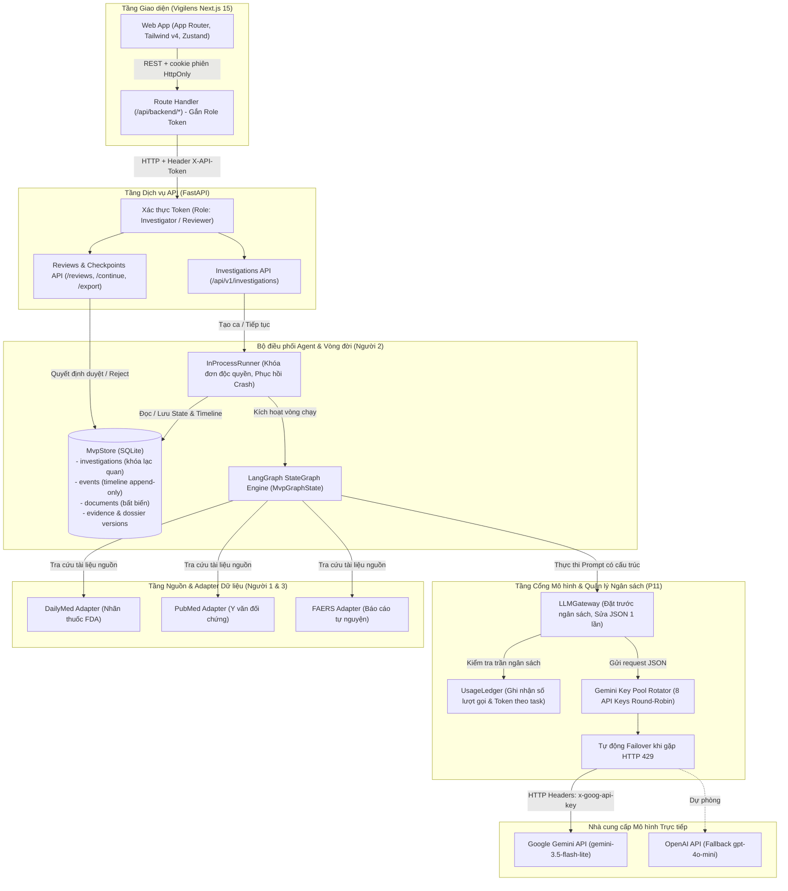
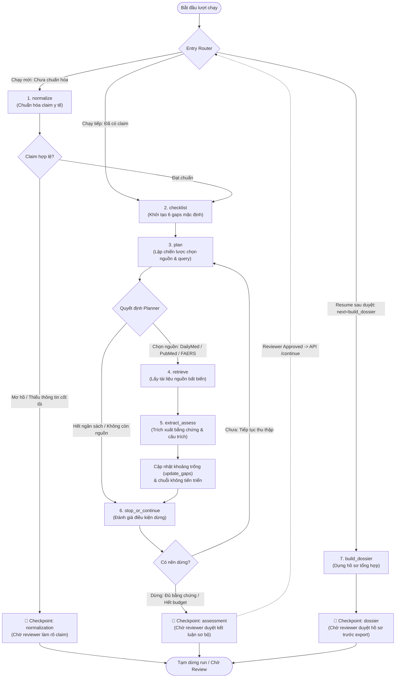
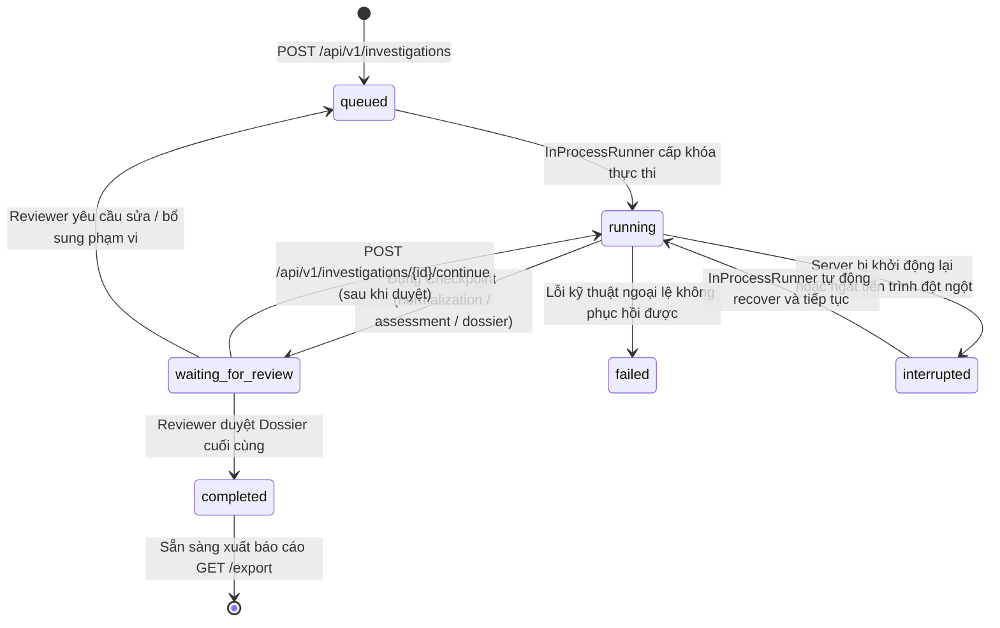

# Sơ đồ Kiến trúc Hệ thống & Điều phối Agent (P-066)

> **Phạm vi:** Trợ lý AI điều tra an toàn thuốc (P-066 / VMEC-03 MVP) — Phụ trách bởi **Kỹ sư trưởng Backend & Điều phối Agent (Người 2)**.  
> **Mục tiêu:** Kiểm soát chu trình suy luận của Agent qua đồ thị trạng thái xác định (Deterministic StateGraph), kiểm soát ngân sách chặt chẽ, hỗ trợ dừng/tiếp tục qua Human-in-the-loop (HITL) và tối ưu hóa hạ tầng LLM với cơ chế xoay vòng 8 Gemini API keys.

---

## 1. Sơ đồ Kiến trúc Điều phối Tổng thể (System & Agent Architecture)

---

## 2. Chu trình LangGraph StateGraph (14 Nodes & Checkpoints)

Đồ thị trạng thái được thiết kế theo nguyên tắc hữu hạn, chống lặp vô tận và có các điểm dừng chờ con người (Human-In-The-Loop):

---

## 3. Vòng đời Trạng thái Cuộc Điều tra (Run Lifecycle & State Transitions)

---

## 4. Các Nguyên tắc Thiết kế Cốt lõi (Design Decisions & Defense-in-Depth)

| Tiêu chuẩn | Cách triển khai trong mã nguồn P-066 | Mục đích đối với tiêu chí BTC |
|------------|--------------------------------------|-------------------------------|
| **Deterministic StateGraph** | Sử dụng LangGraph `StateGraph(MvpGraphState)` với các điều kiện rẽ nhánh rõ ràng | Ngăn chặn vòng lặp vô tận, đảm bảo mọi ca đều đi qua các bước kiểm tra có trật tự (System Design 9/10). |
| **Strict Budget Boundaries** | `BudgetController`: Giới hạn cứng 20 bước suy luận, 100 tài liệu nguồn, 80 lượt truy vấn | Đảm bảo không cạn kiệt tài nguyên, bảo vệ chi phí token (System Design & DevOps). |
| **Human-In-The-Loop (HITL)** | Tách biệt quyền máy và quyền người tại 3 checkpoints: `normalization`, `assessment`, `dossier` | Bác sĩ/Dược sĩ luôn là người quyết định cuối cùng; Agent không tự kết luận quan hệ nhân quả. |
| **Anti-Hallucination & Provenance** | Bằng chứng bắt buộc trích dẫn đúng nguyên văn (`quote`), nguồn (`source_id`) và vị trí (`locator`) | Chống bịa đặt trích dẫn; tự động từ chối xuất hồ sơ nếu câu trích bị sai lệch. |
| **Gemini Multi-Key Rotator** | Pool 8 API keys với cơ chế Round-Robin đa luồng và tự động failover khi chạm HTTP 429 | Đảm bảo hệ thống đạt độ sẵn sàng cao (High Availability), không bị gián đoạn vì giới hạn RPM/TPM của Gemini. |
| **Optimistic Locking & Immutability** | SQLite `version` field kiểm soát ghi đè; tài liệu nguồn là bất biến (hash-addressed) | Đảm bảo tính toàn vẹn dữ liệu khi có nhiều thao tác đồng thời. |
