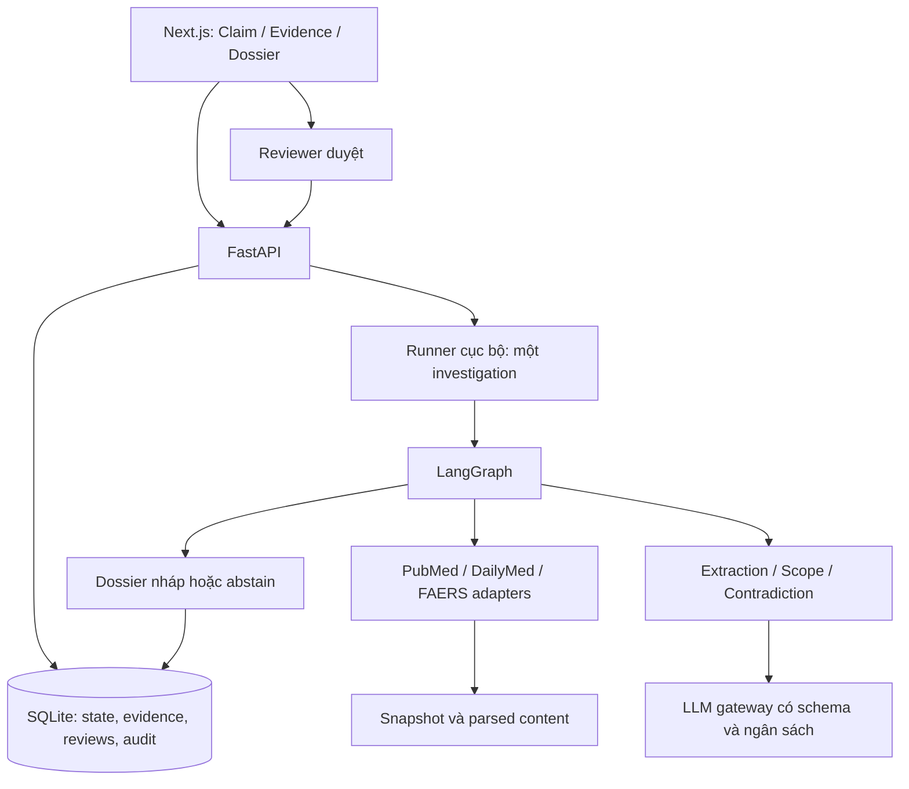

# Kế hoạch MVP — AI Agent điều tra bằng chứng an toàn thuốc

**Mục tiêu:** Tạo một prototype có thể demo trọn vẹn việc kiểm tra một nhận định an toàn thuốc: nhập claim → agent tìm và phân tích bằng chứng → phát hiện thiếu sót/mâu thuẫn → chuyên viên duyệt → xuất hồ sơ Markdown có nguồn.

**Nhóm:** 4 người. Các hạng mục được sắp theo phụ thuộc; không gắn lịch hoặc thời lượng công việc.

**Cơ sở:** [Đề tài](../../../detai/vanmau.md). Đây là kế hoạch xây phiên bản đầu tiên; [kế hoạch toàn dự án](planthegioifinal.md) là tài liệu tham khảo cho các phần mở rộng. Khi làm MVP, dùng phạm vi, kiến trúc và đường dẫn trong tài liệu này.

**Công nghệ:** Python 3.11, FastAPI, Pydantic, LangGraph, HTTPX, SQLite, Next.js/TypeScript, pytest và Ruff. Tận dụng backend/agent mẫu của repository; các thành phần nghiệp vụ trong kế hoạch là công việc cần thực hiện.

**Kiến trúc:** Giao diện Next.js gọi FastAPI. Một runner trong tiến trình backend chạy LangGraph, lưu state và audit vào SQLite. Các adapter lấy bằng chứng từ PubMed, DailyMed và openFDA FAERS. Bản demo chạy trên máy cục bộ, mỗi lần xử lý một cuộc điều tra.

## 1. MVP cần chứng minh điều gì?

MVP được coi là có giá trị khi reviewer có thể:

1. Nhập một nhận định có thuốc và biến cố cụ thể.
2. Xem agent đã tìm nguồn nào và vì sao chọn bước tìm tiếp theo.
3. Kiểm tra bằng chứng ủng hộ, phản bác hoặc chưa rõ, cùng đoạn trích gốc.
4. Thấy được evidence khác phạm vi và mâu thuẫn biểu kiến.
5. Nhận lý do rõ ràng khi không đủ bằng chứng để đánh giá.
6. Sửa, yêu cầu tìm thêm, duyệt và tải hồ sơ có audit log.

Khác biệt cần demo được là **agent thay đổi truy vấn hoặc nguồn dựa trên evidence gap**, thay vì chỉ tìm một lần rồi tóm tắt.

## 2. Phạm vi phiên bản đầu tiên

### 2.1. Bắt buộc làm

| Thành phần | Phạm vi MVP |
|---|---|
| Claim | Một thuốc/hoạt chất và một adverse event; population, dose, route và time window là tùy chọn |
| Ngôn ngữ | Evidence bằng tiếng Anh; giao diện và nhãn trạng thái có thể bằng tiếng Việt |
| Nguồn | PubMed, DailyMed và openFDA FAERS |
| Normalization | Dictionary nhỏ có nguồn và synonym cho bộ claim demo; giữ thông tin chưa rõ |
| Retrieval | Tìm nhiều truy vấn, đổi tên thương mại sang hoạt chất, mở rộng/thu hẹp query, đổi nguồn |
| Evidence | Trích đoạn hỗ trợ, source URL, source ID/version, scope và stance |
| Scope | Ưu tiên ingredient, event, population, dose, route và time window |
| Contradiction | Phân biệt kết quả đối lập trong scope tương đương với khác biệt do scope |
| Ngân sách | Mặc định 8 bước truy xuất, 50 tài liệu; trần 20 bước và 100 tài liệu |
| Kết quả | Một trong sáu assessment status của đề tài; không có kết luận nhân quả |
| Human review | Xác nhận claim mơ hồ, xử lý mâu thuẫn quan trọng, duyệt đánh giá và dossier |
| Hồ sơ | Markdown, có citations, gaps, limitations, lý do dừng và quyết định reviewer |
| Lưu trữ | SQLite + snapshot/parsed content được phép lưu; mở lại investigation sau khi refresh |
| Đánh giá | 20 claim: 5 development, 15 held-out; so sánh keyword, RAG một lượt và agent |

Các field khác như indication, comparator, comorbidity hoặc concomitant medication được giữ khi nguồn có. Nếu chúng quyết định khả năng áp dụng mà MVP chưa kiểm tra được, hệ thống phải ghi unknown/limitation và chuyển reviewer, không tự đánh dấu phù hợp.

### 2.2. Để sau MVP

| Phần mở rộng | Điều kiện cân nhắc |
|---|---|
| PostgreSQL, worker riêng, hàng đợi và nhiều cuộc điều tra đồng thời | Luồng đơn đã đạt nghiệm thu và cần phục vụ nhiều người |
| Tài khoản, SSO và phân quyền tổ chức đầy đủ | Chuẩn bị triển khai ngoài máy demo |
| Vector database và semantic retrieval | Baseline cho thấy lexical retrieval chưa đủ |
| ClinicalTrials.gov, EMA/FDA regulatory connector | Ba nguồn bắt buộc đã ổn định |
| Retrospective benchmark có cutoff lịch sử | Có snapshot và source version được xác minh |
| PDF export, đa ngôn ngữ, MedDRA đầy đủ | Luồng Markdown và thuật ngữ MVP đã đạt |
| Tự khôi phục cuộc điều tra đang chạy sau crash | Có kiểm thử đầy đủ về replay và ngân sách |
| Duplicate detection theo nhiều trường bệnh nhân | Dữ liệu đủ; MVP chỉ loại trùng kỹ thuật và gắn nghi trùng để reviewer xem |

MVP không thực hiện tư vấn điều trị, đánh giá nhân quả tự động hoặc nộp hồ sơ regulatory. Đây là giới hạn nghiệp vụ từ đề tài.

## 3. Trải nghiệm người dùng

### Màn hình 1 — Tạo và mở cuộc điều tra

- Nhập claim, drug, event và các trường scope tùy chọn.
- Chọn nguồn và ngân sách trong giới hạn server.
- Xem danh sách điều tra đã lưu và tình trạng của từng cuộc.
- Claim thiếu drug/event báo lỗi ngay; claim có nhiều cách hiểu chuyển bước xác nhận.

### Màn hình 2 — Tiến trình và bằng chứng

- Timeline: nguồn, query, kết quả, lý do tìm tiếp và ngân sách còn lại.
- Bảng evidence: nguồn, loại tài liệu, stance, scope, đoạn trích và link gốc.
- Khu vực gaps, nguồn lỗi, contradiction và evidence ngoài phạm vi.
- Reviewer có thể xác nhận cách hiểu claim, loại evidence, sửa stance/scope với lý do hoặc yêu cầu tìm thêm.

### Màn hình 3 — Hồ sơ và phê duyệt

- Xem dossier nháp với kết quả, evidence, gaps và limitations.
- Duyệt hoặc từ chối đúng phiên bản hiện hành.
- Tải Markdown sau khi đã được duyệt; sửa nội dung làm mất hiệu lực duyệt cũ.

Ba màn hình có thể dùng chung một trang chi tiết với các tab; không cần dashboard quản trị riêng.

## 4. Kiến trúc tối thiểu và dữ liệu

### 4.1. Quyết định để giữ phạm vi nhỏ

- Backend bind loopback và chạy một worker Uvicorn. Runner giữ khóa một investigation; yêu cầu chạy mới khi đang bận trả thông báo `runner_busy`.
- API trả ID ngay, UI đọc state/events bằng polling. Dữ liệu đã lưu vẫn đọc được khi refresh.
- Lưu state sau mỗi node và trước điểm chờ reviewer. Các điểm chờ kết thúc lượt graph hiện tại, lưu `next_stage`; sau review, dispatcher chạy tiếp từ stage hợp lệ và giữ counters.
- Sau crash/restart, run đang `queued/running` chuyển `interrupted`; giữ dữ liệu đã có và cho người dùng tạo run mới liên kết với bản cũ. Không tự báo rằng đã tiếp tục đúng từ external call bị gián đoạn.
- Run đang `waiting_for_review` có state đã lưu vẫn tiếp tục được sau restart vì chưa có tác vụ ngoài hệ thống đang dang dở tại điểm chờ.
- Claim/evidence/dossier dùng version tăng dần; review kiểm tra `expected_version` để tránh ghi đè.
- SQLite dùng giao dịch ngắn và một luồng ghi; `data/` chứa database và snapshot cục bộ, được bỏ qua bởi Git.

### 4.2. Schema cần chốt

| Model | Trường tối thiểu |
|---|---|
| `ClaimInput` | claim_text, drug, event, population, dose, route, time_window |
| `NormalizedClaim` | ingredient/event candidates, normalized scope, unknowns, ambiguities, dictionary version |
| `SourceDocument` | document_id, source, source_id, source_version, source_url, retrieved_at, text, content_hash, content_level, limitations |
| `EvidenceUnit` | evidence_id/version, document_id/hash, stance, scope, result, limitations, quoted_span, span_locator |
| `InvestigationState` | ID/version, claim, plan, executed queries, documents, evidence, gaps, contradictions, counters, next_stage và các trạng thái |
| `ReviewDecision` | checkpoint_kind, action, expected_version, reason, changes, reviewer_id do server xác định |
| `Dossier` | ID/version, claim/scope, assessment, evidence refs, gaps, limitations, stop/abstention reason, citations, review, audit_ref |

Giới hạn input: `claim_text` 1–5.000 ký tự, `drug` và `event` 1–200 ký tự; steps 1–20, documents 1–100; danh sách nguồn không rỗng và chỉ có ba nguồn được hỗ trợ. Audit giữ mode live/fixture/replay, model ID, prompt hash, dictionary/parser version và source manifest để đối chiếu kết quả.

SQLite gồm `investigations`, `documents`, `evidence_versions`, `review_decisions`, `dossier_versions`, `audit_events`. JSON có schema được lưu trong các bảng; các cột ID/version/status dùng để tra cứu và kiểm tra ràng buộc. Snapshot giữ nội dung được phép lưu và hash tương ứng.

### 4.3. Trạng thái thống nhất

- `run_status`: `queued`, `running`, `waiting_for_review`, `completed`, `interrupted`, `failed`.
- `assessment_status`: `supported_for_scope`, `contradicted_for_scope`, `insufficient_evidence`, `scope_mismatch`, `out_of_scope`, `requires_human_review`; chưa đánh giá thì `null`.
- `review_status`: `pending`, `approved`, `rejected`, `changes_requested`.
- `checkpoint_kind`: `normalization`, `assessment`, `dossier`.

Đề xuất supported/contradicted cần assessment review trước khi hiển thị là đánh giá đã xác nhận. Run completed vẫn có thể còn dossier chưa được duyệt.

## 5. Các quy tắc cốt lõi phải hiện thực

### 5.1. Nguồn và bằng chứng

- PubMed dùng metadata/abstract lấy được; ghi `abstract_only` khi chưa đọc full text. DailyMed giữ SETID/version và section. FAERS giữ report ID/version và dữ liệu thực có.
- Nhiều drugs/reactions trong cùng FAERS report không được tự ghép thành quan hệ nhân quả; không lấy liều/route của drug khác.
- Không tìm thấy khác với nguồn bị lỗi. Lỗi tạo gap, không tạo evidence phản bác.
- Citation phải gồm source ID/URL, đoạn trích, vị trí và hash của bản text đã phân tích.
- Chỉ lưu/tái phân phối nội dung khi có quyền; trường hợp link-only vẫn ghi nguồn và giới hạn đọc.
- Mặc định điều tra theo dữ liệu hiện tại. Chỉ ghi ngày công bố/truy xuất và version; không đưa ra bảo đảm về kết quả lịch sử khi chưa có corpus phù hợp.

### 5.2. Điều tra thích ứng

1. Chuẩn hóa claim và tạo checklist: label, literature phù hợp, spontaneous reports, contrary evidence, scope gaps.
2. Chọn query/source cho gap quan trọng còn mở.
3. Lấy tài liệu, trích evidence và cập nhật scope/contradiction.
4. Nếu kết quả nhiễu: thêm scope/filter. Nếu ít kết quả: thêm synonym hoặc dùng hoạt chất. Nếu còn thiếu loại evidence: đổi nguồn.
5. Chủ động tìm evidence phản bác; lưu query và lý do.
6. Dừng khi đủ điều kiện, cần reviewer hoặc hết ngân sách. Hai lượt không tạo thông tin mới kích hoạt kiểm tra dừng, không tự coi là đã đủ bằng chứng.

Planner MVP dùng rule-based routing và LLM có cấu trúc cho các phần ngôn ngữ. Mỗi quyết định có `action`, `gap_id`, `query`, `source`, `reason`; không dùng text tự do để điều khiển graph.

### 5.3. Ngân sách và lỗi

- Một bước là một lượt chọn/gọi tool truy xuất, kể cả khi kết quả có trong cache.
- Mỗi tài liệu duy nhất theo nguồn + ID + version/hash chỉ tính một lần; report nghi trùng giữa các ID vẫn giữ riêng.
- Giới hạn kỹ thuật đề xuất/run: 80 HTTP requests nguồn, 80 LLM calls, 150.000 input tokens và 25.000 output tokens; cho phép giảm theo config. Retry và sửa output lỗi đều tính vào ngân sách.
- Timeout/retry có giới hạn; source request được thử lại tối đa một lần khi lỗi tạm thời. LLM output sai schema được sửa tối đa một lần.
- Dành phần budget cho dossier; nếu không còn đủ, xuất nháp từ template gồm evidence đã có và gaps, rồi chuyển reviewer.
- Reserve trước external call; nếu crash làm usage chưa rõ thì giữ reservation bảo thủ. Resume sau review không reset counters.

### 5.4. Safety và human review

- Chỉ FAERS không đủ để agent đề xuất supported/contradicted.
- Scope unknown không được đánh dấu matched; mismatch quan trọng chặn dùng làm evidence trực tiếp.
- Kết quả không có ý nghĩa thống kê với độ bất định cao không tự trở thành bằng chứng phủ nhận.
- Citation thiếu/không hỗ trợ statement, overclaim causality hoặc diễn giải FAERS thành incidence phải chặn dossier chính thức.
- Prompt trong tài liệu truy xuất là dữ liệu, không phải chỉ dẫn; chỉ adapter được tạo URL nguồn thuộc allowlist.
- Mọi sửa claim/evidence làm tăng version và mất hiệu lực phê duyệt nội dung bị ảnh hưởng.
- Dossier nháp được xem trước, nhưng API xuất chính thức chỉ cho đúng version đã duyệt.

## 6. API và quyền dùng bản demo

Mọi API có tiền tố `/api/v1`, trừ `/health`. Request ghi có schema và `expected_version` khi sửa; create/continue dùng idempotency key để tránh double click.

| Endpoint | Chức năng |
|---|---|
| `POST /investigations` | Kiểm tra claim/config, tạo run và trả `202` cùng ID |
| `GET /investigations` | Danh sách điều tra cục bộ |
| `GET /investigations/{id}` | State summary, counters, checkpoint và version |
| `GET /investigations/{id}/events?after_id=...` | Timeline theo thứ tự, không lặp event |
| `GET /investigations/{id}/evidence` | Evidence, scope, citations và contradiction refs |
| `GET /investigations/{id}/documents/{doc_id}` | Parsed content/quote locator thuộc đúng investigation |
| `GET /investigations/{id}/dossier` | Nháp hoặc bản đã duyệt, có version |
| `POST /investigations/{id}/reviews` | Approve, reject, edit hoặc request_more theo checkpoint |
| `POST /investigations/{id}/continue` | Tiếp tục từ checkpoint đã duyệt hoặc decision tìm thêm, giữ budget |
| `GET /investigations/{id}/export` | Markdown của version hiện hành đã duyệt |
| `GET /health` | Kiểm tra backend đang hoạt động |

MVP dùng hai token cấu hình riêng phía server: `INVESTIGATOR_TOKEN` và `REVIEWER_TOKEN`, ánh xạ tới `investigator-local`/`reviewer-local`. UI nhận token qua trường nhập bảo mật và chỉ giữ trong bộ nhớ phiên; không hard-code token hoặc đưa vào bundle/URL. Backend kiểm tra quyền, không chỉ ẩn nút duyệt.

Token chung theo vai trò chỉ phục vụ demo cục bộ, chưa chứng minh danh tính cá nhân hoặc phân quyền tổ chức. Trước khi mở ra Internet, triển khai hệ thống tài khoản/session và HTTPS theo kế hoạch đầy đủ.

Lỗi chuẩn có `code`, `message`, `details`: 401/403 cho token/quyền; 409 cho version conflict, checkpoint không hợp lệ hoặc runner bận; 422 cho input; nguồn lỗi được ghi vào investigation thay vì luôn làm API trả 500.

## 7. Phân công nhóm 4 người

| Thành viên | Chủ trì | Đầu ra bàn giao | Review chính |
|---|---|---|---|
| Người 1 | SQLite, snapshot/cache, ba connectors, đóng gói | Dữ liệu có provenance, môi trường chạy và test nguồn | Người 2, Người 3 |
| Người 2 | Schema/API, runner, planner, budget, LangGraph | Luồng điều tra chạy được, checkpoint và API nhất quán | Người 1, Người 3 |
| Người 3 | Normalization, extraction, scope, contradiction, dossier | Evidence đúng schema, policy và bộ claim có nhãn | Người 2, Người 4 |
| Người 4 | UI, baseline, evaluation và demo | Ba màn hình, báo cáo so sánh và kịch bản trình diễn | Người 2, Người 3 |

Mỗi người viết test cho mô-đun mình. Người 2 quản lý schema/state/graph/API; Người 1 quản lý config/dependencies/storage; Người 3 quản lý prompt/policy/dossier; Người 4 quản lý frontend/eval.

## 8. Công việc triển khai M01–M10

### M01. Chốt contract, fixture và policy MVP

**Chủ trì:** Người 2; cả nhóm review. **Phụ thuộc:** Không.

**Tệp:** `src/models/schemas.py`, `src/agents/state.py`, `docs/mvp-contracts.md`, `tests/fixtures/mvp/`, `tests/test_models/test_mvp_contracts.py`.

- [x] Định nghĩa các model, enum, limits và lỗi ở mục 4–6.
- [x] Chuẩn hóa giao tiếp: `SourceAdapter.search(action) -> SourceSearchResult`; `extract_evidence(document, claim) -> list[EvidenceUnit]`; `assess_scope(evidence, claim) -> ScopeAssessment`; `choose_action(state) -> PlannerDecision`; `build_dossier(state) -> Dossier`.
- [x] Tạo fixture cho supported, insufficient, mismatch, contradiction, source error và ambiguity; dữ liệu giả có nhãn `synthetic`.
- [x] Viết policy không kết luận nhân quả, không suy incidence, không dùng citation ngoài tập retrieved.
- [x] Test từ chối >20 steps, >100 docs, nguồn không hỗ trợ và assessment `causal`.

**Nghiệm thu:** Cả bốn người dùng cùng schema/fixture; hợp đồng đủ để làm việc độc lập. Chạy `python -m pytest tests/test_models/test_mvp_contracts.py -q`.

### M02. SQLite, runner nền và gateway dùng cho test

**Chủ trì:** Người 1; Người 2 phối hợp runner/gateway. **Phụ thuộc:** M01.

**Tệp:** `src/services/storage.py`, `src/services/runner.py`, `src/services/llm.py`, `src/config.py`, `tests/conftest.py`, `tests/test_services/test_mvp_runtime.py`.

- [x] Tạo các bảng ở mục 4.2, transaction và lưu version/state/event.
- [x] Snapshot có hash; cache không ghi lỗi thành kết quả rỗng.
- [x] Runner giữ một lượt chạy; lưu state từng node và đánh dấu interrupted khi restart giữa run.
- [x] Inject LLM/HTTP giả vào test; gateway validate schema và ghi calls/tokens.
- [x] Định nghĩa thao tác reserve budget bền vững; M05 sử dụng và kiểm tra chính sách giới hạn.
- [x] Test mở lại state, một runner tại một thời điểm, stale version và test offline không gọi provider.

**Nghiệm thu:** Lưu/đọc lại được một run giả và audit sau restart; run đang chạy không bị báo completed. Chạy `python -m pytest tests/test_services/test_mvp_runtime.py -q`.

### M03. Ba connectors và parser tối thiểu

**Cập nhật triển khai Người 1:** đã bổ sung adapters/transport/parser và tích hợp cấu hình fixture/live trên nhánh `codex/data-m03-mvp`. Xem [bàn giao](mvp-person1-status.md) và [runbook](runbook.md). PubMed live còn bị chặn trên mạng kiểm tra; các checkbox nghiệm thu dưới đây chỉ chốt sau review và smoke đủ ba nguồn.

**Kiểm chứng bổ sung 2026-10-02:** hoàn thiện PubMed local từ export thật (lựa chọn chủ động, không phải PubMed API live), kiểm tra lại provenance từ raw export và từ chối nội dung/metadata/locator bị sửa. Smoke DailyMed/FAERS đạt; PubMed API vẫn bị redirect. Docker backend/frontend đã dựng và chạy luồng fixture qua Next proxy, backup/restore giữ citation và hồ sơ đã duyệt. Chi tiết, lệnh và phần còn phụ thuộc Người 3/4 nằm trong tài liệu bàn giao; chưa chốt toàn bộ M03/M10.

**Chủ trì:** Người 1; Người 3 review dữ liệu. **Phụ thuộc:** M01, M02.

**Tệp:** `src/services/sources/base.py`, `transport.py`, `pubmed.py`, `dailymed.py`, `faers.py`, `parser.py`; `tests/test_sources/test_mvp_sources.py`.

- [ ] PubMed lấy PMID và metadata/abstract theo batch; phân biệt missing abstract với không có kết quả.
- [ ] DailyMed lấy label/version/section, giữ ingredient/route khác nhau ở các nhãn khác nhau.
- [ ] FAERS giữ report-level data, đúng phần tử drug và các trường thiếu; không giả định ghép thuốc–reaction.
- [ ] Giữ URL/source ID/version/hash/locator; escape query, allowlist domain và parse XML an toàn.
- [ ] Timeout/retry/rate limit có trần; source lỗi trả typed error và warning.
- [ ] Test đủ ba nguồn bằng fixture; chạy smoke nguồn thật riêng với số tài liệu nhỏ.

**Nghiệm thu:** Cả ba nguồn trả SourceSearchResult chuẩn, lỗi khác empty và citation truy được nội dung nguồn. Chạy `python -m pytest tests/test_sources/test_mvp_sources.py -q`.

### M04. Normalization và phân tích evidence

**Chủ trì:** Người 3; Người 2 review contract. **Phụ thuộc:** M01, M02; dùng fixture khi M03 chưa hoàn thành.

**Tệp:** `src/services/evidence/normalize.py`, `extract.py`, `scope.py`, `contradiction.py`, `citations.py`; `src/prompts/`; `data/dictionaries/`; `tests/test_evidence/test_mvp_evidence.py`.

- [ ] Dictionary có nguồn cho claim demo; brand nhiều ứng viên đưa về ambiguity.
- [ ] Extraction bằng structured output, giữ quote và các trường unknown; output sai schema chỉ sửa một lần.
- [ ] Scope rules ưu tiên sáu trường ở mục 2; khác scope quan trọng chặn direct evidence.
- [ ] Contradiction lọc cặp so sánh phù hợp, tránh gọi study khác population là phản bác trực tiếp.
- [ ] Quote/locator/hash phải khớp và có hỗ trợ statement; URL thật không đủ để xác nhận citation.
- [ ] Trùng source/version không tính lại; report nghi cùng case chỉ gắn candidate cơ bản, không xóa.

**Nghiệm thu:** Fixture khác route/population, ambiguous brand, quote giả và null result bất định cho kết quả mong đợi. Chạy `python -m pytest tests/test_evidence/test_mvp_evidence.py -q`.

### M05. Agent thích ứng, stopping và budget

**Chủ trì:** Người 2; Người 3 review nghiệp vụ. **Phụ thuộc:** M02, M03, M04.

**Tệp:** `src/agents/graph.py`, `src/agents/state.py`, `src/agents/nodes/mvp_nodes.py`, `src/services/planner.py`, `budget.py`, `stopping.py`; `tests/test_agents/test_mvp_graph.py`.

- [x] Ghép normalize → checklist → plan → retrieve → extract/assess → update gaps → stop/continue.
- [x] Dispatcher nhận run mới hoặc state từ điểm review đã lưu; không reset counters.
- [x] Rule replanning cho query ít kết quả, nhiều nhiễu, thiếu scope, thiếu nguồn và contradiction.
- [x] Chống query lặp vô ích bằng fingerprint; chủ động tạo contrary-evidence search.
- [x] Enforce giới hạn steps/docs/requests/calls/tokens trước tác vụ; retry cũng tính.
- [x] Khi cần review, lưu checkpoint/next_stage rồi dừng lượt graph; khi hết budget, trả kết quả với gaps.

**Nghiệm thu:** Có trace đổi query/source do evidence gap; FAERS-only không auto-support; test budget và abstain đạt. Chạy `python -m pytest tests/test_agents/test_mvp_graph.py -q`.

### M06. Dossier và nghiệp vụ reviewer

**Chủ trì:** Người 3; Người 2 phối hợp version/checkpoint. **Phụ thuộc:** M02, M04, M05.

**Tệp:** `src/services/dossier.py`, `src/services/review.py`, `data/templates/dossier.md`; `tests/test_dossier/test_mvp_dossier.py`, `tests/test_services/test_mvp_review.py`.

- [x] Dossier có claim/scope, search strategy, evidence các nhóm, contradictions, gaps, limitations và audit ref.
- [x] Typed statements trỏ evidence ID/version; validator chặn thiếu citation, overclaim và ref ngoài investigation.
- [x] Review có kind/action/reason/expected_version; sửa claim/evidence tạo version mới và invalidation đúng.
- [x] Approve assessment không tự approve dossier. Request_more giữ ngân sách cũ và cần continue hợp lệ.
- [x] Markdown chính thức chỉ tạo từ phiên bản đã duyệt; fallback template giữ được dữ liệu khi hết LLM budget.

**Nghiệm thu:** Sửa evidence làm export bị chặn tới khi duyệt lại; dossier abstain vẫn có lý do và dữ liệu còn thiếu. Chạy các test dossier và review nêu trên.

### M07. API và kiểm soát reviewer phía server

**Chủ trì:** Người 2; Người 4 review response. **Phụ thuộc:** M02, M05, M06.

**Tệp:** `src/api/investigations.py`, `src/api/reviews.py`, `src/api/auth.py`, `src/main.py`; `tests/test_api/test_mvp_api.py`.

- [x] Implement danh sách endpoint ở mục 6 và lỗi có cấu trúc.
- [x] Token role chỉ ở cấu hình server; reviewer identity không lấy từ body người dùng gửi.
- [x] Create/continue idempotent; kiểm tra expected_version và trạng thái runner.
- [x] Document/evidence phải thuộc investigation tương ứng; export kiểm tra approval từ DB.
- [x] Giữ `/health`; vô hiệu hóa `/chat` mẫu trong cấu hình chạy MVP để mọi lượt xử lý đi qua budget/review của API nghiệp vụ; không trả trường `analysis` nội bộ như nội dung cho người dùng.
- [x] Test gọi trực tiếp API bằng token sai, role sai, double request, ID không khớp và export chưa duyệt.

**Nghiệm thu:** API đủ để UI chạy trọn luồng; không thể bypass review chỉ bằng gọi endpoint. Chạy `python -m pytest tests/test_api/test_mvp_api.py -q`.

### M08. Ba màn hình MVP

**Chủ trì:** Người 4; Người 2/3 review flow. **Phụ thuộc:** M01 để làm bằng mock; M07 để tích hợp thật.

**Tệp:** `frontend/app/`, `frontend/components/`, `frontend/lib/api.ts`, `frontend/tests/`, `frontend/e2e/mvp.spec.ts`.

- [ ] Form claim, danh sách investigation và nhập token phiên cục bộ.
- [ ] Timeline, counters, gaps và các trạng thái loading/error/review/interrupted.
- [ ] Evidence matrix, quote viewer, scope differences và contradiction cạnh nhau.
- [ ] Reviewer edit/approve/reject/request_more, hiển thị stale version và lý do chưa export được.
- [ ] Dossier preview và download Markdown; renderer không thực thi HTML/script từ nguồn.
- [ ] Refresh trang đọc lại state, không tạo run mới hoặc reset tiến trình.

**Nghiệm thu:** Demo hoàn chỉnh bằng trình duyệt; user không phải sửa DB hoặc gọi API thủ công. Chạy lint/typecheck/unit/build và `npm run test:e2e -- mvp.spec.ts` sau khi script đã được tạo.

### M09. Bộ claim, baseline và đánh giá MVP

**Chủ trì:** Người 4; Người 3 phụ trách nhãn và rubric. **Phụ thuộc:** M03–M06.

**Tệp:** `data/benchmark/mvp_claims.jsonl`, `mvp_gold.jsonl`, `mvp_manifest.json`; `eval/mvp_baselines.py`, `eval/run_mvp.py`, `eval/mvp_metrics.py`, `eval/mvp_report.md`; `tests/test_eval/test_mvp_metrics.py`.

- [ ] Chọn 20 claim phủ supported, contradicted, insufficient, mismatch, ambiguity và contradiction; các nhóm có thể chồng nhau.
- [ ] Tách 5 development và 15 held-out theo họ drug–event/tài liệu, tránh biến thể cùng claim lọt sang hai tập.
- [ ] Hai reviewer chuyên môn gán nhãn độc lập và xử lý bất đồng; chưa có nhãn chuyên môn thì đánh dấu bộ kiểm thử kỹ thuật.
- [ ] Keyword baseline dùng BM25; RAG dùng cùng kết quả truy xuất một lượt rồi tổng hợp; agent dùng loop thích ứng.
- [ ] Dùng cùng corpus đóng băng, cutoff thực tế của corpus, output contract phù hợp và trần ngân sách; không đưa gold answers vào prompt/retrieval.
- [ ] Đo retrieval, citation, scope, contradiction, abstention, số bước/calls/tokens; thêm thời gian reviewer khi có thử nghiệm phù hợp.

**Nghiệm thu:** Có raw results và bảng so sánh thật; keyword chỉ có metric retrieval. Chạy test metrics rồi `python -m eval.run_mvp --split heldout --mode replay` khi dataset đã sẵn sàng.

### M10. Kiểm tra xuyên suốt, đóng gói và demo

**Chủ trì:** Người 1 về môi trường; Người 4 về demo. **Phụ thuộc:** M01–M09.

**Tệp:** `tests/test_integration/test_mvp_flow.py`, `README.md`, `.env.example`, `requirements.txt`, lockfiles, `docs/mvp-demo.md`, `presentation/`; cập nhật Docker/CI hiện có ở phạm vi cần thiết.

- [ ] Chạy ma trận lỗi mục 10; mỗi thành viên sửa phần mình sở hữu.
- [ ] Khóa dependencies; README hướng dẫn Windows/local và tùy chọn Docker, token demo, API keys, seed data và chạy eval.
- [ ] Cấu hình cả backend và frontend chỉ lắng nghe loopback trong bản demo cục bộ; không đưa token vào cấu hình frontend công khai.
- [ ] Test mặc định dùng fixture/mock, không cần key thật hoặc Internet; live smoke được chạy chủ động riêng.
- [ ] Sao chép database và snapshots ở trạng thái dừng ghi để tạo bản backup demo; thử mở lại và kiểm tra một citation từ backup.
- [ ] Chuẩn bị bốn demo có input/output kỳ vọng và ghi rõ live hay fixture.
- [ ] Cập nhật report, sơ đồ, demo video/pitch và giới hạn thực tế của MVP.

**Nghiệm thu:** Thành viên khác dựng từ clone sạch và chạy được luồng nhập → điều tra → review → export. Giữ nguyên cấu hình runner GitHub đã cài; kế hoạch MVP không yêu cầu cài lại runner.

## 9. Thứ tự thực hiện và cách làm song song

| Điểm ghép | Công việc | Đầu ra để chuyển tiếp |
|---|---|---|
| A | M01 | Schema, fixture và policy chung |
| B | M02; Người 3 chuẩn bị rubric/dictionary, Người 4 làm M08 bằng fixture | Lưu trữ, runner, mock gateway và khung UI |
| C | M03 và M04 song song | Tài liệu chuẩn hóa và evidence analysis qua test |
| D | M05 → M06 → M07 | Backend đi hết luồng và có reviewer gate |
| E | Ghép M08 với API; hoàn thiện M09 | UI chạy thật, số đo có thể kiểm tra |
| F | M10 | Demo tái lập và bộ bàn giao |

M09 bắt đầu chọn claim/rubric ngay từ A, không chờ toàn bộ code. Chỉ chạy so sánh hệ thống sau khi các mô-đun cần thiết đã được ghép.

Để giảm conflict: mỗi Mxx dùng một issue và nhánh riêng; ghép schema trước; chủ trì tệp chung review mọi thay đổi liên quan; cập nhật từ main trước khi ghép; tách thay đổi giao tiếp khỏi thay đổi định dạng hàng loạt.

## 10. Các tình huống bắt buộc kiểm thử

| Tình huống | Hành vi cần đạt |
|---|---|
| Claim thiếu event | Báo lỗi trước khi gọi nguồn |
| Brand mơ hồ | Chờ normalization review |
| Bằng chứng chỉ ở liều/route/quần thể khác | Scope mismatch, không dùng trực tiếp cho claim |
| Hai studies khác quần thể cho kết quả khác nhau | Không gắn contradiction trực tiếp |
| Null result có độ bất định cao | Uncertain, không phủ nhận nguy cơ |
| Chỉ có FAERS hoặc thiếu evidence thiết yếu | Insufficient hoặc yêu cầu reviewer |
| Citation sai đoạn hoặc không hỗ trợ statement | Chặn statement/dossier chính thức |
| Source lỗi | Ghi gap, thử phương án khác trong budget hoặc abstain |
| Hết budget hoặc query lặp | Dừng có lý do, không vượt giới hạn |
| Prompt injection/HTML/script trong nguồn | Không thay policy/tool; không thực thi trong UI |
| Reviewer sửa evidence đã duyệt | Approval cũ mất hiệu lực, phải duyệt lại |
| Token investigator gọi approve | Server từ chối |
| Double create/continue | Không chạy hai lần hoặc tăng budget limit |
| Restart giữa run | Đánh dấu interrupted, giữ state; không tự báo hoàn thành |
| Tiếp tục từ checkpoint review | Giữ ngân sách, version và audit |

## 11. Nghiệm thu MVP

### 11.1. Điều kiện chức năng bắt buộc

- [ ] Một claim đi hết luồng bằng UI và xuất được hồ sơ đã duyệt.
- [ ] Ba nguồn đều có adapter và được smoke test bằng dữ liệu thật; demo fixture được gắn nhãn riêng.
- [ ] Có ít nhất một scenario agent đổi query/source theo gaps.
- [ ] Có scope checking, contradiction analysis, abstention và citations có thể đối chiếu.
- [ ] Không tự kết luận nhân quả hoặc suy incidence từ FAERS.
- [ ] 100% dossier có audit, source refs và đúng version reviewer đã duyệt.
- [ ] Không vượt budget khi retry hoặc tiếp tục sau review.
- [ ] Không bỏ qua phê duyệt bằng direct API call.
- [ ] Test, README, dữ liệu demo và kết quả đánh giá đủ để người khác chạy lại.

### 11.2. Mục tiêu nghiên cứu cần báo cáo

| Chỉ số | Mục tiêu theo đề tài |
|---|---|
| Evidence Recall@20 | ≥ 0,85 |
| Citation precision | ≥ 0,95 |
| Unsupported-claim rate | ≤ 0,02 |
| Scope-mismatch recall | ≥ 0,80 |
| Giảm thời gian reviewer | ≥ 25% nếu đã thực hiện thử nghiệm phù hợp |

Các giá trị này là mục tiêu, không phải kết quả đã có. Báo số liệu từng claim, mẫu số và giới hạn tập nhỏ. Không có gold evidence phù hợp hoặc chưa làm thử nghiệm reviewer thì ghi “chưa đo”, không suy ra đã đạt.

Recall@20 tính phần gold evidence được top 20 kết quả bao phủ; citation precision kiểm tra cả đúng nguồn lẫn hỗ trợ nhận định. Nhãn không có mẫu số hợp lệ trả N/A. Unsupported rate tính trên factual statements, không tính trên số dossier. Tách development/held-out trước khi điều chỉnh prompt.

## 12. Bốn kịch bản demo

| Demo | Tình huống | Điều phải nhìn thấy |
|---|---|---|
| D1 — Claim quá rộng | Evidence chỉ ở một nhóm/liều cụ thể | Scope mismatch, phạm vi evidence thực có và yêu cầu thu hẹp/abstain |
| D2 — Mâu thuẫn biểu kiến | Hai studies khác population | So sánh cạnh nhau và lý do không gọi phản bác trực tiếp |
| D3 — FAERS dễ bị diễn giải sai | Nhiều reports hoặc nhiều drugs/reactions | Nguồn được giữ nguyên, không tính incidence/causality, tìm thêm label/literature |
| D4 — Replanning | Query đầu ít kết quả hoặc nhiều nhiễu | Query/source thay đổi, lý do và evidence mới sau thay đổi |

Mỗi demo có fixture để trình diễn ổn định và một file ghi input, expected behavior, source manifest. Live mode dùng dữ liệu thật có thể cho kết quả khác fixture; UI phải hiển thị chế độ đang dùng.

## 13. Bộ sản phẩm bàn giao

1. Backend FastAPI và agent LangGraph MVP.
2. Ba connectors, bộ chuẩn hóa/phân tích evidence và lưu trữ SQLite.
3. Giao diện ba màn hình với reviewer gate.
4. Dossier Markdown mẫu đã duyệt và audit log tương ứng.
5. Bộ 20 claim, nhãn/gold có provenance hoặc nhãn rõ là test synthetic.
6. Keyword baseline, RAG baseline, agent evaluation và báo cáo kết quả.
7. Kiểm thử đơn vị/tích hợp và bốn demo.
8. README, schema/API contract, sơ đồ, cấu hình mẫu và hướng dẫn chạy lại.

MVP hoàn thành khi luồng cốt lõi và các kiểm tra bắt buộc có bằng chứng chạy được. Sau đó mới chọn từng phần mở rộng từ kế hoạch toàn dự án dựa trên lỗi và nhu cầu quan sát được.

## 14. Tài liệu kỹ thuật tham khảo

- PubMed retrieval đối chiếu [NLM E-utilities](https://www.nlm.nih.gov/dataguide/eutilities/utilities.html) và [hướng dẫn quota NCBI](https://support.nlm.nih.gov/kbArticle/?pn=KA-05510).
- Nhãn và phiên bản SPL đối chiếu [DailyMed Web Services](https://dailymed.nlm.nih.gov/dailymed/app-support-web-services.cfm).
- Query và giới hạn diễn giải báo cáo đối chiếu [openFDA Drug Events](https://open.fda.gov/apis/drug/event/) và [hướng dẫn endpoint](https://open.fda.gov/apis/drug/event/how-to-use-the-endpoint/).

Các đường dẫn module và lệnh test trong kế hoạch là đầu ra cần tạo, không phải tuyên bố rằng chức năng đã được triển khai.
