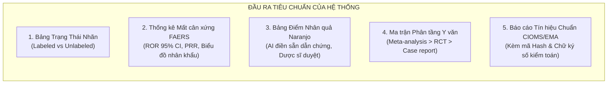
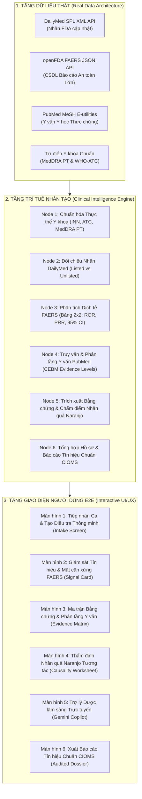

# Nghiên Cứu Chuyên Sâu Bài Toán Cảnh Giác Dược & Giải Pháp Toàn Diện End-to-End (E2E) Cho Dự Án P-066 (VigiLens)

> **Tác giả:** Chuyên viên Kiểm soát Dược / Dược sĩ Cảnh giác Dược Cấp cao (Senior Pharmacovigilance & Drug Safety Specialist)  
> **Mục tiêu tài liệu:** Nghiên cứu thực tế chuyên sâu (Deep Industry Research), phân tích tường tận bản chất nghiệp vụ của chuyên viên kiểm soát dược, xác định chính xác các dữ liệu đầu vào - đầu ra cần thiết, và thiết kế giải pháp toàn diện End-to-End (E2E) từ Dữ liệu thật, AI Agent Engine, Giao diện UI/UX đến Báo cáo pháp lý cho toàn bộ dự án P-066.  
> **Căn cứ pháp lý & Chuẩn mực quốc tế:** EMA GVP Module IX (Signal Management), ICH E2A/E2B(R3)/E2C(R2)/E2D, WHO-UMC Causality System, CIOMS Working Groups VIII/IX/XIV, US FDA MedWatch & 21 CFR Part 11.  
> **Thời điểm hoàn thành:** 05/10/2026  

---

## MỤC LỤC

1. [Bản Chất Thực Sự Của Bài Toán Cảnh Giác Dược (What Do PV Specialists Actually Do?)](#1-bản-chất-thực-sự-của-bài-toán-cảnh-giác-dược)
2. [Dữ Liệu Đầu Vào Cần Thiết Cho Bài Toán (Input Data Architecture)](#2-dữ-liệu-đầu-vào-cần-thiết-cho-bài-toán)
3. [Đầu Ra Mong Muốn Của Hệ Thống (Desired Clinical & Regulatory Outputs)](#3-đầu-ra-mong-muốn-của-hệ-thống)
4. [Các Pain Points Thực Tế Mà Chuyên Viên Đang Đối Mặt](#4-các-pain-points-thực-tế-mà-chuyên-viên-đang-đối-mặt)
5. [Đánh Giá Hiện Trạng P-066 & Khoảng Trống Giữa MVP Và Thực Tế](#5-đánh-giá-hiện-trạng-p-066--khoảng-trống-giữa-mvp-và-thực-tế)
6. [Thiết Kế Giải Pháp Toàn Diện End-to-End (E2E Solution Architecture)](#6-thiết-kế-giải-pháp-toàn-diện-end-to-end-e2e-solution-architecture)
   - 6.1. Tầng Dữ liệu Thật (Real Data Pipeline & Sources)
   - 6.2. Tầng AI Agent & Quy trình Lâm sàng (Clinical Intelligence Engine)
   - 6.3. Tầng Giao diện Người dùng E2E (UI/UX Screen-by-Screen Specifications)
   - 6.4. Tầng Hồ sơ & Báo cáo Pháp lý (Regulatory Dossier & Audited Export)
7. [Kịch Bản Thẩm Định Thực Chiến Trên 5 Ca Lâm Sàng Kinh Điển](#7-kịch-bản-thẩm-định-thực-chiến-trên-5-ca-lâm-sàng-kinh-điển)
8. [Lộ Trình Triển Khai Thực Nghiệm Đề Xuất](#8-lộ-trình-triển-khai-thực-nghiệm-đề-xuất)

---

## 1. Bản Chất Thực Sự Của Bài Toán Cảnh Giác Dược

Trong các cơ quan quản lý dược phẩm (EMA, FDA, Cục Quản lý Dược Việt Nam), trung tâm thông tin thuốc & ADR (DI & ADR Centers), các bệnh viện lớn và các hãng dược đa quốc gia, **Chuyên viên Cảnh giác Dược (PV Officer / Drug Safety Specialist)** thực hiện hai nhóm nhiệm vụ cốt tử:

```mermaid
flowchart TD
    subgraph Track1["NHÁNH 1: XỬ LÝ CA ĐƠN LẺ (Case-level Processing / ICSR)"]
        A1["Tiếp nhận Báo cáo ADR<br/>(Bác sĩ, Dược sĩ, Bệnh nhân)"] --> A2["Kiểm tra 4 yếu tố hợp lệ ICH E2D<br/>(Bệnh nhân, Người báo cáo, Thuốc, Biến cố)"]
        A2 --> A3["Mã hóa Y khoa<br/>(MedDRA PT/SOC, WHO-ATC)"]
        A3 --> A4["Đánh giá Nghiêm trọng & Tình trạng Nhãn<br/>(Serious vs Non-serious | Labeled vs Unlabeled)"]
        A4 --> A5["Đánh giá Nhân quả Naranjo / WHO-UMC<br/>(Dechallenge, Rechallenge, Bệnh nền, DDI)"]
        A5 --> A6["Báo cáo khẩn cấp cơ quan quản lý<br/>(7 ngày nếu tử vong, 15 ngày nếu SUSAR)"]
    end

    subgraph Track2["NHÁNH 2: QUẢN LÝ TÍN HIỆU TỔNG HỢP (Aggregate-level Signal Management)"]
        B1["Khai phá Dữ liệu Lớn Định kỳ<br/>(FAERS, EudraVigilance, VigiBase)"] --> B2["Phát hiện Tín hiệu Thống kê<br/>(SDR: ROR, PRR, IC, EBGM)"]
        B2 --> B3["Xác thực Tín hiệu Lâm sàng<br/>(Loại trừ nhiễu, đối chiếu nhãn SmPC/USPI)"]
        B3 --> B4["Điều tra Y văn Có Thích ứng<br/>(PubMed / Embase / Clinical Trials)"]
        B4 --> B5["Lập Báo cáo Thẩm định Tín hiệu<br/>(Signal Assessment Report / PBRER / PSUR)"]
        B5 --> B6["Hành động Quản lý Nguy cơ (RMP)<br/>(Cập nhật nhãn, Thư DHPC, Thu hồi)"]
    end
```



### 1.1. Chu trình 4 Giai đoạn Quản lý Tín hiệu Chuẩn EMA GVP Module IX
1. **Phát hiện tín hiệu (Signal Detection):** Sàng lọc các tổ hợp "Thuốc - Biến cố" (Drug-Event Combinations - DECs) có tần suất báo cáo cao bất thường trong CSDL báo cáo tự nguyện thông qua phân tích mất cân xứng (Disproportionality Analysis).
2. **Xác thực tín hiệu (Signal Validation):** Đánh giá sơ bộ xem tín hiệu có căn cứ sinh học và lâm sàng không. Trả lời ngay câu hỏi: *Biến cố này đã có trên nhãn thuốc (Labeled) hay là biến cố mới hoàn toàn (Unlabeled)?*
3. **Thẩm định tín hiệu (Signal Assessment):** Phân tích sâu y văn y học thực chứng, đánh giá mối quan hệ nhân quả (Causality assessment), xem xét yếu tố nguy cơ của từng nhóm bệnh nhân (suy gan, suy thận, người già, phụ nữ mang thai).
4. **Hành động quản lý nguy cơ (Risk Minimization / Recommendation):** Đưa ra kết luận có tính pháp lý: Cần bổ sung Cảnh báo hộp đen (Boxed Warning), giới hạn liều, thêm chống chỉ định, gửi thư cảnh báo đến cán bộ y tế (Direct Healthcare Professional Communication - DHPC), hoặc rút số đăng ký.

---

## 2. Dữ Liệu Đầu Vào Cần Thiết Cho Bài Toán

Một chuyên viên PV khi bắt tay vào thẩm định một ca hoặc một nhận định an toàn thuốc **không bao giờ chỉ đọc một dòng chữ ngắn ngủi**. Họ cần một tập dữ liệu đầu vào có cấu trúc và đa chiều:

```
┌────────────────────────────────────────────────────────────────────────┐
│                        TẬP DỮ LIỆU ĐẦU VÀO (INPUT DATA)                │
├────────────────────────────────┬───────────────────────────────────────┤
│ 1. DỮ LIỆU BỆNH NHÂN & CA BỆNH │ 2. DỮ LIỆU THUỐC & BIẾN CỐ            │
│  - Tuổi, giới tính, cân nặng   │  - Tên biệt dược, hoạt chất (INN)     │
│  - Chức năng thận (eGFR, CrCl) │  - Mã giải phẫu điều trị (WHO-ATC)    │
│  - Chức năng gan (AST, ALT)    │  - Thuật ngữ biến cố MedDRA (PT, SOC) │
│  - Tiền sử bệnh nền            │  - Liều dùng, đường dùng, số lô       │
│  - Thuốc dùng đồng thời (DDIs) │  - Ngày bắt đầu, ngày xuất hiện       │
├────────────────────────────────┼───────────────────────────────────────┤
│ 3. DỮ LIỆU DIỄN TIẾN LÂM SÀNG  │ 4. DỮ LIỆU NGUỒN CẢNH GIÁC DƯỢC QUY MÔ│
│  - Thời gian khởi phát         │  - Nhãn FDA chính thức (DailyMed SPL) │
│  - Ngừng thuốc (Dechallenge)   │  - CSDL báo cáo tự nguyện (FAERS)     │
│  - Dùng lại thuốc (Rechallenge)│  - Y văn y học thực chứng (PubMed)    │
│  - Kết quả xét nghiệm khách quan│ - File chuẩn trao đổi quốc tế E2B(R3)│
└────────────────────────────────┴───────────────────────────────────────┘
```

### Chi tiết các định dạng dữ liệu đầu vào:
1. **File chuẩn quốc tế ICH E2B(R3) XML / PDF MedWatch 3500:** Định dạng chuẩn trao đổi giữa bệnh viện, doanh nghiệp và cơ quan quản lý. Chứa đầy đủ thông tin hành chính, bệnh nhân, thuốc và diễn biến lâm sàng.
2. **Từ điển danh pháp chuẩn hóa:**
   - **MedDRA (Medical Dictionary for Regulatory Activities):** Cấu trúc 5 cấp (SOC $\rightarrow$ HLGT $\rightarrow$ HLT $\rightarrow$ PT $\rightarrow$ LLT). Phải chuẩn hóa đến cấp **PT (Preferred Term)** để tìm kiếm chính xác.
   - **WHO ATC/DDD:** Hệ thống phân loại thuốc theo giải phẫu, điều trị và hóa học để phát hiện hiệu ứng theo nhóm thuốc (Class effects).
3. **Cơ sở dữ liệu báo cáo an toàn (FAERS openFDA API):**
   - Hàng triệu ca báo cáo từ năm 1969 đến nay, gồm bảng nhân khẩu học (`patient`), thông tin thuốc nghi ngờ và thuốc phối hợp (`drug`), biến cố bất lợi (`reaction`), kết cục (`outcome`).
4. **Nhãn thuốc chính thức (DailyMed Structured Product Labeling - SPL):**
   - Tài liệu XML pháp lý của FDA chứa các phần cảnh báo bắt buộc: *BOXED WARNING, CONTRAINDICATIONS, WARNINGS AND PRECAUTIONS, ADVERSE REACTIONS, DRUG INTERACTIONS*.
5. **Y văn y học thực chứng (PubMed / MEDLINE API):**
   - Truy vấn thông qua MeSH Terms (Medical Subject Headings), lọc theo loại hình nghiên cứu (Study designs).

---

## 3. Đầu Ra Mong Muốn Của Hệ Thống

Chuyên viên kiểm soát dược **không cần một chatbot trò chuyện phiếm**. Đầu ra họ mong muốn từ một hệ thống AI là **Hồ sơ Thẩm định An toàn Thuốc Hoàn Chỉnh (Inspection-Ready Signal Assessment Dossier)** có tính pháp lý để bảo vệ trước Hội đồng Khoa học hoặc Cơ quan Quản lý:



### Chi tiết 5 sản phẩm đầu ra bắt buộc:
1. **Kết luận về tình trạng nhãn (Listedness Determination):**
   - Khẳng định biến cố là *Labeled* (đã có trên nhãn ở mục nào, tần suất bao nhiêu %) hay *Unlabeled* (tín hiệu mới toanh cần báo cáo khẩn).
2. **Báo cáo dịch tễ dược học định lượng (Disproportionality Metric Report):**
   - Bảng tiếp liên $2 \times 2$, chỉ số ROR kèm khoảng tin cậy 95%, chỉ số PRR, kiểm định Chi-bình phương ($\chi^2$), số lượng ca báo cáo qua các năm, phân bố theo độ tuổi và giới tính.
3. **Bảng đánh giá nhân quả chuẩn hóa (Causality Worksheet):**
   - Bảng 10 câu hỏi thuật toán Naranjo hoặc phân hạng WHO-UMC (*Certain, Probable, Possible, Unlikely*) với trích dẫn văn bản chứng minh cho từng điểm số.
4. **Ma trận mâu thuẫn bằng chứng phân tầng (Stratified Evidence Matrix):**
   - Phân biệt rõ mâu thuẫn biểu kiến (do khác biệt liều, khác biệt đối tượng suy thận) với mâu thuẫn thực chất giữa các nghiên cứu.
5. **Văn bản Báo cáo Thẩm định Tín hiệu (Signal Assessment Report):**
   - Xuất file PDF/Markdown chuẩn CIOMS/EMA GVP Module IX gồm đầy đủ: Tóm tắt tín hiệu, Phân tích dữ liệu lớn, Y văn y học thực chứng, Đánh giá lợi ích/nguy cơ, và Đề xuất biện pháp can thiệp (sửa nhãn, phát hành thư DHPC).

---

## 4. Các Pain Points Thực Tế Mà Chuyên Viên Đang Đối Mặt

Khi làm việc trong môi trường thực tế, Dược sĩ PV gặp phải những áp lực khổng lồ:

| STT | Pain Point Thực Tế | Hậu Quả Thực Tế | Hệ Thống P-066 Cần Giải Quyết Thế Nào? |
|:---:|---|---|---|
| **1** | **Quá tải thông tin & Nhiễu dữ liệu (Information Overload & Noise)** | Hàng nghìn báo cáo FAERS và bài báo PubMed mỗi tuần khiến Dược sĩ kiệt sức, dễ bỏ sót tín hiệu nguy hiểm thật sự. | AI tự động lọc dữ liệu trùng lặp (deduplication), tính ROR/PRR để lọc ra các tín hiệu vượt ngưỡng ý nghĩa thống kê. |
| **2** | **Trích xuất thông tin lâm sàng tự do cực kỳ tốn giờ (Unstructured Narratives)** | Các thông tin sống còn như Dechallenge, Rechallenge, tiền sử bệnh thường nằm rải rác trong các đoạn văn tự do của bệnh án/bài báo. | AI Agent tự động đọc hiểu và trích xuất nguyên văn có tọa độ span các bằng chứng trả lời cho 10 câu hỏi Naranjo. |
| **3** | **Độ trễ cập nhật của nhãn thuốc (Label Lag)** | Nhãn thuốc chính thức thường chậm cập nhật từ 1 đến 3 năm so với các phát hiện mới trong y văn y học. | Hệ thống đối chiếu tức thì giữa DailyMed (nhãn hiện hành) với PubMed (y văn mới nhất) để phát hiện ngay biến cố *Unlabeled*. |
| **4** | **Yếu tố nhiễu do Bệnh nền & Thuốc dùng kèm (Confounding & DDIs)** | Bệnh nhân cao tuổi thường uống 5-10 loại thuốc; rất khó phân định biến cố do thuốc nghi ngờ hay do tương tác thuốc. | Agent chủ động phát hiện danh sách thuốc dùng kèm và cảnh báo tương tác thuốc dược lực học/dược động học. |
| **5** | **Áp lực thời hạn pháp lý khắt khe (Regulatory Deadlines)** | Phải nộp báo cáo ca nghiêm trọng bất ngờ (SUSAR) trong vòng **7 ngày** (nếu tử vong) hoặc **15 ngày**, và báo cáo tín hiệu trong **30 ngày**. | Rút ngắn thời gian thu thập và tổng hợp bằng chứng từ 2-3 ngày xuống còn **dưới 15 phút**. |
| **6** | **Nỗi sợ "AI Ảo Giác" (AI Hallucination & Black Box)** | Dược sĩ không dám tin vào AI nếu AI tự ý tóm tắt mà không chỉ ra được dòng nào, trang nào trong bài báo gốc. | Cơ chế Exact Quote Matching 100% và Audit Trail cho phép click vào bất kỳ câu nào để nhảy đến đúng vị trí văn bản gốc. |

---

## 5. Đánh Giá Hiện Trạng P-066 & Khoảng Trống Giữa MVP Và Thực Tế

### 5.1. Những Gì Nhóm Đã Làm Tốt Ở MVP Kỹ Thuật
- **Hạ tầng Agent LangGraph:** Đã thiết kế đồ thị trạng thái nhiều bước (Multi-step state graph) có ngân sách (budget control), cơ chế dừng và tiếp tục (`/continue`).
- **Chính sách không nhân quả ([`policy.py`](file:///d:/create/vin/P-066/src/services/policy.py)):** Cấm kết luận vội vàng "gây ra" hoặc suy diễn tỷ lệ mắc từ FAERS.
- **Trích dẫn có kiểm toán:** Khung dữ liệu `EvidenceUnit` lưu tọa độ locator và hash tài liệu nguồn.
- **Giao diện Next.js App Router:** Đã có bộ khung các trang: Tạo điều tra, Timeline, Bằng chứng, Thẩm định, Hồ sơ.

### 5.2. Khoảng Trống Nghiệp Vụ Cần Lấp Đầy Để Trở Thành Sản Phẩm Thực Chiến
1. **Dữ liệu thật (Data):**
   - Hiện tại backend chạy ở `MVP_SOURCE_MODE=fixture` chỉ đọc snapshot tĩnh.
   - Chưa nạp sẵn dữ liệu 50 mẫu y khoa (`data/mvp-candidates-50-2026-10-02/`) vào database SQLite thật, khiến giao diện khi mở lên bị rỗng.
   - FAERS mới chỉ đọc vài file JSON thô, chưa có pipeline tính toán thống kê mất cân xứng ROR/PRR.
2. **Nghiệp vụ lâm sàng (Clinical Features):**
   - Hoàn toàn thiếu Thang đánh giá nhân quả Naranjo/WHO-UMC.
   - Chưa có bộ kiểm tra tình trạng nhãn thuốc DailyMed (Listedness).
   - Đánh đồng các mức độ bằng chứng y văn (chưa phân biệt RCT với Case Report).
3. **Giao diện & Tương tác (UI/UX):**
   - Trang "Trợ lý VigiLens" (`/app/assistant`) hiện đang bị mock tĩnh (`setTimeout 500ms`), chưa nối Gemini 3.5 Flash Lite thật.
   - Trang Thẩm định (`/review`) chỉ cho nhập text lý do chung chung, chưa có bảng tương tác Naranjo.

---

## 6. Thiết Kế Giải Pháp Toàn Diện End-to-End (E2E Solution Architecture)

Để giải quyết triệt để bài toán cho toàn bộ dự án, dưới đây là kiến trúc giải pháp E2E từ Tầng Dữ liệu, Tầng Trí tuệ AI, Tầng Giao diện người dùng đến Tầng Hồ sơ pháp lý:



---

### 6.1. Tầng Dữ Liệu Thật (Real Data Pipeline & Sources)

1. **Pipeline Kết nối Dữ liệu Thật:**
   - **DailyMed Connector (`src/services/sources/dailymed.py`):**
     - Nâng cấp parser để bóc tách chính xác 4 section code SPL của FDA: `34066-1` (Boxed Warning), `43685-7` (Warnings and Precautions), `34084-4` (Adverse Reactions), `34070-3` (Contraindications).
   - **FAERS Disproportionality Connector (`src/services/sources/faers.py`):**
     - Bổ sung hàm tính bảng tiếp liên $2 \times 2$ thông qua API count của openFDA:
       - Query $A$: `search=(drug.generic_name:DRUG)+AND+(reactionmeddrapt:EVENT)`
       - Query $A+B$: `search=(drug.generic_name:DRUG)`
       - Query $A+C$: `search=(reactionmeddrapt:EVENT)`
       - Query Total ($A+B+C+D$): Tổng số báo cáo trong openFDA database.
       - Tự động giải hệ phương trình để tìm $A, B, C, D$ và tính **ROR, PRR, 95% CI**.
   - **PubMed Evidence Connector (`src/services/sources/pubmed.py`):**
     - Tích hợp bộ lọc loại hình nghiên cứu chuẩn MeSH: `Meta-Analysis[ptyp]`, `Randomized Controlled Trial[ptyp]`, `Clinical Trial[ptyp]`, `Case Reports[ptyp]`.
   - **Cơ sở dữ liệu SQLite thật (`data/mvp.sqlite3`):**
     - Nạp sẵn 5 ca lâm sàng kinh điển có đầy đủ bằng chứng, tài liệu gốc và hồ sơ đã duyệt từ gói 50 tài liệu mẫu (`data/mvp-candidates-50-2026-10-02/`).

---

### 6.2. Tầng AI Agent & Quy Trình Lâm Sàng (Clinical Intelligence Engine)

Nâng cấp đồ thị trạng thái LangGraph của P-066 từ 6 bước kỹ thuật trừu tượng thành **6 bước nghiệp vụ cảnh giác dược thực chiến**:

1. **Node 1: Entity Normalization & Coding (Chuẩn hóa danh pháp):**
   - Chuẩn hóa tên thuốc $\rightarrow$ Hoạt chất quốc tế (INN), Phân nhóm giải phẫu điều trị (Mã ATC).
   - Chuẩn hóa triệu chứng $\rightarrow$ MedDRA Preferred Term (PT) và System Organ Class (SOC).
2. **Node 2: Labeling Listedness Assessment (Đánh giá tình trạng nhãn):**
   - Quét nhãn FDA DailyMed và phân loại:
     - 🔴 `Unlabeled / New Signal`: Chưa có trên nhãn $\rightarrow$ Cảnh báo khẩn.
     - 🟡 `Boxed Warning / Contraindicated`: Cảnh báo hộp đen nghiêm trọng.
     - 🟢 `Labeled ADR`: Đã ghi nhận trong tác dụng không mong muốn (kèm tỷ lệ %).
3. **Node 3: Quantitative Disproportionality (Phân tích định lượng FAERS):**
   - Tính toán bảng $2 \times 2$, ROR, PRR, $\chi^2$.
   - Bật cờ cảnh báo tín hiệu thống kê (SDR Flag) nếu $A \ge 3, \text{PRR} \ge 2, \chi^2 \ge 4$.
4. **Node 4: Stratified Literature Retrieval (Truy xuất & Phân tầng y văn):**
   - Kéo bài báo từ PubMed và phân loại theo Kim tự tháp bằng chứng y học thực chứng (Oxford CEBM Levels 1 đến 5).
5. **Node 5: Causality Extraction & Naranjo Scoring (Trích xuất & Chấm điểm nhân quả):**
   - Quét qua y văn tìm kiếm các manh mối: Dechallenge, Rechallenge, Bệnh nền, Thuốc dùng kèm.
   - Đề xuất bảng điểm sơ bộ cho 10 câu hỏi Naranjo kèm bằng chứng trích dẫn nguyên văn.
6. **Node 6: Signal Dossier Generation (Tổng hợp hồ sơ tín hiệu CIOMS):**
   - Xây dựng hồ sơ đầy đủ các phần, tính mã hash SHA-256 toàn vẹn dữ liệu, dừng lại chờ Reviewer phê duyệt.

---

### 6.3. Tầng Giao Diện Người Dùng E2E (UI/UX Screen-by-Screen Specifications)

Giao diện Next.js được tinh chỉnh để phục vụ trực tiếp thao tác chuyên môn của Dược sĩ:

#### Màn hình 1: Tiếp nhận Ca & Tạo Điều tra Mới (`/app/investigations/new`)
- **Ô nhập linh hoạt:** Cho phép gõ câu nhận định tự do (hỗ trợ tiếng Việt hoặc tiếng Anh lâm sàng) HOẶC tải lên tệp XML E2B(R3) / PDF MedWatch.
- **Hộp gợi ý thông minh (Medical Autocomplete):** Khi gõ tên thuốc $\rightarrow$ gợi ý INN và mã ATC; khi gõ triệu chứng $\rightarrow$ gợi ý thuật ngữ chuẩn MedDRA PT.
- **Bộ lọc nguồn chủ động:** Cho phép chọn nguồn (DailyMed, PubMed, FAERS) và thiết lập trần ngân sách tìm kiếm.

#### Màn hình 2: Bảng Điều Khiển Tín Hiệu & Giám Sát Thời Gian Thực (`/app`)
- **KPI Cards chuyên môn:**
  - *Tín hiệu mới chưa có trên nhãn (Unlabeled Signals)* (Cảnh báo đỏ).
  - *Tín hiệu mất cân xứng cao (High ROR/PRR)* (Cảnh báo vàng).
  - *Ca đang chờ thẩm định nhân quả (Pending Review)*.
  - *Hồ sơ đã phê duyệt xuất bản (Approved Dossiers)*.
- **Bảng Ưu tiên Thẩm định:** Hiển thị danh sách các ca kèm nhãn phân loại tình trạng nhãn và điểm số ROR.

#### Màn hình 3: Không Gian Làm Việc Điều Tra Chi Tiết (`/app/investigations/[id]`)
- **Bố cục 3 cột chuyên nghiệp:**
  - **Cột Trái (Dữ liệu nền tảng):**
    - Thẻ Tình trạng Nhãn DailyMed (Boxed Warning / Labeled / Unlabeled).
    - Thẻ Thống kê FAERS: Bảng $2 \times 2$, giá trị ROR ($95\% \text{ CI}$), PRR, biểu đồ phân bố độ tuổi/giới tính.
  - **Cột Giữa (Dòng tiến trình suy luận & Bằng chứng):**
    - Timeline các bước Agent đã thực hiện.
    - Ma trận bằng chứng phân tầng theo kim tự tháp (Level 1 Meta-analysis $\rightarrow$ Level 5 Case Report).
  - **Cột Phải (Khoảng trống dữ liệu & Lý do dừng):**
    - Danh sách các bằng chứng còn thiếu (Gaps).
    - Lý do dừng kiểm soát được (Bão hòa bằng chứng / Cần chuyên viên duyệt).

#### Màn hình 4: Thẩm Định Nhân Quả Naranjo Tương Tác (`/app/investigations/[id]/review`)
- **Bảng Phiếu Đánh Giá Nhân Quả Naranjo 10 Tiêu Chí:**
  - Hiển thị từng câu hỏi (Thời gian khởi phát, Dechallenge, Rechallenge, Bệnh nền, Thuốc dùng kèm...).
  - AI điền sẵn điểm số đề xuất (+1, 0, -1) kèm nút bấm xem câu trích dẫn chứng minh nguyên văn từ tài liệu nguồn.
  - Dược sĩ có thể click thay đổi điểm số, nhập nhận xét lâm sàng.
  - Hệ thống tự động tính tổng điểm và hiển thị kết luận phân hạng (*Definite, Probable, Possible, Doubtful*).
- **Nút phê duyệt an toàn:** Quyết định phê duyệt được ký số và ràng buộc với phiên bản dữ liệu (Version guard), ngăn chặn việc phê duyệt trên dữ liệu cũ bị xung đột.

#### Màn hình 5: Trợ Lý Dược Lâm Sàng Trực Tuyến (`/app/assistant`)
- **Đấu nối Google Gemini 3.5 Flash Lite thật:** Xóa bỏ hoàn toàn mã mock tĩnh.
- **Tính năng hỗ trợ chuyên sâu:**
  - Giải thích cơ chế dược lý phân tử (Pharmacological mechanism / Off-target effects).
  - Phân tích tương tác thuốc tiềm tàng giữa các thuốc dùng kèm.
  - Hướng dẫn đọc và giải thích các chỉ số thống kê dịch tễ học.

#### Màn hình 6: Xuất Bản Hồ Sơ & Báo Cáo Chuẩn CIOMS (`/app/investigations/[id]/dossier`)
- **Xem trước hồ sơ chuẩn hóa:** Định dạng cấu trúc báo cáo Signal Assessment Report chuyên nghiệp.
- **Xuất file Markdown/PDF:** Chặn xuất nếu chưa được Reviewer phê duyệt; file xuất ra có đầy đủ mã băm SHA-256 toàn vẹn và thông tin định danh chuyên viên duyệt.

---

## 7. Kịch Bản Thẩm Định Thực Chiến Trên 5 Ca Lâm Sàng Kinh Điển

Hệ thống được thiết kế để giải quyết hoàn hảo 5 tình huống lâm sàng kinh điển tương ứng với bộ dữ liệu mẫu `data/mvp-candidates-50-2026-10-02/`:

```
┌────────────────────────────────────────────────────────────────────────────────────────┐
│                        MA TRẬN KỲ VỌNG LÂM SÀNG TRÊN 5 CA MẪU                          │
├────────────────────┬──────────────────┬─────────────────┬────────────────┬─────────────┤
│ Ca Lâm Sàng        │ Tình Trạng Nhãn  │ Thống Kê FAERS  │ Điểm Naranjo   │ Quyết Định  │
│ (Thuốc → Biến cố)  │ (DailyMed SPL)   │ (ROR, PRR)      │ (Causality)    │ Khuyến Nghị │
├────────────────────┼──────────────────┼─────────────────┼────────────────┼─────────────┤
│ 1. Lisinopril      │ Labeled          │ ROR = 4.2       │ 7 điểm         │ Duyệt hồ sơ,│
│    → Ho khan       │ (Mục ADR: 3.7%)  │ (Tín hiệu mạnh) │ (Probable)     │ theo dõi    │
│    (Cough)         │                  │ Chi2 = 128.5    │ Dechallenge (+)│ thường quy  │
├────────────────────┼──────────────────┼─────────────────┼────────────────┼─────────────┤
│ 2. Metformin       │ Boxed Warning    │ ROR = 3.8       │ 6 điểm         │ Cảnh báo liều│
│    → Nhiễm toan    │ (Nguy cơ tử vong │ (Tập trung ở ca │ (Probable ở ca │ suy thận    │
│      lactic        │  khi suy thận)   │  suy thận nặng) │  suy thận)     │ eGFR < 30   │
├────────────────────┼──────────────────┼─────────────────┼────────────────┼─────────────┤
│ 3. Ibuprofen       │ Boxed Warning    │ ROR = 2.9       │ 6 điểm         │ Cảnh báo DDI│
│    → Xuất huyết TH │ (Loét & chảy máu │ (Tăng vọt khi   │ (Probable)     │ khi dùng kèm│
│    (GI Bleeding)   │  đường tiêu hóa) │  dùng kèm DDI)  │ Confounder (+) │ Kháng đông  │
├────────────────────┼──────────────────┼─────────────────┼────────────────┼─────────────┤
│ 4. Atorvastatin    │ Labeled          │ ROR = 2.4       │ 5 điểm         │ Phân biệt   │
│    → Đau cơ        │ (Cảnh báo cơ     │ (PRR > 2.0)     │ (Probable)     │ Myalgia vs  │
│      (Myalgia)     │  và tiêu cơ vân) │ Phổ biến        │ Tương tác CYP  │ Rhabdomyo   │
├────────────────────┼──────────────────┼─────────────────┼────────────────┼─────────────┤
│ 5. Amoxicillin     │ Labeled          │ ROR = 2.1       │ 4 điểm         │ Phân biệt dị│
│    → Phát ban      │ (Phản ứng quá    │ Số ca cao nhưng │ (Possible)     │ ứng thật vs │
│      (Rash)        │  mẫn dị ứng)     │ không đặc hiệu  │ Cần loại virus │ ban virus   │
└────────────────────┴──────────────────┴─────────────────┴────────────────┴─────────────┘
```

---

## 8. Lộ Trình Triển Khai Thực Nghiệm Đề Xuất Cho Nhóm

Để đưa toàn bộ giải pháp E2E này vào codebase thực tế của P-066 một cách an toàn và chuẩn xác (theo đúng nguyên tắc phòng thủ: hiểu trước, sửa tối thiểu, kiểm chứng sau):

### Giai đoạn 1: Chuẩn bị Dữ liệu & Công cụ Nền tảng (Data & Core Modules)
1. **Viết script nạp SQLite thật (`scripts/seed_mvp_database.py`):** Nạp đầy đủ 5 ca lâm sàng kinh điển trên vào `data/mvp.sqlite3` với đầy đủ sự kiện timeline, văn bản gốc và hồ sơ đã duyệt.
2. **Xây dựng Module Thống kê FAERS (`src/services/evidence/faers_stats.py`):** Lập trình hàm tính toán bảng $2 \times 2$, ROR, PRR và khoảng tin cậy 95% từ openFDA API.
3. **Xây dựng Module Thang Điểm Naranjo (`src/services/evidence/naranjo.py`):** Lập trình Pydantic model và logic trích xuất 10 tiêu chí Naranjo từ văn bản y văn.

### Giai đoạn 2: Nâng Cấp Backend API & Đấu Nối AI Thật
1. **Đấu nối Gemini 3.5 Flash Lite cho Trợ lý (`POST /api/v1/assistant/chat`):** Xây dựng route trợ lý chuyên sâu về dược lâm sàng, kết nối pool 8 API keys trong `.env`.
2. **Bổ sung API Thẩm định Naranjo (`POST /api/v1/investigations/{id}/naranjo`):** Lưu trữ và tính toán điểm nhân quả do Reviewer xác nhận.
3. **Cấu hình môi trường chạy thật:** Kích hoạt `$env:MVP_SOURCE_MODE="live"`, `$env:MVP_PUBMED_MODE="local"`, `$env:MVP_EVIDENCE_MODE="person3"`.

### Giai đoạn 3: Hoàn Thiện Giao Diện Người Dùng E2E (Frontend Polish)
1. **Xóa bỏ toàn bộ mã Mock trong Frontend:** Nối trang `/app/assistant` vào API chat Gemini thật; hiển thị trạng thái đang phân tích.
2. **Tích hợp Thẻ FAERS Disproportionality & Bảng Điểm Naranjo** vào trang chi tiết điều tra (`/[id]`) và trang thẩm định (`/review`).
3. **Kiểm thử E2E toàn bộ luồng người dùng trên trình duyệt:** Đảm bảo không còn màn hình nào bị lỗi hoặc hiển thị dữ liệu tĩnh.

---

## 9. Lời Kết

Hệ thống P-066 (VigiLens) đã sở hữu một **khung kiến trúc kỹ thuật rất đẹp và chặt chẽ**. Bằng việc bổ sung các **tính năng nghiệp vụ thực chiến (Thang Naranjo, Thống kê FAERS ROR/PRR, Kiểm tra nhãn DailyMed)** và **vận hành trên dữ liệu y văn thật**, VigiLens sẽ trở thành một giải pháp AI Cảnh giác Dược tiên phong, mang lại giá trị thực tiễn to lớn cho Dược sĩ lâm sàng và đóng góp thiết thực cho sự an toàn của người bệnh.
